## {.title-slide-custom data-menu-title="Title" data-state="hide-footer"}

::: {style="text-align: center; margin-top: 1.2em;"}

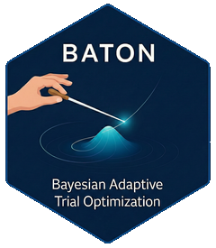

<h1 class="ts-title">Planning under uncertainty</h1>

<p class="ts-subtitle">AI-guided design of efficient clinical trials with BATON</p>

<p class="ts-author">Naim Rashid</p>
<p class="ts-affil">Department of Biostatistics · Lineberger Comprehensive Cancer Center · UNC Chapel Hill</p>

<p class="ts-meta">Computational Medicine Seminar · September 4, 2026</p>


:::

::: {.notes}
**Delivery:** No lab intro. Open on the program.
:::


## Overview {data-menu-title="Overview"}

```{=html}
<div style="display: grid; grid-template-columns: 1fr 1fr 1fr; gap: 1.2em; margin-top: 3em;">
  <div style="border: 1px solid #E6EAEF; background: #F4F6F8; padding: 1.1em 1.2em; min-height: 9.5em;">
    <div style="font-family: 'IBM Plex Mono', monospace; font-size: 0.62em; letter-spacing: 0.08em; color: #2E6A9F; text-transform: uppercase;">Section 1</div>
    <div style="font-weight: 700; color: #13294B; font-size: 0.95em; margin: 0.25em 0 0.6em 0;">The problem: designing EVOLVE</div>
    <ul style="color: #1A202C; font-size: 0.72em; line-height: 1.35; margin: 0 0 0 1.1em; padding: 0;"><li>the ARPA-H ADAPT platform trial</li><li>why standard design workflows break</li></ul>
  </div>
  <div style="border: 1px solid #E6EAEF; background: #F4F6F8; padding: 1.1em 1.2em; min-height: 9.5em;">
    <div style="font-family: 'IBM Plex Mono', monospace; font-size: 0.62em; letter-spacing: 0.08em; color: #2E6A9F; text-transform: uppercase;">Section 2</div>
    <div style="font-weight: 700; color: #13294B; font-size: 0.95em; margin: 0.25em 0 0.6em 0;">Our proposal: BATON</div>
    <ul style="color: #1A202C; font-size: 0.72em; line-height: 1.35; margin: 0 0 0 1.1em; padding: 0;"><li>model-guided search over trial designs</li><li>choosing deliberately among designs that all work</li></ul>
  </div>
  <div style="border: 1px solid #E6EAEF; background: #F4F6F8; padding: 1.1em 1.2em; min-height: 9.5em;">
    <div style="font-family: 'IBM Plex Mono', monospace; font-size: 0.62em; letter-spacing: 0.08em; color: #2E6A9F; text-transform: uppercase;">Section 3</div>
    <div style="font-weight: 700; color: #13294B; font-size: 0.95em; margin: 0.25em 0 0.6em 0;">Does it work, and what did it change?</div>
    <ul style="color: #1A202C; font-size: 0.72em; line-height: 1.35; margin: 0 0 0 1.1em; padding: 0;"><li>validation, then the EVOLVE designs</li><li>from one trial to the whole program</li></ul>
  </div>
</div>
```


::: {.notes}
**Delivery:** 30 to 45 seconds, spoken over the bullets rather than read from them. Land the third section's second line lightly; it is the destination and should sound like a promise, not a spoiler.
:::


## {.section-divider data-state="hide-footer" data-background-color="#13294B" data-menu-title="Section 1: The problem"}

::: {.divider-inner}
::: {.divider-kicker}
The problem
:::
::: {.divider-rule}
:::
::: {.divider-title}
Designing EVOLVE
:::
::: {.divider-question}
Why couldn't we design this trial the usual way?
:::
:::


## ARPA-H ADAPT: the challenge {data-menu-title="ADAPT challenge"}

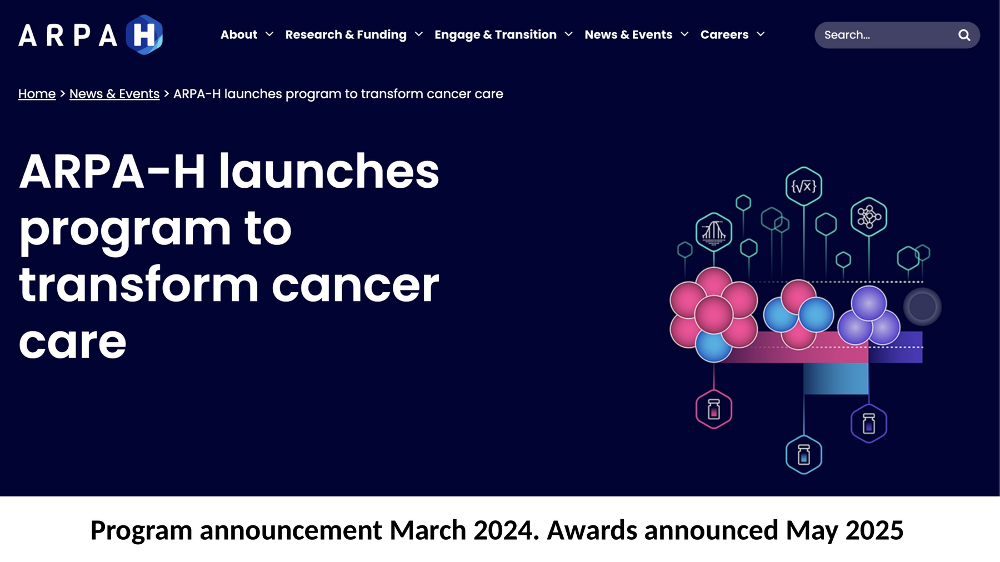

::: {.notes}
**Delivery:** Optional spoken hook before anything else: "This talk exists because one trial design took me two weeks and still failed. Here is where that problem came from." Then the one point: ARPA-H asked teams to make biomarkers, treatments, and trials co-evolve instead of proceeding sequentially.
:::


## The future state: measure before, during, and after treatment {data-menu-title="Future state"}

::: {.columns style="align-items: center;"}
::: {.column width="30%"}
::: {.frame-box style="font-size: 0.7em;"}
**Current state**<br/>
Static measurements for a dynamic disease. Biomarkers mostly assessed once, before treatment.
:::
::: {.frame-box style="font-size: 0.7em; border-color: #4B9CD3; margin-top: 0.6em;"}
**ADAPT's future state**<br/>
Serial measurements as the tumor changes. Therapies switch as resistance traits appear.
:::
:::
::: {.column width="70%"}

:::
:::

::: {.landing}
The trial has to keep measuring and keep deciding while patients are on it.
:::

::: {.notes}
**Delivery:** One sentence: serial biopsies, real-time learning, intercepting resistance as it happens. Point at the second row: every switch is a decision the trial design has to be built to make. This is what "transform cancer care" concretely means; keep it fast.

**Source:** ARPA-H ADAPT program slide (approved for public release), Hopkins kickoff deck slide 20.
:::


## ADAPT has three integrated components {data-menu-title="ADAPT components"}

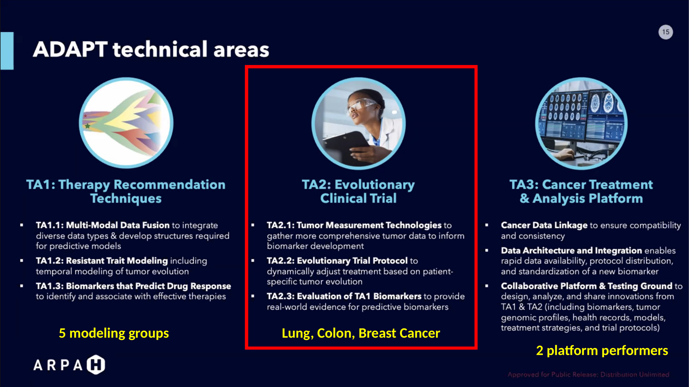

::: {.landing}
Our team leads the clinical-trial component, and it has to react to what the rest of the program learns.
:::

::: {.notes}
**Delivery:** Do not explain every workstream. Point at the trial component and move.
:::


## Our piece: EVOLVE {data-menu-title="UNC team + EVOLVE"}

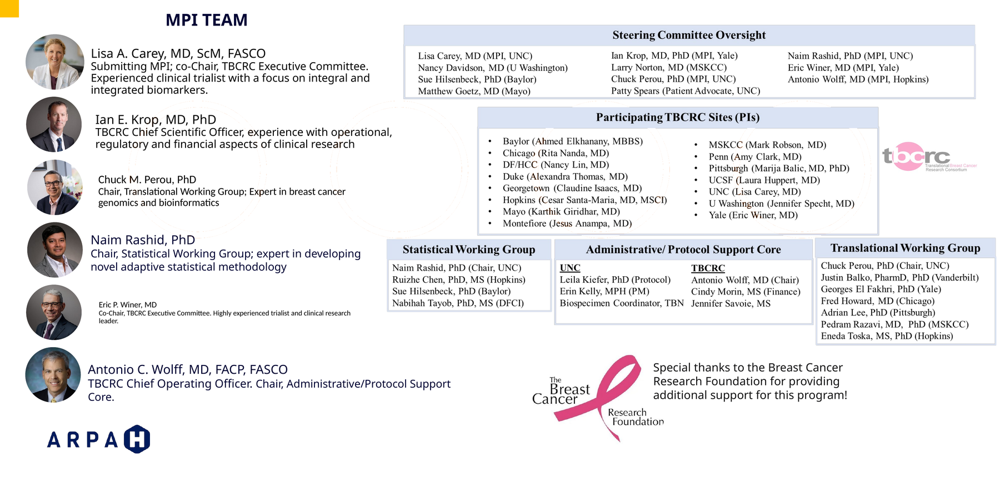

::: {.notes}
**Pull-from-if-needed:** Metastatic breast cancer, master protocol, biomarker-defined subtrials, TBCRC network.
:::


## The trial had to learn while the program was running {data-menu-title="What ARPA-H asked"}

```{=html}
<!-- Full requirements list in vector text (viewer-proof), quoting the user's
     own program-solicitation excerpts; length of the list is the point. The
     two highlighted lines carry the eye. Meme stays as the only image. -->
<div style="max-width: 1170px; margin: 0.2em auto 0 auto;">
<div style="display:flex; gap: 1.3em; align-items: flex-start;">
<div style="flex: 56 0 0;">
<div style="border: 1px solid #E6EAEF; border-left: 3px solid #4B9CD3; padding: 0.5em 0.9em; background: #fff; font-family: Georgia, serif; font-size: 0.5em; line-height: 1.45;">
<em>(ii) Clinical trial characteristics:</em>
<ol style="margin: 0.3em 0 0.3em 1.4em; padding: 0;">
<li>Clinical trial for metastatic cancer patients.</li>
<li>Clinical trial that includes multiple lines of therapy under a single protocol.</li>
<li style="background: #EAF2FA; font-weight: 600;">Flexible clinical trial protocol that enables changes in design (e.g., randomized, adaptive, etc.).</li>
<li>Strong capability to collect tumor and blood-based measurements.</li>
<li>Possess a treatment line with a Progression Free Survival (PFS) rate of &lt;9 months average.</li>
<li>Mechanisms for biomarker evaluation.</li>
<li style="background: #EAF2FA; font-weight: 600;">Modular clinical trial design enabling rapid dissemination and protocol uptake by different sites.</li>
</ol>
<em>(iii) General characteristics:</em> key clinical needs; evolutionary design examples and rapid-enrollment plans; treatment lines; biomarker testing and integration plans.
</div>
<div class="fragment" data-fragment-index="1" style="border: 1px solid #E6EAEF; border-left: 3px solid #E07C24; padding: 0.45em 0.9em; background: #fff; margin-top: 0.6em; font-size: 0.6em;"><strong style="color:#13294B;">New ask</strong> (program-manager email): integrate an "N-of-1" trial component.</div>
<p style="color: #5B6670; font-size: 0.48em; margin-top: 0.5em;">excerpts from the ARPA-H solicitation and program-manager correspondence</p>
</div>
<div style="flex: 44 0 0;">
<div class="fragment" data-fragment-index="2" style="font-size: 0.76em; font-weight: 700; color: #13294B; line-height: 1.35;">The ask: design an <span style="color:#2E6A9F;">adaptive multi-line</span> trial to <span style="color:#2E6A9F;">discover, evaluate, and implement novel biomarkers</span>, with an additional <span style="color:#2E6A9F;">N-of-1 subcomponent</span></div>

</div>
</div>
</div>
```

::: {.notes}
**Delivery:** Three keypresses, one element at a time, in the spirit of the original PowerPoint build: solicitation excerpts, then the new-ask line, then the summary ask, then the meme as the punchline. Let each be read, not read aloud. If asked, the full source slides (complete requirement list and program-manager email) are in the pptx decks.
:::


## These requirements collide with how trials are usually designed {data-menu-title="Collision"}

|  | A typical trial | EVOLVE |
|:--|:--|:--|
| Designs needed | One | Many subtrials |
| Design timing | Fixed before launch | Repeatedly, on a clock |
| Design parameters | Few | Many, interacting |
| Power and type I error | Often closed-form | Simulation only |

::: {.notes}
**Delivery:** Thirty seconds. The right column is the rest of the talk. On the fourth row, define the two terms in one breath: "power is the chance the trial correctly advances a treatment that works; type I error is the false-go rate when it does not." Slide 12 makes both concrete.
:::


## Frequentist trial designs have a convenient property {data-menu-title="One equation"}

<br/>

::: {.frame-box style="max-width: 60%; margin: 0 auto; text-align: center; font-size: 1.05em;"}
Assumed effect size&ensp;+&ensp;type I ceiling&ensp;+&ensp;power floor<br/>
<span style="font-size: 1.4em; color: #5B6670;">↓</span><br/>
**minimum sample size N**
:::

::: {.landing .fragment}
Simple designs: a formula gives N directly. Adaptive but frequentist designs, like Simon's two-stage: exact calculation for every candidate, then complete enumeration. Either way, **computable**.
:::

::: {.notes}
**Delivery, say these two sentences aloud here:** "Power is the chance we correctly advance an effective treatment. Type I error is the false-go rate when it does not work." That buys both terms for the rest of the talk.

**Pull-from-if-needed:** The frequentist toolbox rarely needs simulation. Fixed designs have closed forms; group-sequential boundaries come from standard algorithms; and Simon's two-stage designs are adaptive yet frequentist: each candidate's operating characteristics are exact binomial calculations, and the optimal design is found by complete enumeration of the discrete space (the paper's phrasing: closed-form operating characteristics make exhaustive enumeration possible). Plant this: enumeration returns later as our benchmark, precisely because the answer is known. The Bayesian adaptive designs ahead lose both routes: no closed form, and a space where exhaustive enumeration is infeasible.

**Pull-from-if-needed:** 0.05 is the confirmatory convention; 0.10 for screening trials like these. Halve the assumed effect and N roughly quadruples.

**Q&A pocket:** *Why 0.10 here?* Non-registrational screening subtrials; a confirmatory trial carries a confirmatory ceiling.
:::


## Bayesian adaptive trials decide as they go. Each rule adds settings. {data-menu-title="Bayesian adaptive knobs"}

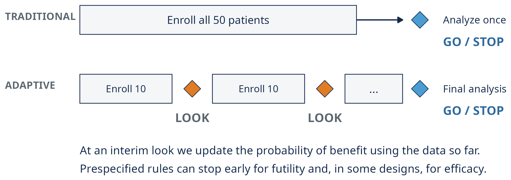

::: {.landing .fragment}
Posterior-based monitoring brings maximum N, look timing, futility (stop for lack of benefit) and efficacy thresholds, margins, priors, model settings: **8 to 13 interacting choices**, and every one changes how the trial behaves.
:::

::: {.notes}
**Pull-from-if-needed:** The precise contrast, per the paper: unlike classical group-sequential designs (Jennison and Turnbull), complex Bayesian adaptive trials generally lack closed-form operating characteristics (Berry 2010; Thall and Simon 1994). The flexibility comes from posterior-probability monitoring; the cost is that neither formulas nor enumeration reach the behavior.

**Q&A pocket:** *Bayesian rule, frequentist error rates?* The monitoring rule is Bayesian (posterior probabilities drive stopping); regulators require frequentist behavior demonstrated by simulation. Calibration is the job of making one satisfy the other.
:::


## No simple formulas for type I error or power here, so we count them {data-menu-title="Count them"}

[FDA typically wants **power of at least 0.80** and **type I error of at most 0.05 to 0.10**.]{.muted style="display:block; text-align:center; margin-bottom: 0.4em;"}

::: {.columns}
::: {.column width="50%"}
::: {.frame-box style="font-size: 0.78em; min-height: 5.4em; border-color: #E07C24;"}
**Type I error (false go)**<br/>
Simulate under the **null** (no effect). Fraction of trials that declare efficacy.
:::
:::
::: {.column width="50%"}
::: {.frame-box style="font-size: 0.78em; min-height: 5.4em; border-color: #2E6A9F;"}
**Power (true go)**<br/>
Simulate under the **alternative** (drug works as hypothesized). Fraction that declare efficacy.
:::
:::
:::

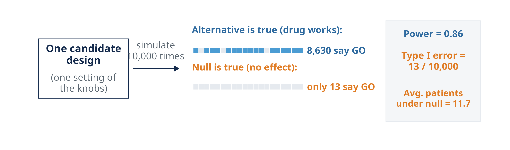

[A design meeting your prespecified targets is **feasible**.]{.muted style="display:block; text-align:center;"}

::: {.landing .fragment}
We know how to **evaluate** a design. We do not know **what to try next**.
:::

::: {.notes}
**Pull-from-if-needed:** The paper's own definition, worth quoting if pressed: a design is feasible if its simulated type I error and power satisfy prespecified targets under the calibration scenarios. FDA's 2019 adaptive-designs guidance treats simulation-demonstrated error control as the expectation for complex designs, not a workaround; the two scenario simulations (null, alternative) are run separately with independent randomness.

**Delivery:** Walk the two sentences, point at the two rows of the figure (they are exactly these two simulations), then the pivot. Say the landing line twice if needed: it is the talk's central turn.
:::


## One subtrial became a two-week search {data-menu-title="Two weeks"}

<br/><br/>

::: {style="text-align: center; font-size: 1.5em; color: #13294B; font-weight: 700;"}
2 weeks
:::

::: {style="text-align: center; color: #5B6670;"}
manual tuning of one subtrial's design<br/>
[a Bayesian adaptive design with **8 interacting settings**: change one and power, type I error, and sample size all move]{style="font-size: 0.8em;"}
:::

<br/>

::: {style="text-align: center; font-size: 1.2em; color: #E07C24; font-weight: 700;"}
power stalled at 0.78, below the 0.80 floor
:::

<br/>

::: {.landing .fragment}
Several more subtrials were waiting. And is the design you settle on really the smallest one that works?
:::

::: {.notes}
**Pull-from-if-needed:** An illustrative single comparison, documented in the paper's web appendix, not a controlled benchmark across analysts. 0.78 is within Monte Carlo noise of the floor; the precise statement is "no design I could certify as feasible."

**Delivery:** First person. This is the credibility beat: BATON exists because the workflow was failing, not because manual tuning was philosophically unsatisfying.
:::


## Grid search and random search do not rescue us {data-menu-title="Alternatives fail"}

::: {.columns style="align-items: center;"}
::: {.column width="50%"}
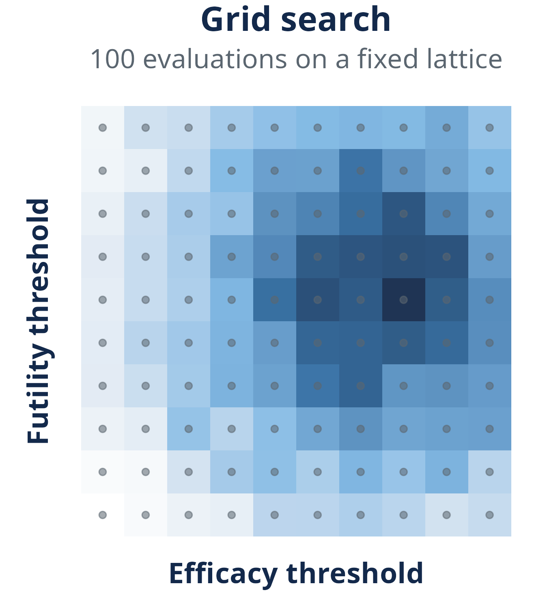
:::
::: {.column width="50%" .fragment}
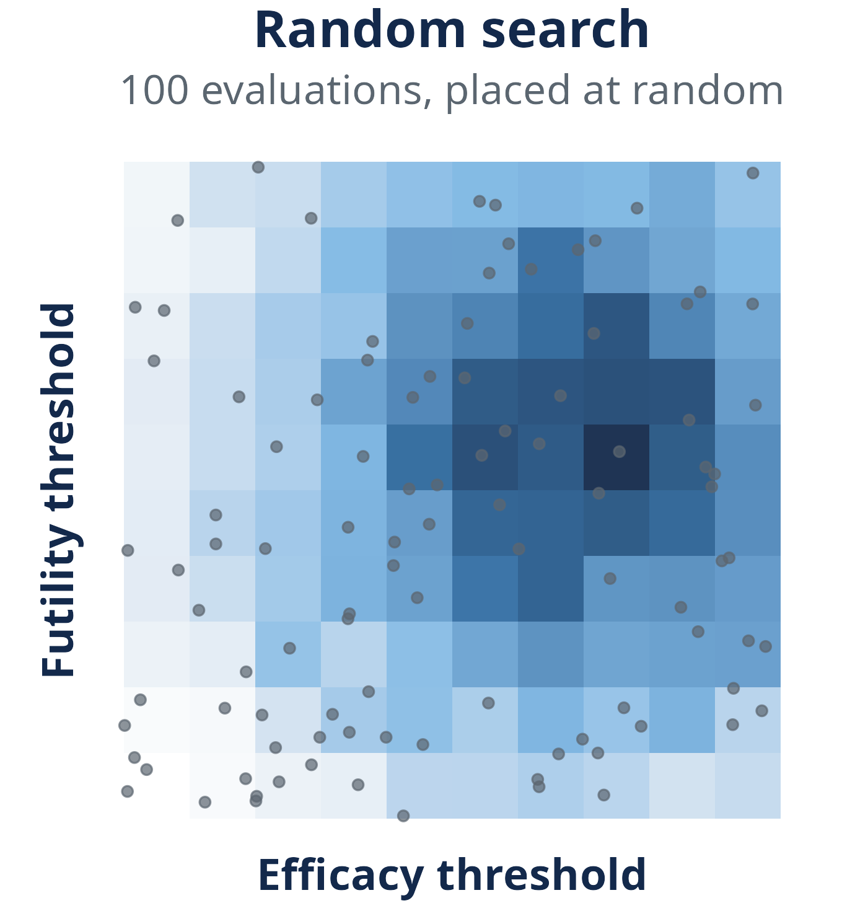
:::
:::

::: {.landing .fragment}
Grid explodes with dimension. Random, in our benchmark run of 2,000 evaluations, spent 93% of its budget on failing designs: **136 feasible, 6.8%**. (Darker = better design.)
:::

::: {.notes}
**Q&A pocket:** *Didn't random search find a better value than BATON somewhere?* Different design class and an unvalidated selection minimum over 2,000 noisy estimates; the commensurable internal comparison is on the benchmark slide later.

**Delivery:** If the meme slide follows, this is its setup; one beat only.
:::


## And we had to solve this repeatedly {data-menu-title="10-15 subtrials"}

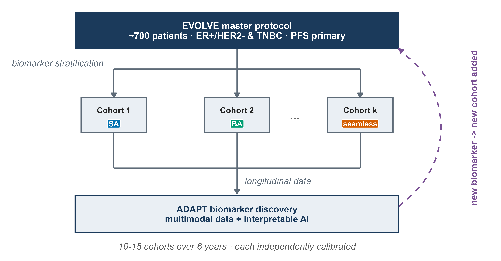

::: {.landing}
This was not one calibration problem. The platform needs **10 to 15 independent subtrials**, each with its own design, opened on a short clock.
:::

::: {.notes}
**Q&A pocket:** *Why not calibrate once and reuse?* Each cohort differs in prevalence, endpoint behavior, and available control data; a design calibrated for one routinely violates the requirements in another.
:::


## Not an EVOLVE problem: a Bayesian adaptive design problem {data-menu-title="Not unique"}

::: {.columns}
::: {.column width="33%"}
::: {.frame-box style="min-height: 7.4em; text-align: center; font-size: 0.85em;"}
**Phase I dose-finding**<br/>escalation and safety rules tuned by simulation
:::
:::
::: {.column width="33%"}
::: {.frame-box style="min-height: 7.4em; text-align: center; font-size: 0.85em;"}
**Phase II Bayesian designs**<br/>posterior thresholds and interim looks tuned by simulation
:::
:::
::: {.column width="33%"}
::: {.frame-box style="min-height: 7.4em; text-align: center; font-size: 0.85em;"}
**Platform trials**<br/>every added feature adds settings that interact
:::
:::
:::

::: {.landing .fragment}
Same shape every time: many interacting settings, behavior you can only get by simulation, and no tool that searches for you.
:::

::: {.notes}
**Delivery:** First person. "I hit exactly this designing phase I and phase II trials with the standard tools, for the same reasons. The more ambitious the design, the worse it gets."

**Pull-from-if-needed:** The paper's own generality claim (Discussion): the calibration challenge "arises across simulation-calibrated Bayesian adaptive designs, including basket, umbrella, response-adaptive, and enrichment designs" (Berry et al. 2010; Woodcock and LaVange 2017 master protocols; Golchi 2022); thresholds cannot be tuned in isolation (Granholm et al. 2025). Existing Bayesian phase II calibrators (BOP2 and successors) search posterior-probability thresholds by grid or particle swarm and return one design under one criterion. The phase I claim on the slide is my own experience, not a citation from the paper.
:::


## {.section-divider data-state="hide-footer" data-background-color="#13294B" data-menu-title="Section 2: BATON"}

::: {.divider-inner}
::: {.divider-kicker}
Our proposal
:::
::: {.divider-rule}
:::
::: {.divider-title}
BATON
:::
::: {.divider-question}
What should we simulate next?
:::
:::


## This is a familiar computational problem {data-menu-title="ML bridge"}

::: {.columns}
::: {.column width="50%"}
::: {.frame-box style="text-align: center;"}
**Machine learning**<br/><br/>
hyperparameters<br/>↓<br/>expensive training run<br/>↓<br/>validation performance
:::
:::
::: {.column width="50%" .fragment}
::: {.frame-box style="text-align: center;"}
**Trial design**<br/><br/>
design parameters<br/>↓<br/>expensive Monte Carlo simulation<br/>↓<br/>power, type I error, enrollment
:::
:::
:::

::: {.landing .fragment}
The same problem appears in hyperparameter tuning. The difference here: the answer must also satisfy **hard statistical constraints**.
:::

::: {.notes}
**Delivery:** This is where the room recognizes the problem as theirs. One sentence on the difference, then the name. And say what AI-guided means: "By AI-guided I mean model-guided optimization: a probabilistic model learns from the simulations we have already run and decides which design is worth simulating next." No LLM is coming.
:::


## BATON turns calibration into a guided search {data-menu-title="BATON + loop"}

::: {.columns style="align-items: center;"}
::: {.column width="34%"}
::: {.frame-box style="font-size: 0.7em;"}
**BATON**<br/>Bayesian Adaptive Trial OptimizatioN<br/>[Model-guided: a probabilistic model learns from the simulations already run and picks the next one worth paying for.]{.muted style="font-size: 0.9em;"}

**You specify:** a power floor, a type I error cap, and what to minimize (expected N, maximum N, or a mix).

**Your simulator:** design settings plus null and alternative scenarios in; power, type I error, and enrollment out.
:::
:::
::: {.column width="66%" .fragment}
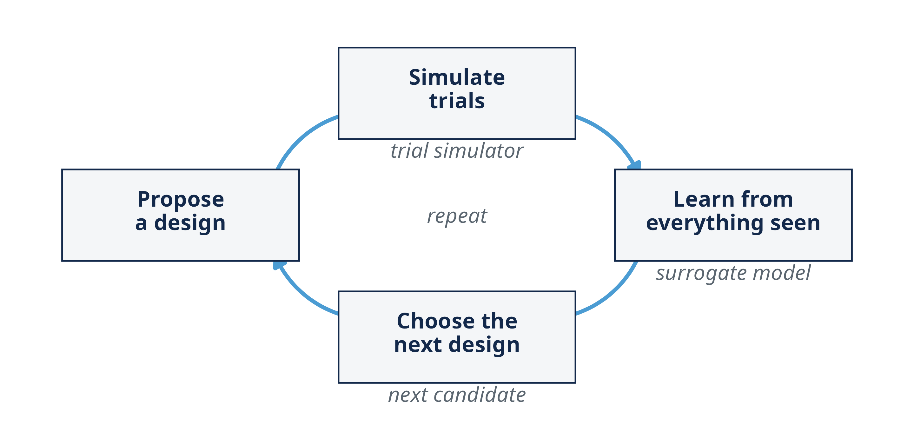
:::
:::

::: {.landing .fragment}
A closed loop: simulate, learn from everything seen so far, choose the next design, repeat.
:::

::: {.notes}
**Pull-from-if-needed:** Formal names: Monte Carlo simulator, Gaussian-process surrogate, feasibility-aware acquisition (expected improvement times probability of feasibility), multi-seed verification.
:::


## BATON starts with a small space-filling sample {data-menu-title="Initial sample"}

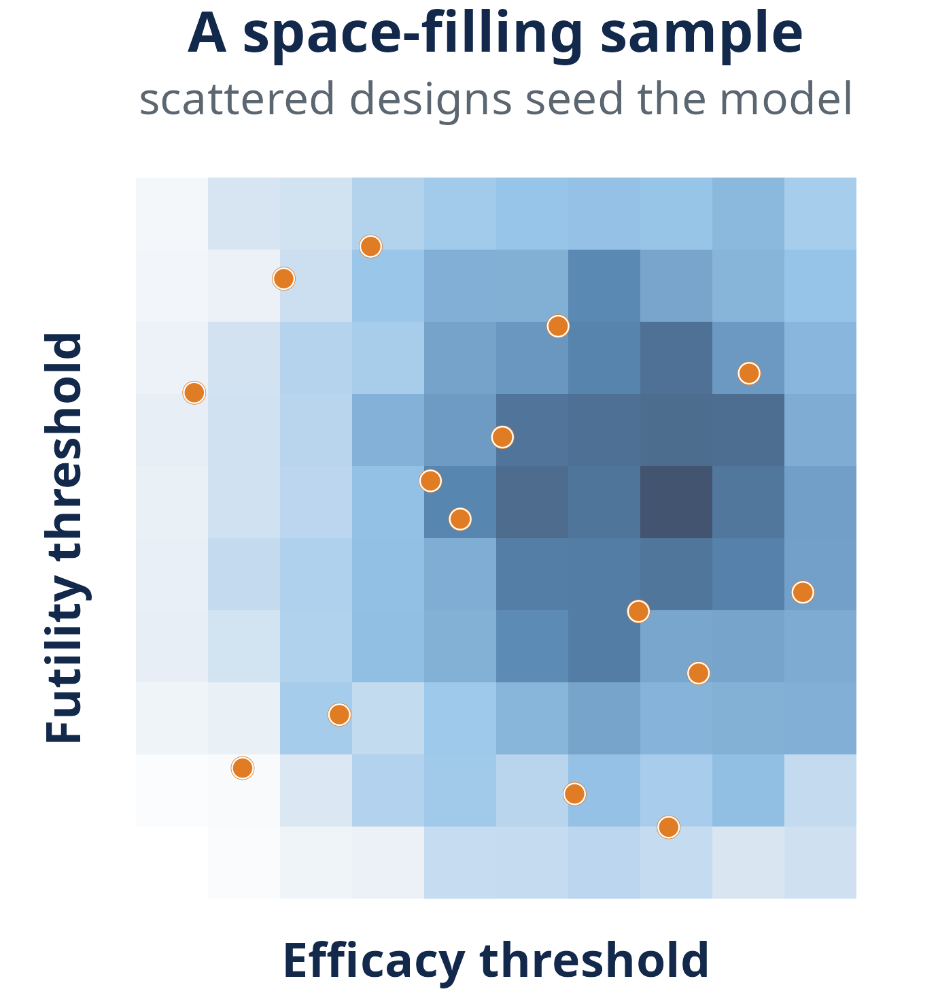

::: {.landing}
No lattice, no model yet: a handful of designs scattered across the space, just enough to sketch the landscape. (Darker = better design.)
:::

::: {.notes}
**Delivery:** "Step one is not clever. Scatter a small sample across the space so the model has something to learn from." One beat, then the map.

**Pull-from-if-needed:** The production runs seed with a 60-point Latin-hypercube design at low fidelity, then hand over to model-guided selection in batches of 3.
:::


## From simulations to a prediction model {data-menu-title="Surrogate map"}

::: {.r-stack}
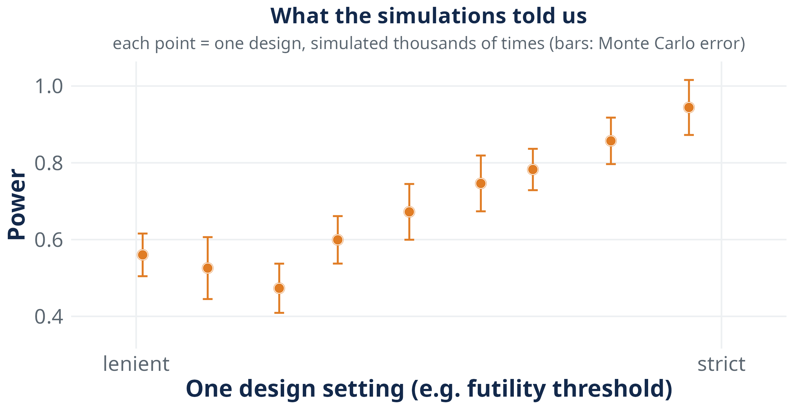

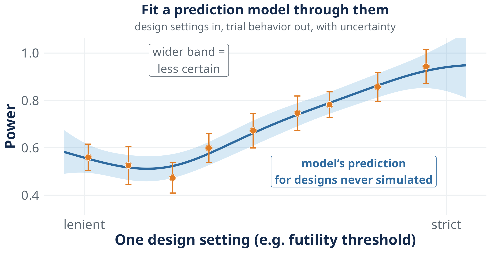
:::

::: {.landing .fragment}
Design settings in, trial behavior out. The model predicts designs we have not paid to simulate, and says how sure it is.
:::

::: {.notes}
**Delivery, ~20 seconds:** Open with "You do not need to read this plot." Then: "Every simulation becomes a point. BATON fits a flexible surface through those points, including uncertainty. Near a constraint boundary that uncertainty matters, because we do not yet know which side of the line a candidate really lies on." Then move on.

**Pull-from-if-needed:** The part that is not off-the-shelf constrained BO: the Monte Carlo noise itself varies across the design space (early-stopping designs give noisier estimates), and the surrogate models that noise rather than assuming it constant, with the constraints' Monte Carlo standard errors feeding the model. Full technical treatment in backup B1.
:::


## Where is the next simulation worth spending? {data-menu-title="Acquisition"}

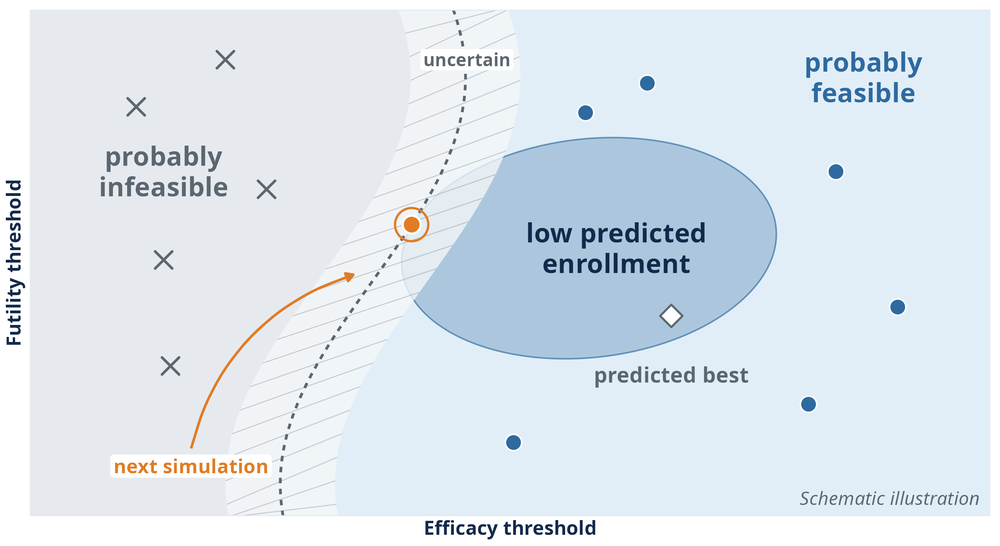

::: {.landing}
Not necessarily at the predicted best: where another expensive simulation is **most useful** for finding the feasible optimum.
:::

::: {.notes}
**Q&A pocket:** *Acquisition details?* Expected improvement against the best posterior mean among observed-feasible designs, multiplied by the modeled probability of meeting every constraint. Backup B1 has the code-verified specifics.
:::


## Now the model takes over {data-menu-title="Carpet vs walk"}

::: {.columns style="align-items: center;"}
::: {.column width="50%"}

:::
::: {.column width="50%" .fragment}
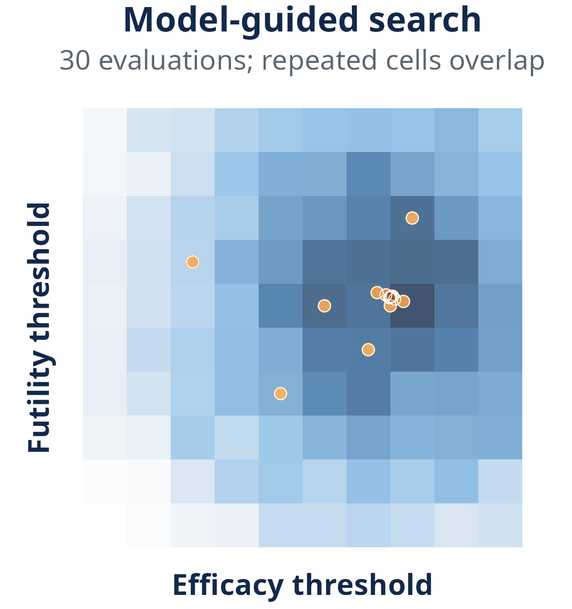
:::
:::

::: {.landing .fragment}
The seed sketches the map. After that, the model places every evaluation where information matters, homing in on the best feasible region.
:::


## Spend precision where it matters {data-menu-title="Fidelity ladder"}


::: {.landing}
Cheap screening for the many, expensive re-checks for the few, and a separate multi-seed verification for the one design you report.
:::

::: {.notes}
**What the code actually does (verified against the driver 2026-09-03):** Stage 1 searches at 3,000 replications; the top 3 feasible designs, then 2 more, are re-simulated at 10,000. If at least 30% of them survive, stages 2 and 3 are skipped and the best validated design goes to verification. Only if validation fails does the search escalate with narrowed bounds at 5,000 and then 10,000. In the production runs behind the paper's tables, validation succeeded after Stage 1 in essentially every run, so the escalation stage is drawn dashed. Do not describe it as "three rounds of increasing fidelity" out loud.

**Pull-from-if-needed:** Name the failure mode if asked: selection-induced optimism, the winner of a noisy search looks better than it is precisely because it won. The verification stage exists to remove it: independent multi-seed re-simulation at high fidelity, reporting means and an upper confidence bound on type I error (worst seamless mean 0.084, bound near 0.087 against 0.10; 100% strict feasibility across seeds). Reported numbers come from verification, never from the search.
:::


## Finding feasible designs is not the whole design problem {data-menu-title="Hinge"}

<br/><br/>

::: {.thesis-line}
The feasible region can contain many designs that all satisfy power at least 0.80 and type I error at most 0.10.
:::

<br/>

::: {.landing .fragment}
Which one should we optimize for?
:::

::: {.notes}
**Delivery:** The hinge from machinery to science. Two sentences, then the table.
:::


## Two designs. Both correct. {data-menu-title="Two designs"}

Calibrated under **different objectives**, both meeting the same requirements:

|  | Design A | Design B |
|:--|:-:|:-:|
| Maximum patients committed | **47** | **30** |
| Average patients *if the drug fails* | **11.7** | **22.8** |
| Power *(go when it works)* | 0.86 | 0.94 |
| Type I *(false go)* | 0.001 | 0.021 |

::: {.landing .fragment}
One quits losers quickly. One caps the worst-case commitment. Neither is universally better.
:::

::: {.notes}
**Pull-from-if-needed:** Scenario A, the platform's TNBC cohort, futility-only stopping. Verified values from the philosophy comparison file. Say plainly these two arise under different objectives; they are not two outputs of one feasibility run.

**Q&A pocket:** *Why care about average N under the null?* Most experimental oncology drugs do not work; the ethical cost center is patients enrolled onto an ineffective therapy.
:::


## The objective should reflect the trial you actually want {data-menu-title="Philosophies"}

A feasibility criterion tells us whether a design is acceptable. It does not encode which acceptable design we **prefer**.

```{=html}
<div class="ext-grid" style="margin-top: 0.5em;">
<div class="ext-card fragment">
<h4>“Quit losers quickly”</h4>
<span class="ext-status">H0-Optimal</span>
<p>Minimize average N when the drug fails.<br/><em>Tradeoff: may need a larger maximum N.</em></p>
</div>
<div class="ext-card fragment">
<h4>“Cap the worst case”</h4>
<span class="ext-status">Minimax</span>
<p>Minimize maximum N.<br/><em>Tradeoff: more patients when the drug fails.</em></p>
</div>
<div class="ext-card fragment">
<h4>“The compromise”</h4>
<span class="ext-status">Admissible</span>
<p>Weighted blend of the two.<br/><em>Trades one against the other, explicitly.</em></p>
</div>
</div>
```

::: {.landing .fragment}
Frequentist two-stage designs made these tradeoffs explicit for decades. **BATON transports them into complex adaptive designs where exhaustive enumeration is impractical.**
:::

::: {.notes}
**Delivery, spoken transition into this slide:** "So far I have pretended there is one objective. There is not. Power and type I error tell us whether a design is acceptable; they do not tell us which acceptable trial we would rather run." Clinician anchor: "this is really a choice between how many patients we expose to an inactive treatment and how much worst-case capacity the network must reserve."

**Pull-from-if-needed:** Simon (1989); Jung's admissible designs. The claim is transport, not "first to notice tradeoffs." BATON takes the weighting as input: explicit, on the record, before any data. And because we model the whole response surface, we can begin to see which design parameters drive these tradeoffs.

**Q&A pocket:** *When is this locked?* At design time, in the protocol, before data are seen, like a Simon optimal-versus-minimax choice.

**Q&A pocket:** *Why not multi-objective BO for the whole front?* Fair alternative; named scalarizations keep constraint handling direct and give a steering committee a legible, pre-registrable objective.
:::


## {.section-divider data-state="hide-footer" data-background-color="#13294B" data-menu-title="Section 3: Evidence"}

::: {.divider-inner}
::: {.divider-kicker}
The evidence
:::
::: {.divider-rule}
:::
::: {.divider-title}
Does it work?
:::
::: {.divider-question}
And did it change anything?
:::
:::


## First, a problem where the answer is known {data-menu-title="Simon unit test"}

[Simon two-stage designs: every possible design can be enumerated, so the exact optimum is known. **One benchmark scenario, 10 independent BATON runs.**]{.muted}

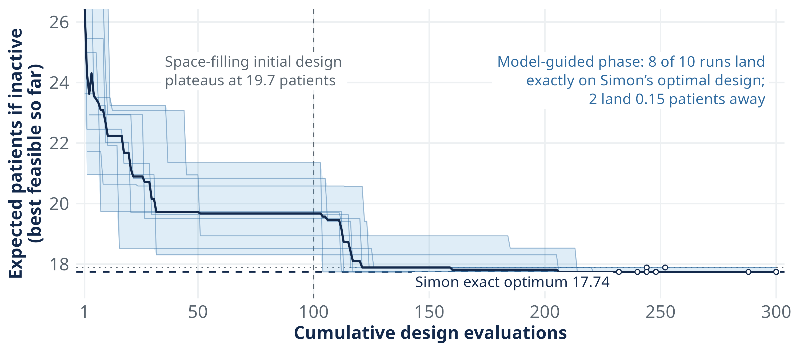

::: {.landing}
**10 independent random starts:** 8 return Simon's exact optimal design; 2 land on a near-neighbor 0.15 patients away.
:::

::: {.notes}
**Pull-from-if-needed:** Ten repeats of one scenario (response rates 0.20 vs 0.40). The two remaining runs land on the next admissible design, 0.15 patients away. Evaluations 1 to 100 are the Latin hypercube phase: internal, exactly commensurable random search.
:::


## Across 12 different benchmark scenarios {data-menu-title="Benchmark"}

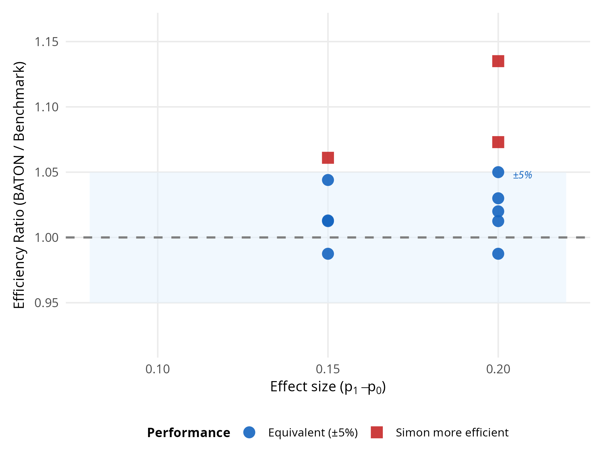

::: {.landing}
Always feasible: **12 of 12**. Exact optimum in **4 of 12**; median within **2.5%**; worst case **13.5%**.
:::

[Primary target: verified feasibility. Objective optimization is approximate in an expensive, noisy, discrete space.]{.muted style="display:block; text-align:center;"}

::: {.notes}
**Pull-from-if-needed:** One calibration per scenario; the worst case is a single-seed result, and reseeding the 0.20 scenario returns the exact optimum in 8 of 10 runs. Do not compress this to "recovers the optimum."
:::


## The same tradeoff appears in EVOLVE's Bayesian adaptive trial {data-menu-title="Frontier: single-arm"}

::: {.columns style="align-items: center;"}
::: {.column width="55%"}
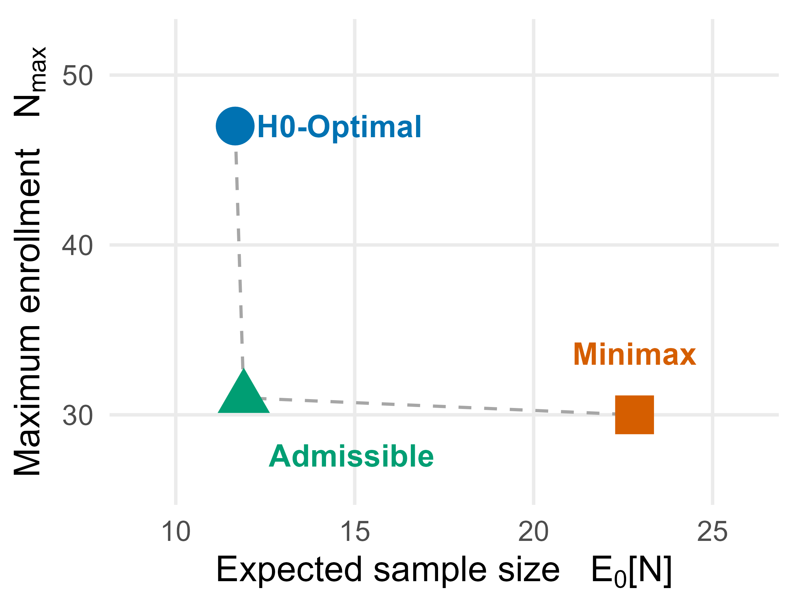
:::
::: {.column width="45%"}

**The platform's TNBC cohort**

- quit losers quickly: 47 max, **11.7** if inactive
- the compromise: 31 max, **11.9**
- cap the worst case: 30 max, **22.8**

::: {.landing .fragment}
The compromise keeps almost all of H0-Optimal's efficiency at almost Minimax's cap.
:::

:::
:::

::: {.notes}
**Q&A pocket:** *Type I 0.001 against a 0.10 ceiling?* The binding constraint is power; aggressive futility stopping suppresses false positives as a byproduct. N_max box was [30, 120]; 47 is interior.

**Delivery:** Speak the randomized-cohort line here: "the same price schedule appears in the randomized doublet-versus-triplet cohort; backup has the figure." Then move to seamless.
:::


## Richer designs: 8 knobs become 13 {data-menu-title="Seamless"}

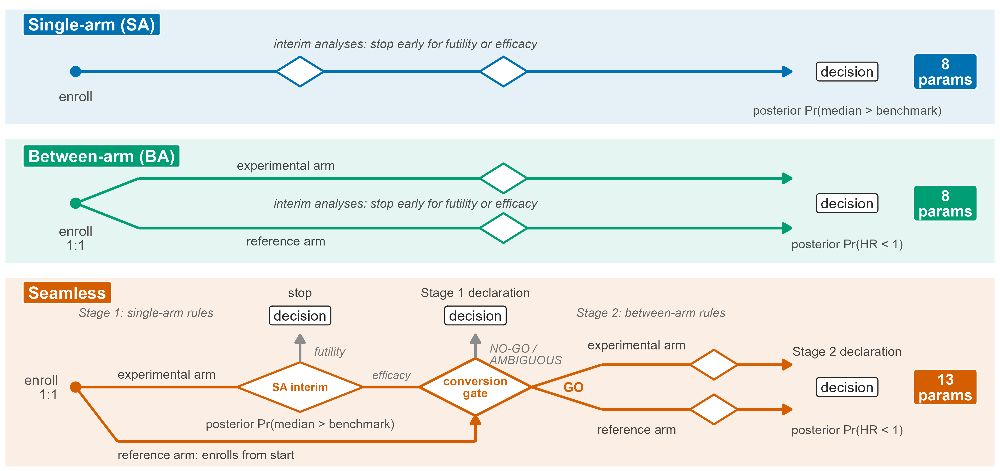

::: {.landing}
Seamless: screen cheaply single-arm, then demand randomized evidence from promising cohorts. Thirteen interacting parameters make manual calibration impractical.
:::


## Sometimes two philosophies become the same design {data-menu-title="Collapse"}

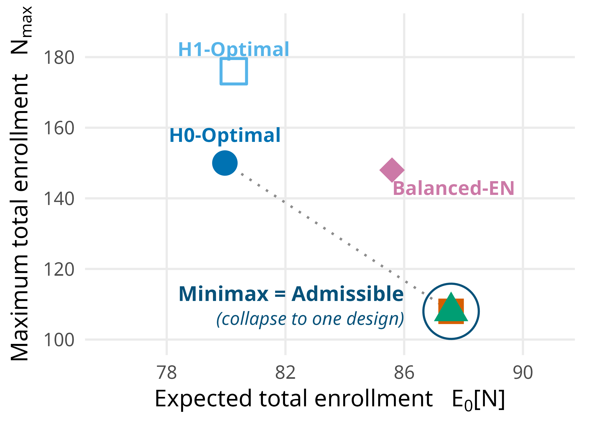

::: {.landing}
Minimax and Admissible calibrate to the **identical 13-parameter design**: not a coincidence but a structural alignment, visible directly in the conversion rates.
:::

::: {.notes}
**Q&A pocket:** *Optimizer artifact?* Identical vectors, identical 5-seed high-fidelity verification, and the mechanism (next slide) predicts the degeneracy.
:::


## The mechanism: a gate that rarely opens when the drug fails {data-menu-title="Gate"}

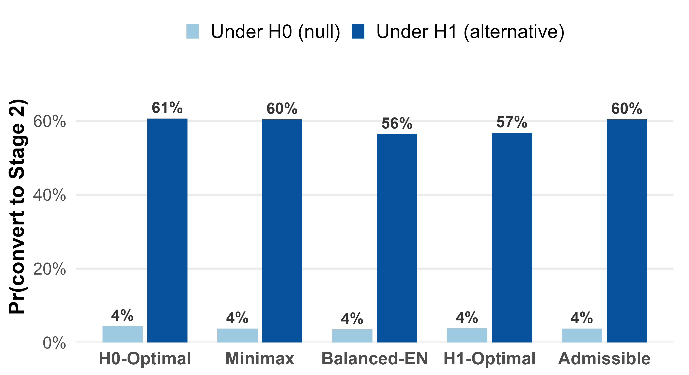

::: {.landing}
When the drug fails, only ~4% of trials reach stage 2, so stage 1 dominates enrollment, bringing the Admissible and Minimax objectives into alignment. **The search became an instrument for understanding the design.**
:::


## BATON changed decisions in EVOLVE {data-menu-title="Operational impact"}

::: {.columns}
::: {.column width="50%"}
::: {.frame-box .fragment style="min-height: 4.0em; font-size: 0.82em;"}
**Capacity**: maximum N locked ~3 months before first enrollment, from frontier curves.
:::
::: {.frame-box .fragment style="min-height: 4.0em; font-size: 0.82em; margin-top: 0.5em;"}
**Program planning**: enrollment and timeline projections across 10 to 15 sequential subtrials.
:::
:::
::: {.column width="50%"}
::: {.frame-box .fragment style="min-height: 4.0em; font-size: 0.82em;"}
**Interim data locks**: look spacing sets the analysis calendar the safety board shares.
:::
::: {.frame-box .fragment style="min-height: 4.0em; font-size: 0.82em; margin-top: 0.5em;"}
**Turnaround**: a feasible design in under 45 minutes per run; full workflow about 4 hours.
:::
:::
:::

::: {.landing .fragment style="margin-top: 0.5em;"}
In practice we generally settled on the **Admissible** designs: efficient enrollment, early stopping, bounded capacity.
:::

::: {.notes}
**Pull-from-if-needed:** The turnaround case: same simulator, same constraints; an illustrative single comparison, not a controlled benchmark (backup B6 has the full numbers).

**Delivery:** Land the Admissible line, then advance. The bridge question is spoken on the next slide (JASA + software), so the room hears it immediately before the program-failure slide answers it.
:::


## From EVOLVE to a general framework {data-menu-title="JASA + software"}

::: {.columns style="align-items: center;"}
::: {.column width="62%"}
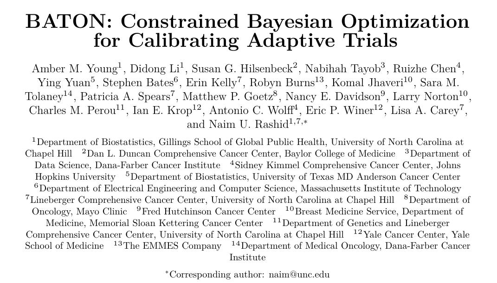
:::
::: {.column width="38%"}


- under review at JASA
- open-source R package
- bring your own trial simulator

:::
:::


## A trial can succeed locally while the development program fails {data-menu-title="Program failure"}

::: {.columns}
::: {.column width="50%"}
::: {.fragment style="text-align: center;"}
<span style="font-size: 3.2em; font-weight: 800; color: #13294B;">54%</span><br/>
[of 640 therapeutics reaching phase 3 or pivotal trials **failed in late-stage development**; 57% of failures for inadequate efficacy]{style="font-size: 0.72em; color: #5B6670;"}
:::
:::
::: {.column width="50%"}
::: {.fragment style="text-align: center;"}
<span style="font-size: 3.2em; font-weight: 800; color: #13294B;">21 of 138</span><br/>
[new oncology drugs carried **dose-optimization postmarketing requirements**; median 6 years to fulfill]{style="font-size: 0.72em; color: #5B6670;"}
:::
:::
:::

::: {.landing .fragment}
Each trial can be well designed locally while the program remains poorly optimized globally.
:::

[Hwang et al., JAMA Internal Medicine 2016 · FDA dose-optimization postmarketing requirements, 2010 to 2022 oncology approvals]{.muted style="display:block; text-align:center; font-size:0.55em; margin-top:0.6em;"}

::: {.notes}
**Sourcing:** the 21 of 138 dose-optimization postmarketing-requirement figure has no named primary analysis yet; say it as "from FDA's own postmarketing-requirement records, as we have compiled them," not as a published statistic.

**Delivery:** 20 seconds: "It is written up, under review, and the package is open source; bring your own simulator." Then speak the bridge on THIS slide, not the previous one: "BATON solved the problem in front of us. But working on it raised a more uncomfortable question. What if the trial is not actually the right unit to optimize?" Advance on the question.

**Pull-from-if-needed:** Left: Hwang et al., JAMA Internal Medicine 2016 (PMID 27723879), cohort of 640 novel therapeutics reaching phase 3 or pivotal trials 1998 to 2008; state the denominator precisely, never "half of drugs fail phase III." Right: 2010 to 2022 oncology approvals; also in this form: 57.3% of planned survival endpoints (82 of 143, across 111 phase III oncology trials) came in weaker than expected. Both statistics appear in my own prior ARPA-H statistics deck.

**Delivery:** This is the bridge that earns the program-level claim. Two fragments, then the landing. Honesty line to speak: "To be clear, these late-stage failures are a different problem from the one I just showed you solved. They are the problem this machinery might reach."
:::


## Early decisions become downstream commitments {data-menu-title="Sotorasib"}

<br/>

::: {.frame-box style="max-width: 56%; margin: 0 auto; text-align: center; font-size: 0.95em;"}
**Sotorasib (KRAS G12C)**<br/><br/>
**960 mg**: highest dose tested in phase I<br/>
<span style="color:#5B6670;">↓ carried forward</span><br/>
selected for development, then approval<br/>
<span style="color:#5B6670;">↓ after approval</span><br/>
FDA required a **240 vs 960 mg** comparison<br/>
<span style="color:#E07C24;">↓</span><br/>
**similar progression-free survival at one-quarter the dose**
:::

::: {.landing .fragment}
A dose decision good enough to advance development left a fundamental question unresolved into the post-approval setting.
:::

[FDA Oncologic Drugs Advisory Committee review of sotorasib dosing and CodeBreaK 200, October 2023]{.muted style="display:block; text-align:center; font-size:0.55em; margin-top:0.4em;"}

::: {.notes}
**Pull-from-if-needed:** FDA Oncologic Drugs Advisory Committee review of sotorasib dosing and CodeBreaK 200, October 2023; the design lesson (the highest tolerated dose was not the best one) is drawn in our RAS-era trial-design commentary. Be fair to the program: the early trial did its local job and the drug is approved and effective; the point is that a fundamental early decision stayed unresolved enough to require post-approval revisiting.

**Delivery:** Human-scale information debt. Walk the chain, land the sentence, and say this distinction aloud: "Nothing here means the Phase I trial was incorrectly analyzed. It means the question it was optimized to answer was narrower than the decision the rest of the development program ultimately needed." Then move to the extensions.
:::


## From trial optimization toward phaseless development {data-menu-title="Extensions"}

<br/>

```{=html}
<div class="ext-grid">
<div class="ext-card fragment">
<h4>Across possible futures</h4>
<span class="ext-status">BATON-C &middot; in progress, with Amber Young</span>
<p>Optimize across a <em>prespecified family</em> of plausible clinical futures, not one assumed truth.</p>
</div>
<div class="ext-card fragment">
<h4>Earlier in development</h4>
<span class="ext-status">BATON-D &middot; in progress, working name</span>
<p>Optimize dose-finding rules for safety <em>and</em> what every later trial inherits.</p>
</div>
<div class="ext-card fragment">
<h4>Across trials</h4>
<span class="ext-status">phaseless development &middot; long-term goal</span>
<p>Optimize dose, population, interim, and confirmatory decisions as <em>one linked program</em>.</p>
</div>
</div>
```

::: {.landing .fragment}
The goal: continuously learning development programs that reach reliable answers with fewer patients, less elapsed time, and lower development cost.
:::

::: {.notes}
**Pull-from-if-needed:** BATON-C: robust optimization over a disclosed scenario family (demonstrable capability, validation ongoing). BATON-D: phase I and I/II, constraints on overdose risk and correct-dose selection; working name. Translation effort is underway to make simulation-guided design usable beyond one academic program: one sentence, disclose the commercial relationship verbally if asked.

**Q&A pocket:** *Does phaseless mean abandoning evidentiary standards?* No: the statistical requirements stay explicit; what changes is that the Phase I/II/III partitions become design choices rather than fixed assumptions about how development must be organized.

**Delivery:** Translation line is one sentence; disclose the commercial relationship verbally if asked. Do not name it from the slide.
:::


## We optimize the trial. The program is what succeeds. {data-menu-title="Development programs"}

```{=html}
<div class="fragment semi-fade-out" data-fragment-index="1" style="display:flex; align-items:center; justify-content:center; gap:0.6em; margin: 0.7em auto 0.2em auto; max-width: 92%;">
<div style="border:1px solid #13294B; background:#F4F6F8; padding:0.7em 1.0em; text-align:center;"><strong style="color:#13294B;">Phase I</strong><br/><span style="color:#5B6670;">choose dose</span></div>
<div style="text-align:center; color:#5B6670; font-size:0.75em;">selection inherited<br/><span style="font-size:1.6em; color:#4B9CD3;">&rarr;</span></div>
<div style="border:1px solid #13294B; background:#F4F6F8; padding:0.7em 1.0em; text-align:center;"><strong style="color:#13294B;">Phase II</strong><br/><span style="color:#5B6670;">choose population, signal</span></div>
<div style="text-align:center; color:#5B6670; font-size:0.75em;">debt accumulates<br/><span style="font-size:1.6em; color:#4B9CD3;">&rarr;</span></div>
<div style="border:1px solid #13294B; background:#F4F6F8; padding:0.7em 1.0em; text-align:center;"><strong style="color:#13294B;">Confirmatory trial</strong><br/><span style="color:#5B6670;">must repay remaining debt</span></div>
</div>
```

::: {.fragment style="max-width: 70%; margin: 0.3em auto 0 auto; border: 2px solid #2E6A9F; background: #FFFFFF; text-align: center; padding: 0.45em 0.8em; font-size: 0.8em;" fragment-index="1"}
**What if we reverse the logic?**<br/>
**final therapeutic claim** + its evidentiary requirements<br/>
<span style="color:#4B9CD3; font-size: 1.2em;">↓</span><br/>
simulate alternative development architectures<br/>
<span style="color:#4B9CD3; font-size: 1.2em;">↓</span><br/>
phased&ensp;·&ensp;seamless&ensp;·&ensp;**potentially phaseless**
:::

::: {.landing .fragment style="font-size: 1.12em; margin-top: 0.25em;"}
Phase structure becomes a design variable.
:::

::: {.notes}
**Q&A pocket:** *Isn't this seamless designs again?* Seamless merges adjacent phases operationally. This changes what each stage is optimized for, and ultimately whether the partitions are assumptions at all.

**Delivery:** Narrate the build: "We behave as if these are separate optimization problems. But Phase I chooses a dose that Phase II inherits; Phase II chooses a population and signal the confirmatory trial inherits. Errors do not disappear at the phase boundary." Reveal the reversal: "Start from the evidence the final claim requires, then derive the fastest architecture that produces it reliably. Sometimes that still looks like Phase I, II, III. Sometimes seamless. Sometimes fewer boundaries." Then say the clarification: "Phaseless does not mean evidence-less or confirmation-less. It means the Phase I, II, III boundaries stop being assumptions and become design choices. Some programs may still need all three; others may support the same reliable claim with fewer separations or no distinct selection-confirmation boundary." Then the payoff: "The goal is not to weaken evidence by removing phases. It is to stop paying automatically for boundaries that may not be necessary." Slowest delivery in the talk. Deeper point if pressed: some information lost through earlier selection is expensive or impossible to recover downstream, which is exactly why the program, not the trial, is the right unit of design.

**Pull-from-if-needed, the economic chain:** wrong early choice, larger downstream trial, failed confirmatory study, repeat development: years, patients, cost. Versus: optimize the program, better upstream choices, reuse accumulating evidence, fewer redundant transitions: faster, smaller development.
:::


## What I hope you remember {data-menu-title="Summary"}

<br/>

::: {.incremental}
1. Simulation can tell us how a proposed adaptive trial behaves, but not what design to try next.

2. BATON turns trial calibration into a guided, constrained search, and makes the tradeoffs among workable designs explicit.

3. The larger opportunity: optimize the **sequence of decisions** across development, toward programs that reach reliable answers faster, with fewer patients.
:::

::: {.notes}
**Delivery:** Reassurance line worth speaking before the close: "Optimization replaces the grid-search part of a statistician's month, not the judgment part." Add "and lower development cost" verbally to point 3. The spoken final close: "BATON started because we needed to design one unusually complicated trial. But the larger problem it points to is that we design drug development one trial at a time. The unit we optimize is the trial; the unit that ultimately succeeds or fails is the development program. If we can design that program as a whole, phase structure itself becomes something we can optimize." Then stop.
:::


## Acknowledgments {data-menu-title="Acknowledgments"}

```{=html}
<div style="display: grid; grid-template-columns: 1fr 1fr; gap: 1.6em; font-size: 0.72em;">
<div class="ack-col">
<h4>EVOLVE / ADAPT</h4>
<ul>
<li>MPIs: Lisa Carey (UNC), Ian Krop (Yale), Chuck Perou (UNC), Eric Winer (Yale), Antonio Wolff (Hopkins)</li>
<li>EVOLVE steering committee and site investigators across 15 TBCRC sites</li>
<li>ARPA-H ADAPT program leadership</li>
</ul>
</div>
<div class="ack-col">
<h4>Statistics / BATON</h4>
<ul>
<li><strong>Amber Young</strong> (UNC), who led BATON's design and validation, and co-leads BATON-C</li>
<li><strong>Didong Li</strong> (UNC) · <strong>Dinelka Nanayakkara</strong> (ARPA-H statistics group)</li>
<li>Statistical working group: Ruizhe Chen (Hopkins), Sue Hilsenbeck (Baylor), Nabihah Tayob (DFCI)</li>
<li>Rashid Lab</li>
</ul>
</div>
</div>
<p style="font-family: var(--rl-font-mono); font-size: 0.5em; letter-spacing: 0.05em; color: #5B6670; border-top: 1px solid #E6EAEF; padding-top: 0.8em; margin-top: 1.2em; text-align: center;">FUNDING&ensp;·&ensp;ARPA-H 140D042590009&ensp;·&ensp;NCI P50-CA257911 (UNC SToP SPORE)&ensp;·&ensp;DOD HT9425241103100121&ensp;·&ensp;NCI U01-CA274298</p>
```


## {.section-divider data-state="hide-footer" data-background-color="#13294B" data-menu-title="Questions"}

::: {.divider-inner}
::: {.divider-kicker}
Thank you
:::
::: {.divider-rule}
:::
::: {.divider-title}
Questions
:::
::: {.divider-question}
naim@unc.edu · rashidlab.github.io<br/>
BATON R package: github.com/naimurashid/BATON · manuscript under review at JASA
:::
:::

::: {.notes}
**Q&A routing index:**
- *Why 0.05 / 0.80, conventions* -> one-equation slide pocket.
- *Bayesian vs frequentist hybrid* -> adaptive-knobs pocket.
- *Random search "beat" you* -> alternatives-fail pocket; Simon slide.
- *GP, acquisition, correlated constraints, CRN* -> backup B1 (code-verified answers).
- *Simon seed accounting, worst case* -> benchmark pocket; backup B2.
- *Collapse an artifact?* -> collapse pocket.
- *Unspent alpha at 0.001, search-box edges* -> single-arm frontier pocket.
- *Multi-objective BO; when is the philosophy locked* -> loss and philosophies pockets.
- *Two-weeks story detail* -> backup B6.
- *Company / translation* -> disclose relationship verbally; keep to one sentence.
:::


## {.section-divider data-state="hide-footer" data-background-color="#13294B" data-menu-title="Backup"}

::: {.divider-inner}
::: {.divider-kicker}
Backup
:::
::: {.divider-rule}
:::
::: {.divider-title}
Reference slides
:::
:::


## Backup: the surrogate and the acquisition {.backup-slide data-menu-title="B1: GP + ECI"}

::: {.columns style="align-items: center;"}
::: {.column width="55%"}
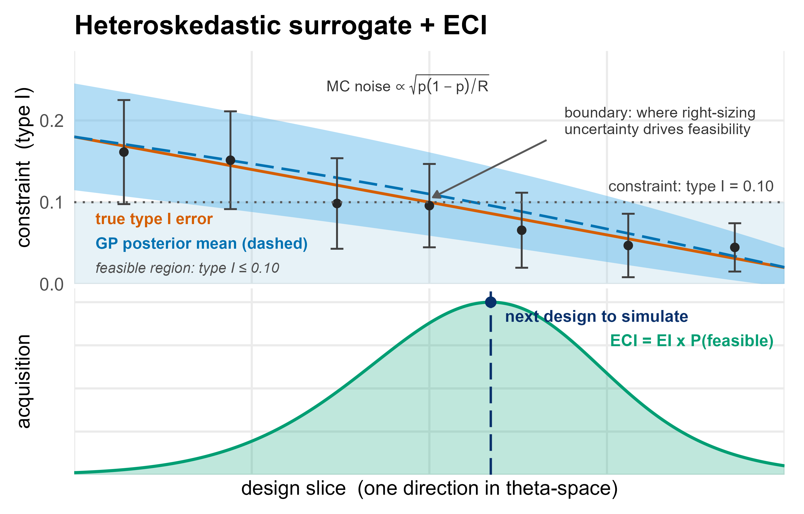
:::
::: {.column width="45%"}

- One GP surrogate per behavior metric (power, type I, expected enrollments).
- **Heteroskedastic** noise model: Monte Carlo variance differs across the space (early-stopping designs give noisier estimates per replication), and hetGP models it rather than assuming it constant.
- Acquisition: **expected constrained improvement**, expected objective gain multiplied by the modeled probability that *every* constraint is satisfied.
- Batched proposals; constraint estimates carry their Monte Carlo standard errors into the model.

:::
:::

::: {.notes}
All three answers below are verified against the BATON source (v0.4.0, the release behind the paper's results; unchanged in v0.8.0 unless noted).

**Q&A pocket:** *How is the incumbent defined under noise?* Best posterior mean, not best observed value: take the evaluated designs whose observed metrics satisfy the constraints, predict the objective surrogate's posterior mean at each, and use the minimum. Feasibility classification is a plug-in on the simulated metrics; the objective value is de-noised through the surrogate. This is the plug-in form of Picheny (2013), and the manuscript states it that way. A best-observed option exists in the code but is not the default and was not used.

**Q&A pocket:** *Constrained EI multiplies marginal feasibility probabilities; power and type I come from the same evaluation. Independence?* Independent surrogates and a product of marginals, deliberately. The noise justification: power and type I are simulated under disjoint scenarios from non-overlapping segments of the RNG stream, so their Monte Carlo errors are independent even though they share an evaluation call. The latent surfaces can still be correlated as functions of the design, the paper says so, and the approximation affects only the search: every reported design is verified by direct simulation, never through the product. (Wording caveat: the supplement says "distinct random seeds"; the code uses consecutive segments of one stream. Independent either way.)

**Q&A pocket:** *Common random numbers?* Not during the search: every evaluation gets its own seed (base seed plus evaluation index), so candidate comparisons carry full independent Monte Carlo noise, and higher-fidelity re-evaluations are independent replicates, which is what the heteroskedastic surrogate's replicate structure wants. The five-seed verification stage does use a shared seed set, so those cross-design comparisons are paired. If pressed on why no CRN in the loop: it was never implemented, not evaluated and rejected; variance control comes from the fidelity ladder and the noise model instead.

**Q&A pocket:** *Isn't plug-in feasibility for the incumbent inconsistent with a smoothed objective?* A real asymmetry, concede it: feasibility of the incumbent set uses observed metrics while its value uses the surrogate mean. Mitigations: the search applies a buffered (tightened) constraint threshold, and no design is reported without high-fidelity multi-seed verification.
:::


## Backup: Simon benchmark, per-scenario {.backup-slide data-menu-title="B2: Simon detail"}

All 12 binary-endpoint benchmark scenarios, BATON vs. the enumerated Simon-optimal design:

| Claim | Value |
|:--|:-:|
| Scenarios where BATON's design is feasible | 12 / 12 |
| Scenarios where BATON returns the exact Simon design | 4 / 12 |
| Median ratio of expected null sample size, BATON / Simon | 1.025 |
| Worst-case ratio | 1.135 |
| Best-case ratio | 1.000 |


Interpretation: on a discrete design lattice many near-optimal designs sit within Monte Carlo resolution of one another; BATON lands on the optimum or a near-neighbor, and never on an infeasible design.


## Backup: the manual-versus-BATON comparison, in full {.backup-slide data-menu-title="B6: Manual vs BATON"}

::: {.columns}
::: {.column width="50%"}
::: {.frame-box}
**Manual tuning (the TNBC cohort)**<br/>
Two weeks of expert effort produced **no feasible design**. The best manual single-arm point reached power 0.78 at an average null enrollment of 39.2: infeasible on power.
:::
:::
::: {.column width="50%"}
::: {.frame-box}
**BATON**<br/>
Found a feasible design (average null enrollment 11.7, power 0.86). Full production workflow about 4 hours wall-clock; a single calibration run under 45 minutes.
:::
:::
:::

::: {.muted style="margin-top: 0.5em;"}
An illustrative single comparison (documented in the paper's web appendix), not a controlled benchmark across analysts. Same simulator, same constraints.
:::


## Backup: what the constraints and parameters actually are {.backup-slide data-menu-title="B3: Parameters"}

::: {.columns}
::: {.column width="50%"}

**Calibrated (searched) parameters, single-arm:**

- maximum enrollment; interim spacing; minimum-events gate before decisions count
- posterior futility threshold; posterior efficacy threshold
- decision margin over the historical benchmark
- analysis-prior concentration; hazard-model resolution (piecewise intervals)

Seamless adds conversion-gate thresholds and second-stage sample-size and stopping parameters (13 total).

:::
::: {.column width="50%"}

**Constraints (headline scenarios):**

- type I error at most the ceiling (0.10 in the scenarios shown)
- power at least the floor (0.80)
- seamless designs add gate-behavior constraints (null conversion rate bounded, alternative conversion rate floored)

**Objectives, by philosophy:** expected null enrollment (H0-Optimal), maximum enrollment (Minimax), weighted blends (Admissible family), expected alternative enrollment (H1-Optimal).

::: {.muted}
Scenario A truths: null median 3.8 months, alternative 9 (hazard ratio 0.42), Weibull shape 1.3, accrual 2 per month; maximum enrollment searched in [30, 120]. Two Simon scenarios use a 0.05 ceiling with 0.90 power.
:::

:::
:::


## Backup: related work and what BATON adds {.backup-slide data-menu-title="B5: Related work"}

::: {.columns}
::: {.column width="50%"}

**Existing approaches**

- **BOP2 / GBOP2** (Zhou; Zhao): grid or particle-swarm search over posterior-probability stopping thresholds; return one design under one criterion.
- **Operating-characteristic acceleration** (Golchi 2022): speeds the estimation, does not optimize the design.
- **Single-objective BO for trial design** (Richter 2022): one objective, without multi-constraint feasibility.
- **gsDesign / rpact / BATSS**: group-sequential and frequentist tooling.

:::
::: {.column width="50%"}

**What BATON adds, jointly in one framework**

1. finds **feasible** designs under **multiple noisy** behavior constraints;
2. models **heteroskedastic** Monte Carlo error;
3. optimizes under **philosophy-specific** sample-size objectives.

It exposes the trade-off surface, and reveals **when philosophies coincide and why**.

:::
:::


## Backup: known failure modes and limits {.backup-slide data-menu-title="B10: Limitations"}

- **Budget exhaustion**: 3 of 10 reproducibility runs used the full 300-evaluation budget rather than stopping early; quote evaluations used, not "convergence."
- **Approximate optimization**: worst benchmark gap 13.5% from the enumerated optimum (single seed); the guarantee is high-fidelity feasibility, not exact optimality.
- **Correlated constraints**: the acquisition multiplies marginal feasibility probabilities; latent surfaces for power and type I error can be correlated. Affects the search only; reported designs are verified directly.
- **No common random numbers in the loop**: candidate comparisons carry full independent Monte Carlo noise; verification uses a shared seed set.
- **One assumed truth per calibration**: every current result conditions on an assumed clinical scenario; robustness across scenarios is BATON-C, in progress.


## Backup: bidirectional stopping variants {.backup-slide data-menu-title="B4: Bidirectional"}

The single-arm and between-arm headline scenarios use futility-only interim stopping (interims can stop for futility; efficacy is decided at the end). The seamless design is calibrated with bidirectional stopping throughout, because its conversion gate is efficacy-driven. The paper's supplement repeats the single-arm and between-arm calibrations with **bidirectional** stopping, where interims may also stop early for efficacy.

- The frontier structure persists, but the philosophies compress: under bidirectional stopping in Scenario A, H0-Optimal and Admissible calibrate to the same maximum enrollment (31), separating only in thresholds.
- Expected enrollment under the alternative drops substantially (early efficacy stopping pays off exactly when the drug works).
- The choice between stopping structures is itself a design decision upstream of the philosophy choice.


## Backup: what I am not arguing {.backup-slide data-menu-title="B7: Not arguing"}

<br/>

::: {.disclaimer}
**Not** that trials are currently miscalibrated. Feasible designs found by hand are feasible. The claim is that the *choice among them* has been invisible.
:::

::: {.disclaimer}
**Not** that one philosophy is right. H0-Optimal and Minimax encode different, legitimate priorities. The method is deliberately neutral among them.
:::

::: {.disclaimer}
**Not** that optimization replaces statisticians. It replaces the *grid search* part of their month, not the judgment part.
:::

::: {.notes}
**Delivery:** Read all three plainly and move. This slide exists to disarm the likeliest hostile readings before Part 2.
:::


## Backup: ten seeds, one design {.backup-slide data-menu-title="B8: Reproducibility"}

::: {.columns style="align-items: center;"}
::: {.column width="50%"}

The whole pipeline, rerun end to end at ten independent random seeds:

| | |
|:--|:-:|
| Runs returning a feasible design | **10 / 10** |
| Runs returning Simon's exact optimal design | **8 / 10** |
| Expected null enrollment, mean (spread) | **17.77** (0.06) |
| Evaluations used, median | 250 of a 300 budget |

:::
::: {.column width="50%"}

::: {.note-box .fragment}
The other two seeds return a near-neighbor design (capacity 29 instead of 25) whose expected enrollment differs by 0.15 patients. What reproduces is the design's behavior, and usually the design itself.
:::

::: {.landing}
For a method meant to sit inside regulatory submissions, this is not a nicety. It is what regulatory credibility requires.
:::

:::
:::

::: {.notes}
**Pull-from-if-needed:** Expected null enrollment takes two values across the ten seeds: 17.74 in eight runs and 17.89 in two. Simon's exact optimum for this scenario (response rates 0.20 versus 0.40) is 17.74, so the modal BATON design IS the Simon optimum, a 0.2% simulated gap. Three of ten runs used the full 300-evaluation budget; quote evaluations used, never "convergence." Continuous thresholds vary across seeds (futility 0.09 to 0.26) while mapping onto the same integer stopping boundaries: the behavior surface is piecewise constant in the thresholds, which is why behavior reproduces exactly.

**Q&A pocket:** *Do all ten seeds return the identical parameter vector?* No, and say so plainly: eight of ten return the identical vector, which is Simon's optimum; two return capacity 29 instead of 25. The design vector is the contract with sites and budget, so the honest claim is "one of two designs, the modal one exactly optimal," not "one design, always."

**Delivery:** Fast slide. The 8-of-10-exactly-Simon line is the only number to say aloud.
:::


## Backup: the randomized-cohort frontier {.backup-slide data-menu-title="B9: Randomized frontier"}

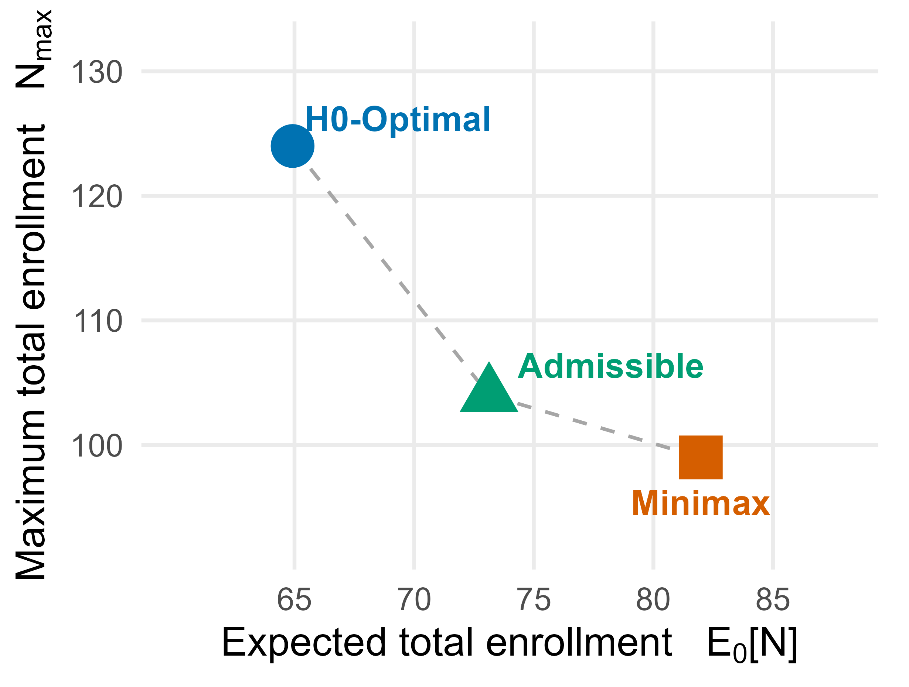

::: {.landing}
Cutting the worst-case cap from 124 to 104 costs about 8 extra patients on average when the treatment does not help; the next 5 cost about 9 more.
:::
