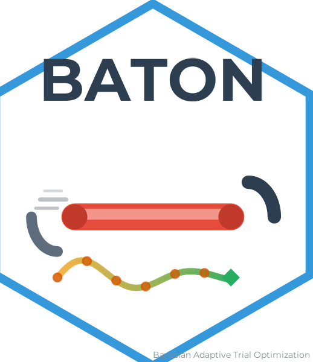
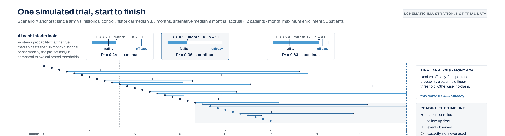
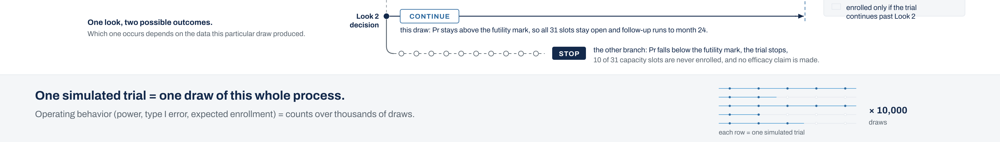
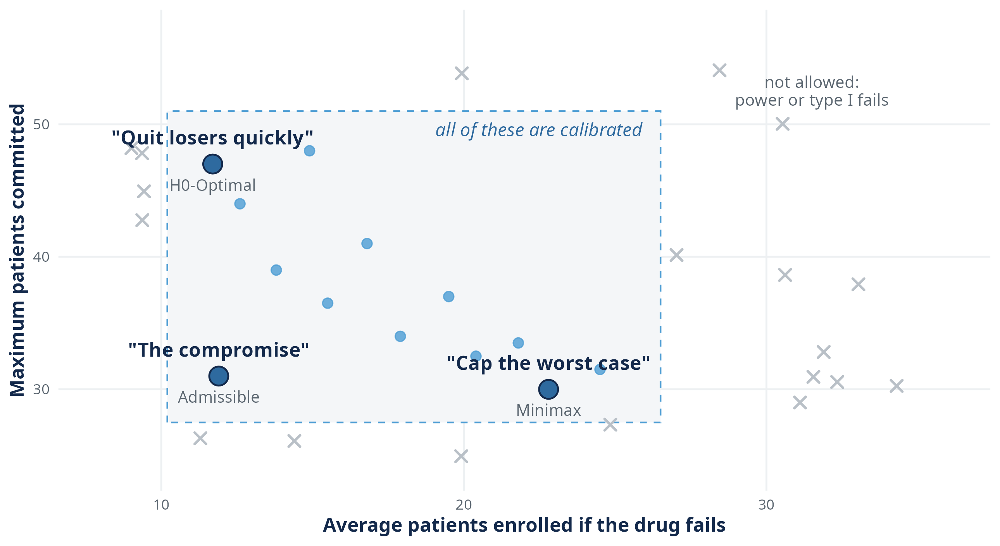
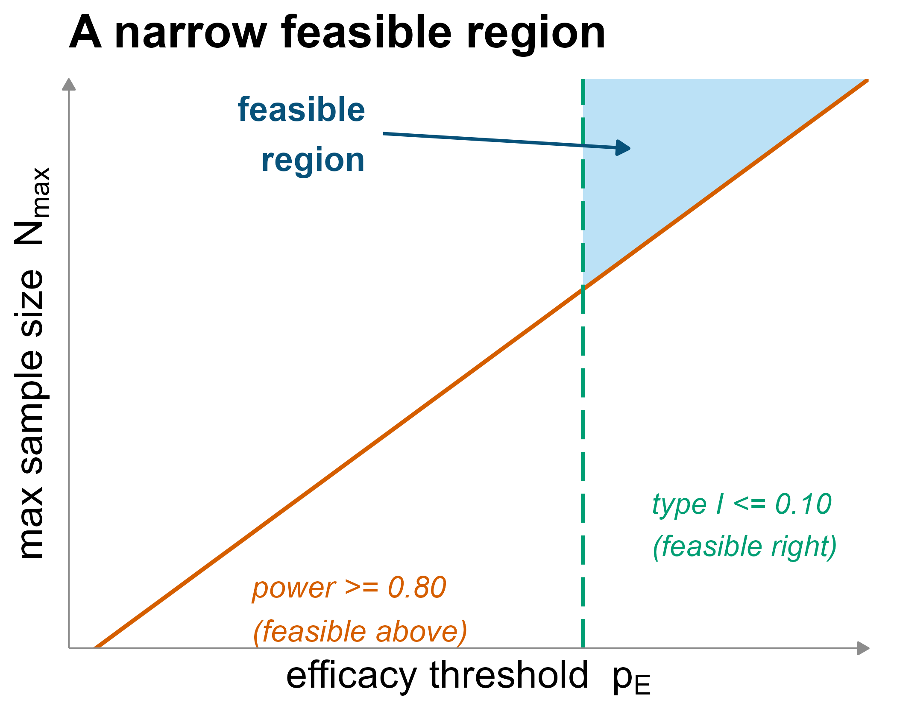
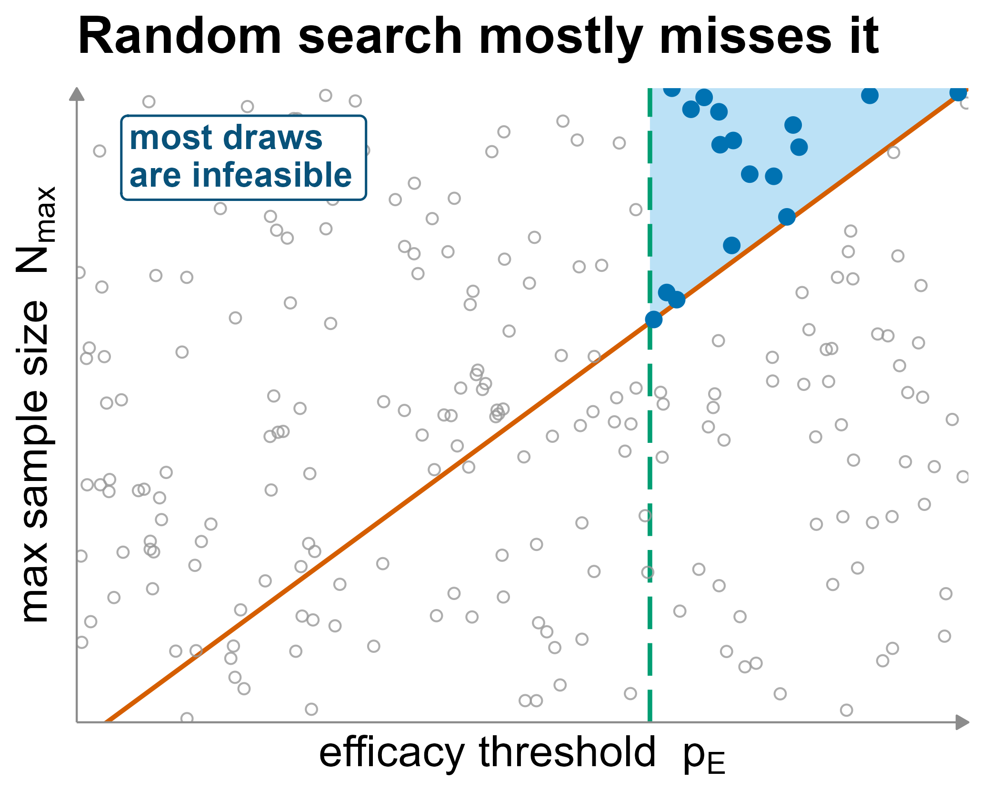
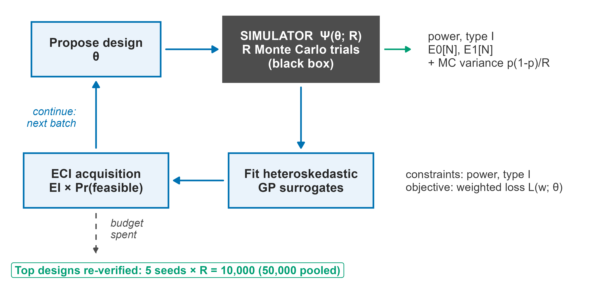
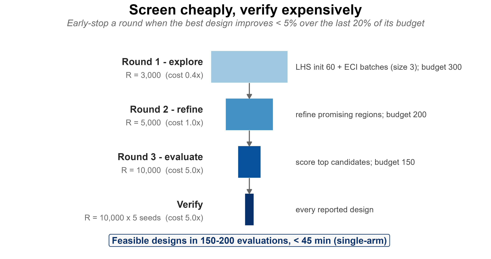
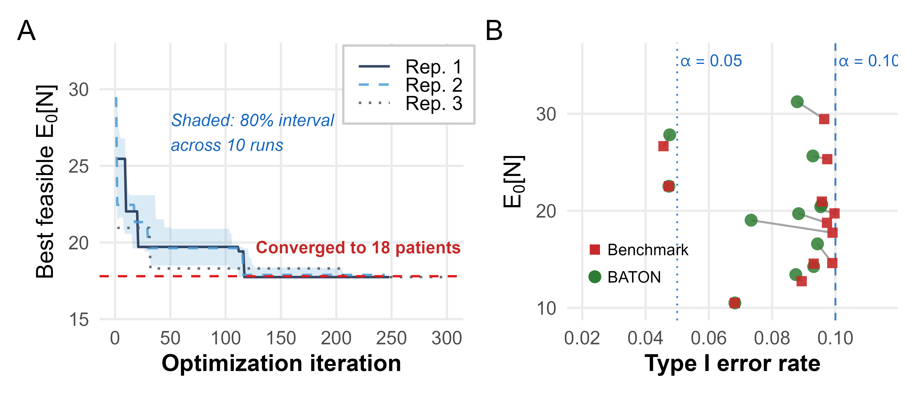

## {.title-slide-custom data-menu-title="Title" data-state="hide-footer"}

::: {style="text-align: center; margin-top: 1.6em;"}



<h1 class="ts-title">Calibration Is a Choice</h1>

<p class="ts-subtitle">Constrained Bayesian optimization for adaptive clinical trial design, and the frontier hiding behind the word "calibrated"</p>

<p class="ts-author">Naim Rashid</p>
<p class="ts-affil">Department of Biostatistics · Lineberger Comprehensive Cancer Center · UNC Chapel Hill</p>

<p class="ts-meta">Computational Medicine Seminar · UNC Chapel Hill · September 4, 2026</p>

:::

::: {.notes}
**Pull-from-if-needed:** BATON = Bayesian Adaptive Trial Optimization Networks; the JASA manuscript is submitted; the package is public. Same room as the RIF talk in January, so some faces know the conformal work.

**Delivery:** Do not introduce the lab. Open cold on the next slide.
:::


## This talk exists because of one trial program {data-menu-title="The program"}


::: {.landing}
**EVOLVE**, the breast cancer platform trial of the ARPA-H ADAPT program: one master protocol that repeatedly opens biomarker-defined subtrials, **10 to 15 over its life, each needing its own design**. One of those design jobs took two weeks by hand and failed. The same problem later took 45 minutes. This talk is about what changed.
:::

::: {.notes}
**Pull-from-if-needed:** ARPA-H ADAPT, breast cancer, biomarker-driven subtrials; the platform motivated everything, but the method is general. Each cohort differs in prevalence, endpoint behavior, and available control data, so a design calibrated for one cohort routinely violates the requirements in another: that is why the design job recurs and cannot be copied forward.

**Q&A pocket:** *Why not calibrate once and reuse?* Because each cohort differs in prevalence, endpoint behavior, and available control data; a design calibrated for one cohort routinely violates constraints in another.

**Delivery:** Thirty seconds. Name the program, land the two-weeks-versus-45-minutes hook, and promise the story for the end. Then the cold open is two designs for THIS program's first cohort.
:::


## Two designs. Both correct. {data-menu-title="Cold open"}

The platform's triple-negative breast cancer cohort: one arm, judged against a historical control (a survival benchmark from prior studies; there is no concurrent control arm). Two candidate designs, same requirements: **power at least 0.80, type I error at most 0.10**.

<br/>

|  | Design 1 | Design 2 |
|:--|:-:|:-:|
| Maximum patients the trial may enroll | **47** | **30** |
| Average patients enrolled *when the drug does not work* | **11.7** | **22.8** |
| Power *(chance of a go when the drug works)* | 0.86 | 0.94 |
| Type I error *(chance of a false go)* | 0.001 | 0.021 |

<br/>

::: {.landing .fragment}
Both are calibrated. Which one is *the* calibrated design?
:::

::: {.notes}
**Pull-from-if-needed:** Scenario A from the paper, futility-only stopping. Design 1 is H0-Optimal, Design 2 is Minimax, but do not name them yet; the names arrive in Part 1. Values from `philosophy_comparison_heritage.csv`, main rows.

**Q&A pocket:** *Why is average enrollment under the null the number to care about?* Because most experimental oncology drugs do not work; the ethical cost center is patients enrolled onto an ineffective therapy, and a design that stops early under the null protects them.

**Delivery:** Let the room sit with the question. If someone answers confidently, that is the talk working: whatever they picked, they just expressed a philosophy. Say so and move.
:::


## The claim I want you to leave with {data-menu-title="Thesis"}

<br/><br/>

::: {.thesis-line}
Calibrating an adaptive trial does not have one answer. It has a frontier of feasible answers, and nearly every trial picks its point on that frontier without ever seeing the alternatives.
:::

<br/>

::: {.fragment}
BATON does three things about that:

1. **Finds** feasible designs automatically, in a space where feasibility cannot be written down.
2. **Optimizes** within the feasible set, under an objective you choose deliberately.
3. **Names the choice**, so the trade-off is made by investigators, not by default.
:::

::: {.notes}
**Delivery:** This exact sentence returns verbatim on the second-to-last slide. Read it slowly once, then paraphrase while the fragments build.
:::


## {.section-divider data-state="hide-footer" data-background-color="#13294B" data-menu-title="Part 1: The choice"}

::: {.divider-inner}
::: {.divider-kicker}
Part 1
:::
::: {.divider-rule}
:::
::: {.divider-title}
Two designs, both correct
:::
::: {.divider-question}
What does "calibrated" actually fail to pin down?
:::
:::


## Trials are built around two mistakes {data-menu-title="Two mistakes"}

A trial exists to earn one decision, with error guarantees agreed **before patient one enrolls**: does this treatment work well enough to act on?

<br/>

|  | The drug works | The drug does not work |
|:--|:--|:--|
| **Trial says go** | Correct *(power: chance of this)* | **False go** *(type I error)* |
| **Trial says stop** | **Missed winner** *(type II error)* | Correct |

<br/>

::: {.landing .fragment}
Regulators cap the false-go rate (0.05 for confirmatory trials; 0.10 for screening trials like ours). Power at least 0.80 is your own insurance against killing a winner.
:::

::: {.notes}
**Pull-from-if-needed:** The false-go cap protects patients and payers from ineffective drugs reaching practice; the power floor protects the sponsor and the patients in the trial from a winner dying by underpowered design. Confirmatory convention is 0.05 two-sided (equivalently 0.025 one-sided); ICH E9, the international statistical-principles guideline, is the canonical statement. Screening-phase II designs, including the ones in this talk, conventionally run at 0.10 because a false go there costs a follow-up trial, not an approval.

**Q&A pocket:** *Why 0.80 power and not more?* Convention balancing cost: 0.90 is common when the sponsor can afford it; each step up buys fewer misses at a steep sample-size price.

**Delivery:** If the room is visibly stat-fluent, this slide and the next compress to 60 seconds total. Do not skip them: the constraints slide later leans on this framing.
:::


## For a traditional trial, design means solving one equation for N {data-menu-title="One equation, one unknown"}

You prespecify three things:

1. **The effect size you assume**: how big a benefit you are designing to detect
2. **The type I ceiling**: the false-go rate you will tolerate
3. **The power floor**: the minimum probability of detecting a real effect

A closed-form formula then hands you the fourth: **the minimum sample size N**. Every statistics package solves it in a millisecond.

::: {.note-box .fragment}
The knobs move as you would expect: assume a smaller effect, N grows fast; tighten the ceiling or raise the floor, N grows. The assumed effect size is a *guess*, and the whole design conditions on it.
:::

::: {.landing .fragment}
One equation, one unknown. Hold that thought.
:::

::: {.notes}
**Pull-from-if-needed:** For a two-arm comparison of means, N per arm scales like $2(z_{\alpha/2}+z_{\beta})^2 \sigma^2 / \delta^2$: halve the assumed effect and N quadruples. The effect size is usually pitched at the minimal clinically important difference, and disagreement about it is where most design meetings are actually spent.

**Q&A pocket:** *Who checks the assumed effect size?* Nobody can, before the trial: it is a modeling commitment, reviewed by regulators and funders for plausibility. That vulnerability is exactly what BATON-C, at the end of the talk, is built to handle for the adaptive case.

**Delivery:** The landing line is a setup: the next slide breaks the "one unknown" and the one after breaks the "one equation."
:::


## Adaptive means acting on accumulating data, by rules fixed in advance {data-menu-title="Fixed vs adaptive"}


::: {.landing .fragment}
The adaptive version has more knobs, and every knob changes how the trial behaves. (Schematic; our designs check futility at the looks and decide efficacy at the end.)
:::

::: {.notes}
**Pull-from-if-needed:** Adaptive designs buy their efficiency here: stopping early when the treatment looks futile is what pulls average enrollment under the null down to the 11.7 in the opening table. The looks are prespecified, which is why frequentist error rates remain computable at all.

**Delivery:** This is the slide that makes "adaptive" concrete for anyone who has never seen a trial. Point at a LOOK diamond and say aloud what happens there. Twenty to thirty seconds.
:::


## A trial design is a point in an 8-dimensional space {data-menu-title="Design as a vector"}

::: {.columns style="align-items: center;"}
::: {.column width="52%"}

An adaptive trial is specified by numbers like:

- **Maximum enrollment**: the most patients it may ever take
- **First interim look**: when we first check the data
- **Stopping thresholds**: how much evidence of failing (futility) or working (efficacy) stops it early
- **Decision margin**: how much better than control counts as "working"

[...plus four more: interim spacing, an events gate, prior strength, model resolution. Eight in all.]{.muted}

Change any one, and the trial *behaves differently*.

:::
::: {.column width="48%"}

::: {.frame-box .fragment}
**"Behaves differently" means:**

- power
- type I error
- expected patients enrolled, under the null and under the alternative
- probability of stopping early
:::

::: {.landing .fragment}
The design is the input. The behavior is the output. The mapping between them is the whole problem.
:::

:::
:::

::: {.notes}
**Pull-from-if-needed:** The single-arm design has 8 free parameters; the seamless two-stage design reaches 13. The Bayesian monitoring rule uses posterior probability thresholds (p_E, p_F) against a historical or concurrent control.

**Q&A pocket:** *Bayesian trial, frequentist error rates: which is it?* The monitoring rule is Bayesian (posterior probabilities drive stopping), but regulators require frequentist behavior (type I, power) demonstrated by simulation. Calibration is exactly the job of making a Bayesian rule satisfy frequentist requirements.

**Delivery:** "Behaves differently" is the phrase to lean on; the room will map input-to-output onto their own black-box problems immediately.
:::


## The mapping from design to behavior has no formula {data-menu-title="Why simulation"}

For a fixed-sample trial, power is a closed-form calculation. Every biostatistics student does it on a whiteboard.

For an adaptive trial, the design's behavior depends on **every interim decision interacting with every other**:

- an early futility look changes who survives to the later looks
- the decision margin changes the futility look's behavior
- enrollment speed changes what data each look sees (survival endpoint: data maturity depends on calendar time, not just patient count)

::: {.note-box .fragment}
The only general way to learn how a candidate design behaves is to **simulate the trial thousands of times** and count what happened.
:::

::: {.landing .fragment}
So evaluating *one* point in design space costs thousands of simulated trials.
:::

::: {.notes}
**Pull-from-if-needed:** At production fidelity we use up to 10,000 replications per design evaluation; one evaluation takes seconds to minutes depending on the design family, and the survival-endpoint simulators are the slow ones.

**Q&A pocket:** *Is simulating error rates acceptable to regulators?* It is the expectation, not a workaround: FDA's 2019 adaptive-designs guidance treats simulation as the way to demonstrate type I control and estimate power for designs too complex for closed forms.

**Pull-from-if-needed:** A concrete run, if the room wants one: patients accrue at about 2 per month; at each interim the model computes the posterior probability that the survival median beats the historical benchmark by the margin; if that probability falls below the futility threshold the trial stops; at the end, efficacy is declared if the posterior clears the efficacy threshold. One simulated trial is one draw of that whole process, and behavior metrics are counts over thousands of draws.

**Delivery:** This is the slide that converts trial design into their language: an expensive, noisy oracle. Say those words explicitly.
:::


## Every number in this talk is a tally over thousands of these {data-menu-title="One simulated trial"}



::: {.fragment}

:::

::: {.notes}
**Pull-from-if-needed:** Anchors are the real Scenario A configuration: historical median 3.8 months, alternative 9 months, accrual about 2 per month. The gauges show the posterior probability that the true median beats the historical benchmark by the margin, checked against the two calibrated thresholds. The figure is labeled a schematic; the probabilities drawn on it are illustrative, not simulation output.

**Delivery:** Say it before they squint: "This is what one simulated trial actually looks like. You do not need to read every detail." Then walk it left to right once: accrual, look, gauge, branch. The next slide is the important part; do not let this one run long.
:::


## Count the draws, and you have the opening table {data-menu-title="Tally strip"}


::: {.notes}
**Pull-from-if-needed:** These are Design 1's real verified numbers (power 0.863, type I 0.0013, expected null enrollment 11.66); the little square rows are illustrative samples drawn to scale. This is the moment the cold-open table stops being on faith: every number in it was a count like this.

**Delivery:** "THIS is the important part: run that thousands of times and count the outcomes." Fifteen seconds. Point at the fails row: "thirteen false go-aheads in ten thousand imaginary trials; that is where 0.001 came from."
:::


## "Calibrated" means constraints are met. Constraints do not pick a design. {data-menu-title="Feasibility"}

::: {.columns style="align-items: center;"}
::: {.column width="50%"}

**What regulators and review boards require:**

- Type I error at most a ceiling (0.10 here: a screening-phase bar for go/no-go subtrials, set per trial by its decision context)
- Power at least a floor (here 0.80)

A design meeting these is **feasible**. Calibration, as usually practiced, stops here.

:::
::: {.column width="50%"}

::: {.fragment}
**What the requirements never mention:**

- how many patients the trial risks at maximum
- how many patients it wastes when the drug fails
- how fast it reaches an answer

::: {.landing}
Feasibility is a *region*, not a point. Everything inside it is "calibrated."
:::
:::

:::
:::

<br/>

::: {.thesis-line .fragment}
The cold-open designs are both inside the region. They differ on everything the requirements do not mention.
:::

::: {.notes}
**Q&A pocket:** *Isn't power an objective?* No, and this matters: power enters as a constraint. Both cold-open designs clear 0.80; one happens to have 0.94. We never maximize power, we satisfy it, and spend the remaining freedom on patient-facing quantities.

**Q&A pocket:** *Type I at 0.10 sounds loose.* These are non-registrational screening subtrials; a confirmatory trial would carry a confirmatory ceiling. And type I here is calibrated at an assumed null configuration (null median 3.8 months), which is standard trial-simulation practice; making the design robust to that assumption being wrong is exactly BATON-C, at the end of the talk.

**Delivery:** This is the conceptual hinge of Part 1. Slow down.
:::


## Naming points on the frontier: design philosophies {data-menu-title="Philosophies"}



::: {.landing}
**Quit losers quickly** (H0-Optimal): fewest patients wasted when the drug fails. **Cap the worst case** (Minimax): smallest maximum commitment. **The compromise** (Admissible): a weighted blend. Classical two-stage designs have carried the formal names since the 1980s; BATON extends them to spaces where no table of designs exists.
:::

::: {.notes}
**Pull-from-if-needed:** Simon (1989) tabulated optimal and minimax two-stage designs for binary endpoints; Jung et al. formalized admissible designs as the weighted frontier between them. Our contribution is making these philosophies *searchable* in 8-to-13-parameter Bayesian adaptive spaces where enumeration is impossible. In the framework each philosophy is one weighted loss. Sweeping the weight traces the convex part of the frontier (a weighted sum cannot reach non-convex notches), so the named philosophies are anchor points, not a claim to enumerate the whole front.

**Q&A pocket:** *Who chooses the philosophy?* The investigators and the steering committee, explicitly, at design time. The point of the frontier plot is that the choice becomes a documented decision instead of an accident of whichever design the statistician's grid search found first.

**Q&A pocket:** *When is the philosophy chosen?* At design time, fixed in the protocol before any data are seen, the same way a Simon optimal-versus-minimax choice is pre-specified. The frontier plot is what makes that pre-specification an informed one.

**Q&A pocket:** *Why not multi-objective BO (hypervolume methods) and get the whole front in one run?* Fair alternative. We run named scalarizations because each run keeps constraint handling direct and gives a steering committee a legible, pre-registrable objective; a hypervolume-based front is a natural extension, not a rejected one.

**Delivery:** "The frontier is the object; the philosophy is a name for a point on it."
:::


## What I am not arguing {data-menu-title="Not arguing"}

<br/>

::: {.disclaimer}
**Not** that trials are currently miscalibrated. Feasible designs found by hand are feasible. The claim is that the *choice among them* has been invisible.
:::

::: {.disclaimer}
**Not** that one philosophy is right. H0-Optimal and Minimax encode different, legitimate priorities. The method is deliberately neutral among them.
:::

::: {.disclaimer}
**Not** that optimization replaces statisticians. It replaces the *grid search* part of their month, not the judgment part.
:::

::: {.notes}
**Delivery:** Read all three plainly and move. This slide exists to disarm the likeliest hostile readings before Part 2.
:::


## Two problems, stacked {data-menu-title="The search problem"}

<br/>

::: {.frame-box style="max-width: 72%; margin: 0 auto; text-align: center;"}
**Problem 1: find the acceptable region.**<br/>
Out of thousands of possible designs, which satisfy power at least 0.80 and type I error at most 0.10?
:::

::: {style="text-align: center; font-size: 1.3em; color: #5B6670;"}
↓
:::

::: {.frame-box style="max-width: 72%; margin: 0 auto; text-align: center;"}
**Problem 2: choose the trade-off within it.**<br/>
Among the acceptable designs, which philosophy do we want to commit to?
:::

<br/>

::: {.landing .fragment}
Neither problem has a formula. BATON solves both in one search, and Part 2 is how.
:::

::: {.notes}
**Delivery:** Twenty seconds, spoken over the boxes. This is the hinge between "why the problem exists" and "how the search works"; land it and move into the divider.
:::


## {.section-divider data-state="hide-footer" data-background-color="#13294B" data-menu-title="Part 2: The search"}

::: {.divider-inner}
::: {.divider-kicker}
Part 2
:::
::: {.divider-rule}
:::
::: {.divider-title}
Searching a space you cannot write down
:::
::: {.divider-question}
Why can you not just grid search it?
:::
:::


## The feasible region is a thin, curved sliver {data-menu-title="Feasible sliver"}



::: {.landing}
A 2-D cartoon slice of the 8-dimensional space. You cannot write the region down: its boundary is defined by simulation output, estimated with Monte Carlo noise, and it curves through all 8 dimensions at once.
:::

::: {.notes}
**Pull-from-if-needed:** The two constraints fight each other: loosening a futility threshold raises power but inflates type I. The feasible band is where they balance, and its location shifts with every other parameter.

**Delivery:** Say first: "Don't worry about the axes. The only thing to see is that the acceptable designs occupy a small, oddly shaped part of all possible designs." Then, for the optimization people: "a black-box constraint you can only query, noisily, at cost."
:::


## Random search finds the sliver 7% of the time {data-menu-title="Random search"}

::: {.columns style="align-items: center;"}
::: {.column width="55%"}

:::
::: {.column width="45%"}

**2,000 random designs, evaluated by simulation:**

| | |
|:--|:-:|
| Feasible | **136 / 2,000** |
| Feasibility rate | **6.8%** |

<br/>

::: {.landing}
93% of the simulation budget is spent learning that a design is infeasible, and the search still cannot tell you it found the frontier. (One scenario, our prespecified search box: an example, not a universal constant.)
:::

:::
:::

::: {.notes}
**Pull-from-if-needed:** The 2,000-design random search ran 9.3 minutes on the fast binary benchmark simulator; on the production survival simulators the same budget is hours. At a matched 150-evaluation budget in the ablation study, random search found zero feasible designs. Grid search at 150 evaluations reaches best feasible expected enrollment 21.09 versus BATON's 20.56, finding 17 feasible designs to BATON's 110: structured baselines get close on objective value on this cheap problem; the compounding edge is feasibility discovery per evaluation, which is what matters when one evaluation is minutes, not milliseconds.

**Q&A pocket:** *Didn't the 2,000-design random search find 17.75, better than BATON's 17.77 mean?* Different problem and an unvalidated number: that search allowed interim efficacy stopping (a different design class, where Simon's optimum is not the floor), used a different parameter box, and its best point sits about one Monte Carlo standard error inside both constraints and was never re-validated: a selection minimum over 2,000 noisy estimates. The commensurable comparison is internal and comes two slides later: BATON's own space-filling phase plateaus at 19.7 on this problem, and the surrogate phase is what closes the gap.

**Q&A pocket:** *Why not a smarter grid?* A grid fine enough to resolve a curved 8-dimensional band is exponentially large, and the band's location is unknown before you search, so you cannot place the grid where it matters.

**Delivery:** One takeaway, spoken plainly: "So blindly trying designs wastes almost all of our expensive simulations." The 6.8% number is the argument; land it and let the figure do the rest.
:::


## Instead of carpeting the space, the model walks toward the optimum {data-menu-title="Search intuition"}

::: {.columns style="align-items: center;"}
::: {.column width="50%" .fragment}

:::
::: {.column width="50%" .fragment}

:::
:::

::: {.landing .fragment}
Same surface (darker = better design), both find the optimum. One spends its budget everywhere; the other spends it where the model says the next evaluation is worth the most.
:::

::: {.notes}
**Pull-from-if-needed:** Schematic, not simulation output: the surface and both search patterns are drawn to teach the idea (the generating script says so in its header). The measured version of this comparison is the sample-efficiency slide at the end of this part, where the numbers are real: space-filling plateaus at 19.7, the guided phase reaches Simon's optimum.

**Delivery:** Two keypresses: carpet first, let it sit, then the walk, saying "BATON learns from what it has already tried and spends the next simulation where it is most informative." This is the single most intuitive slide in Part 2; if the room has non-optimization people, this is the one that catches them up. Do not quote an evaluations-saved percentage from this slide; it is illustrative.
:::


## BATON closes the loop: simulate, model, decide where to look next {data-menu-title="The BATON loop"}



::: {.landing}
Try a design → simulate what happens → learn from everything tried so far → choose the most useful place to try next. Repeat.
:::

[Formal names for those steps: candidate proposal · Monte Carlo simulator · Gaussian-process surrogate (a fast emulator of the simulator) · feasibility-aware acquisition. Active learning, aimed at trial designs.]{.muted style="display: block; text-align: center;"}

::: {.notes}
**Pull-from-if-needed:** Acquisition is expected constrained improvement: expected improvement in the objective multiplied by the modeled probability of satisfying every constraint. Surrogates are heteroskedastic GPs (hetGP) because Monte Carlo noise varies over the space: designs that stop early have noisier operating-characteristic estimates at fixed replication count.

**Delivery:** This is a GP-literate room: name the components once, do not teach them. Full machinery lives in the backup slides if asked.
:::


## Three ingredients, one slide {data-menu-title="Ingredients"}

<br/>

| Ingredient | What it does | Why it is needed here |
|:--|:--|:--|
| **Surrogate model** | Gaussian process predicts each behavior metric, with uncertainty, from every design simulated so far | Recycles simulations too expensive to waste |
| **Feasibility-aware acquisition** | Next design maximizes expected gain *times* probability of meeting every constraint | Draws the search toward the boundary, where the frontier lives |
| **Multi-fidelity ladder** | Cheap, noisy simulations first; promising candidates earn high-replication runs | Most candidates are bad; discover that cheaply |

<br/>

::: {.landing}
These are familiar computational ideas. The novelty is the assembly: constraints as first-class citizens, and the frontier, not a single optimum, as the deliverable.
:::

::: {.notes}
**Q&A pocket:** *How do you trust a design picked by an optimizer over noisy simulation?* Winner's-curse protection is built in: the final design is re-verified at high fidelity across multiple independent seeds before it is reported, and reported operating characteristics come from that verification, not from the search. Verification also reports multi-seed means with an upper confidence bound on type I error: for the seamless headline designs the worst mean is 0.084 with an upper bound near 0.087 against the 0.10 ceiling, and 100% strict feasibility across seeds.

**Delivery:** The last line matters more than the table. This is where methodological credit is claimed, modestly.

**Pull-from-if-needed:** In BO-community terms: constrained expected improvement with heteroskedastic Gaussian processes and a multi-fidelity schedule, applied to a trial simulator rather than a training run.

**Delivery:** This table is the loop slide restated in fixed form. Forty-five seconds; do not re-teach it.
:::


## The fidelity ladder spends simulation where it matters {data-menu-title="Fidelity ladder"}



::: {.landing}
Cheap screening for the many, expensive certainty for the few, and independent re-verification for the one design you report.
:::

::: {.notes}
**Pull-from-if-needed:** Fidelity levels in production: thousands of replications at the low rung up to 10,000 at verification. The verification stage exists because the best *estimated* design is optimistically biased; re-simulating at fresh seeds removes the selection bias from the reported numbers.

**Q&A pocket:** *Does the ladder actually help?* On the cheap binary benchmark, no: the ablation shows full-fidelity BATON doing as well or better, and the all-low-fidelity variant doing worse. Concede that plainly. The ladder's case is arithmetic on the expensive simulators, where a high-fidelity evaluation costs minutes and screening at that price is what you cannot afford.

**Delivery:** 20 seconds. The verification stamp on the figure is the detail to point at, it answers a question before it is asked.
:::


## The first 100 evaluations are random search. Then the model takes over. {data-menu-title="Sample efficiency"}

[Benchmark: **Simon two-stage designs**, a classical problem small enough to enumerate every possible design, so the exact optimum is known. A unit test with a known answer.]{.muted}


::: {.landing}
Ten runs on this benchmark. The space-filling phase plateaus at 19.7 patients; the surrogate-guided phase closes the gap, and 8 of 10 runs land on Simon's exact optimal design.
:::

::: {.notes}
**Pull-from-if-needed:** Evaluations 1 to 100 are the Latin hypercube initial design: literally space-filling random search over the same box, same simulator, same fidelities, so the comparison is internal and exactly commensurable. Between evaluation 50 and 100 the plateau improves by 0.05 patients. The two runs that do not land on the optimum land on the next admissible design (17.89). Trajectory endpoints match the independent 10,000-replication validation exactly because the binary benchmark computes behavior by exact binomial calculation, so these curves carry no winner's-curse bias. X-axis is design evaluations, not simulated trials: per-evaluation replication counts were not stored.

**Delivery:** This is the plot the optimization people in the room have been waiting for. Point at the plateau, then the drop. One sentence: "the model is what crosses that gap."
:::


## {.section-divider data-state="hide-footer" data-background-color="#13294B" data-menu-title="Part 3: The frontier"}

::: {.divider-inner}
::: {.divider-kicker}
Part 3
:::
::: {.divider-rule}
:::
::: {.divider-title}
What the frontier looks like
:::
::: {.divider-question}
What do you see once you can find the whole frontier?
:::
:::


## Scenario A: the cold open, resolved {data-menu-title="Scenario A"}

::: {.columns style="align-items: center;"}
::: {.column width="53%"}

:::
::: {.column width="47%"}

[Triple-negative breast cancer, single arm vs. historical control]{.muted}

| Design | Max N | Avg. N if drug fails | Power | Type I |
|:--|:-:|:-:|:-:|:-:|
| **H0-Optimal** | 47 | 11.7 | 0.86 | 0.001 |
| **Admissible** | 31 | 11.9 | 0.84 | 0.022 |
| **Minimax** | 30 | 22.8 | 0.94 | 0.021 |

::: {.muted}
All three clear the same power floor and type I ceiling. Power *varies* because it is a constraint, not the objective.
:::

::: {.landing}
The surprise is the third row: Admissible nearly matches H0-Optimal's enrollment at nearly Minimax's cap.
:::

:::
:::

::: {.notes}
**Pull-from-if-needed:** Admissible here is the balanced 50/50 weighting between expected null enrollment and maximum enrollment. Its existence at (31, 11.9) is exactly the kind of point a manual search never finds: it dominates neither named philosophy but nearly matches both.

**Q&A pocket:** *Why does H0-Optimal need 47 patients of capacity to enroll 11.7 on average?* The large cap buys aggressive early stopping: the design can afford a big trial precisely because it almost never runs it to the end under the null.

**Q&A pocket:** *Type I 0.001 against a 0.10 ceiling: is that constraint doing anything?* For this design, no: the binding constraint is power, and aggressive futility stopping suppresses false positives as a byproduct. At verification fidelity, 0.001 carries a Monte Carlo standard error near 0.0003, so say "about one in a thousand," not a precise number.

**Q&A pocket:** *Is N_max = 47 a search-box artifact?* No: the box allowed maximum enrollment up to 120, so 47 is interior. The objective is nearly flat in capacity there (47 versus 31 capacity differs by 0.2 expected patients), so treat 47 as a point on a plateau, not a sharp optimum. Related honesty: against Admissible, Minimax pays about 11 expected patients to save one unit of capacity on this scenario; the framework prices philosophies, it does not defend them.

**Delivery:** Callback moment. Put the two cold-open columns back up verbally, then reveal the third row as the payoff of seeing the whole frontier.
:::


## The same structure appears in a randomized comparison {data-menu-title="Scenario B"}

::: {.columns style="align-items: center;"}
::: {.column width="53%"}

:::
::: {.column width="47%"}

[ER-positive cohort, doublet vs. triplet therapy, 1:1 randomization]{.muted}

| Design | Max N | Avg. N if drug fails | Power | Type I |
|:--|:-:|:-:|:-:|:-:|
| **H0-Optimal** | 124 | 64.9 | 0.82 | 0.081 |
| **Admissible** | 104 | 73.1 | 0.81 | 0.087 |
| **Minimax** | 99 | 82.0 | 0.81 | 0.094 |

::: {.landing}
Cutting the worst-case cap from 124 to 104 costs about 8 extra patients on average when the treatment does not help; cutting it 5 further costs about 9 more. That price schedule *is* the design decision.
:::

:::
:::

::: {.notes}
**Pull-from-if-needed:** 8 free parameters, like the single-arm design (the margin becomes a hazard-ratio margin); survival endpoint; the doublet-vs-triplet comparison is a real cohort question in our platform. Price legs: H0-Optimal to Admissible trades 20 capacity for 8.2 expected patients (0.41 per unit); Admissible to Minimax trades 5 for 8.9 (1.77 per unit). The marginal price more than quadruples.

**Delivery:** One idea only: the price schedule. Steering committees can argue about a price; they cannot argue with a single take-it-or-leave-it design. If running long, cut this slide and speak the price sentence over Scenario A instead.
:::


## Richer designs, bigger spaces: 8 parameters becomes 13 {data-menu-title="Design types bridge"}


::: {.landing}
The seamless design starts single-arm and *converts* to a randomized trial mid-stream if an interim gate passes: screen cheaply, then demand randomized evidence from promising cohorts. Thirteen coupled parameters: past what hand calibration can navigate at all.
:::

::: {.notes}
**Pull-from-if-needed:** The conversion gate is efficacy-driven: promising single-arm evidence triggers randomized expansion. Seamless adds gate thresholds, second-stage sample sizes, and second-stage stopping rules on top of the single-arm block, hence 13.

**Delivery:** Bridge slide, 20 seconds, sets up the collapse result next.
:::


## In the seamless design, two philosophies collapse into one {data-menu-title="Seamless collapse"}

[Two philosophies not yet shown appear here: **H1-Optimal** (fewest patients when the drug works) and **Balanced** (weights enrollment under both truths equally).]{.muted}


::: {.landing}
Minimax and Admissible calibrate to the **identical 13-parameter design**: not nearby designs, the same point. No manual search would ever notice this, because no manual search sees the frontier.
:::

::: {.notes}
**Pull-from-if-needed:** Both land at max N = 108, expected null enrollment 87.58, byte-identical in the results file. The other three philosophies stay distinct (H0-Optimal 150/80.0, Balanced 148/85.6, H1-Optimal 176/80.3).

**Q&A pocket:** *Could the collapse be a lattice or shared-initialization artifact?* The two calibrations return identical vectors, the identity survives independent 5-seed high-fidelity re-verification (identical operating characteristics, 100% strict feasibility), and the gate mechanism predicts the degeneracy. The precise claim: at the resolution of this search the two optima are indistinguishable, and the returned designs are identical.

**Delivery:** Pause on "the same point." The next slide explains why, and the explanation is the deepest scientific payoff in the talk.
:::


## The collapse has a mechanism: the conversion gate {data-menu-title="Conversion gate"}


::: {.landing}
Three steps: **(1)** when the drug fails, only ~4% of trials pass the gate into the randomized stage (versus ~60% when it works); **(2)** so average enrollment under failure is almost entirely stage one; **(3)** the compromise objective goes numb to stage two and lands on the same design Minimax picks.
:::

::: {.notes}
**Pull-from-if-needed:** P(convert | null) = 0.038, P(convert | alternative) = 0.604 for the minimax/admissible design. The gate acts as an economic firewall: the null cost of the trial barely depends on the second stage at all, which decouples the two objectives the Admissible loss was built to trade off.

**Q&A pocket:** *Is the collapse an artifact of the optimizer?* No: it replicates across independent calibration runs, and the mechanism (gate decoupling) predicts it. It is a property of the design space under these constraints.

**Delivery:** This is the "optimization as a scientific instrument" moment: the search did not just find designs, it surfaced a structural fact about seamless trials. Say that sentence.
:::


## Sanity check: on a solved problem, BATON agrees with the solution {data-menu-title="Simon benchmark"}



::: {.landing}
The same known-answer unit test, now across **12 different benchmark scenarios** (one calibration each; the 8-of-10 figure earlier was ten repeats of one scenario). A feasible design in all 12; average sample size within **2.5%** of the Simon optimum at the median, 13.5% at the worst; the exact Simon design in 4.
:::

::: {.notes}
**Pull-from-if-needed:** Numbers are deliberately stated in full: 12/12 feasible, median E[N] ratio 1.025, max 1.135, exact design match 4/12. Do NOT compress this to "recovers the optimum." Separately, on one scenario, ten seeded runs give E[N] = 17.77 (sd 0.06) against Simon's 17.75, a 0.1% gap, and all ten runs are feasible: that is the reproducibility claim, and it is a different claim from the 12-scenario claim.

**Q&A pocket:** *What happens in the 8 non-matching scenarios?* BATON returns a different feasible design whose expected sample size is slightly above Simon's optimum; the gap distribution is the median/worst figure quoted. On a discrete lattice, many near-optimal designs sit within Monte Carlo noise of each other.

**Pull-from-if-needed:** Seed accounting: the 12-scenario benchmark is one calibration per scenario, so the 13.5% worst case is a single-seed result. Rerunning the p0 0.20 scenario at ten seeds returns Simon's exact optimal design (2, 12, 7, 25) in eight of ten. And the worst-case scenario is a Minimax-flavored trade (BATON found a smaller maximum sample size with a larger expected one) that the expected-enrollment ratio does not credit. Backup B2 has the per-scenario picture.

**Delivery:** Understate this slide. The room's respect is won by the 13.5% worst case being said out loud.
:::


## Ten seeds, one design {data-menu-title="Reproducibility"}

::: {.columns style="align-items: center;"}
::: {.column width="50%"}

The whole pipeline, rerun end to end at ten independent random seeds:

| | |
|:--|:-:|
| Runs returning a feasible design | **10 / 10** |
| Runs returning Simon's exact optimal design | **8 / 10** |
| Expected null enrollment, mean (spread) | **17.77** (0.06) |
| Evaluations used, median | 250 of a 300 budget |

:::
::: {.column width="50%"}

::: {.note-box .fragment}
The other two seeds return a near-neighbor design (capacity 29 instead of 25) whose expected enrollment differs by 0.15 patients. What reproduces is the design's behavior, and usually the design itself.
:::

::: {.landing}
For a method meant to sit inside regulatory submissions, this is not a nicety. It is what regulatory credibility requires.
:::

:::
:::

::: {.notes}
**Pull-from-if-needed:** Expected null enrollment takes two values across the ten seeds: 17.74 in eight runs and 17.89 in two. Simon's exact optimum for this scenario (response rates 0.20 versus 0.40) is 17.74, so the modal BATON design IS the Simon optimum, a 0.2% simulated gap. Three of ten runs used the full 300-evaluation budget; quote evaluations used, never "convergence." Continuous thresholds vary across seeds (futility 0.09 to 0.26) while mapping onto the same integer stopping boundaries: the behavior surface is piecewise constant in the thresholds, which is why behavior reproduces exactly.

**Q&A pocket:** *Do all ten seeds return the identical parameter vector?* No, and say so plainly: eight of ten return the identical vector, which is Simon's optimum; two return capacity 29 instead of 25. The design vector is the contract with sites and budget, so the honest claim is "one of two designs, the modal one exactly optimal," not "one design, always."

**Delivery:** Fast slide. The 8-of-10-exactly-Simon line is the only number to say aloud.
:::


## {.section-divider data-state="hide-footer" data-background-color="#13294B" data-menu-title="Part 4: Impact"}

::: {.divider-inner}
::: {.divider-kicker}
Part 4
:::
::: {.divider-rule}
:::
::: {.divider-title}
What it changed
:::
::: {.divider-question}
Did this decide anything real?
:::
:::


## Calibration outputs drove four operational decisions in the platform {data-menu-title="Operational impact"}

::: {.columns}
::: {.column width="50%"}
::: {.frame-box .fragment style="min-height: 4.2em; font-size: 0.82em;"}
**1 · Lock contracted capacity**<br/>
Maximum enrollment is capacity locked **~3 months before first enrollment**; frontier curves let the steering committee weigh budget certainty against patient exposure.
:::
::: {.frame-box .fragment style="min-height: 4.2em; font-size: 0.82em; margin-top: 0.5em;"}
**3 · Plan sequential cohorts**<br/>
Per-cohort enrollment and timeline projections flag resource conflicts across the platform's **10 to 15 sequential subtrials**.
:::
:::
::: {.column width="50%"}
::: {.frame-box .fragment style="min-height: 4.2em; font-size: 0.82em;"}
**2 · Align interim data locks**<br/>
Calibrated event gates and interim spacing set the analysis data-lock windows; the platform's safety board (DSMB) reviews share those locks, the first **within year one**.
:::
::: {.frame-box .fragment style="min-height: 4.2em; font-size: 0.82em; margin-top: 0.5em;"}
**4 · Cut turnaround**<br/>
One illustrative case: two weeks of manual tuning found **no feasible** TNBC design (power stalled at 0.78). BATON, same simulator and constraints, found one at power 0.86 in **under 45 minutes**.
:::
:::
:::

::: {.landing style="margin-top: 0.5em;"}
Box 4 is one case, honestly labeled, and still the one to remember: the manual search ran out of time before finding *feasibility*.
:::

::: {.notes}
**Pull-from-if-needed:** The TNBC case is the cold-open scenario, documented in the paper's web appendix as an illustrative single comparison, not a controlled benchmark across analysts. Same simulator, same constraints. 0.78 against the 0.80 floor is within Monte Carlo noise at moderate replication, so the precise phrasing is "did not find a design it could certify as feasible." If asked for the systematic evidence rather than the anecdote, point back to the 6.8% random-search slide.

**Q&A pocket:** *45 minutes on what hardware?* A single 16-core node; production calibrations batch on our Slurm cluster. The budget in the currency that matters: hundreds of design evaluations, each thousands of simulated trials.

**Delivery:** Build the boxes one at a time, spend the time on box 4.
:::


## What BATON is, in one slide {data-menu-title="Contributions"}

<br/>

1. **A problem formulation**: adaptive-trial calibration as *constrained* optimization over a noisy, expensive simulator, with the feasible frontier as the deliverable.

2. **A working method**: an uncertainty-aware emulator, intelligent selection of the next design to simulate, a cheap-to-expensive simulation ladder, and independent verification of whatever design is reported.

3. **A vocabulary**: design philosophies as named, searchable points on the frontier, so the choice among calibrated designs is made deliberately and on the record.

<br/>

::: {.muted style="text-align: center;"}
Open-source R package · manuscript under review at JASA · powering live subtrial designs in an ARPA-H breast cancer platform program
:::

::: {.notes}
**Delivery:** This is the summary a note-taker photographs. Give it 40 seconds, then shift register: "so where does it go from here."
:::


## {.section-divider data-state="hide-footer" data-background-color="#13294B" data-menu-title="Part 5: Next"}

::: {.divider-inner}
::: {.divider-kicker}
Part 5
:::
::: {.divider-rule}
:::
::: {.divider-title}
Where it goes next
:::
::: {.divider-question}
What does calibration look like when the assumptions, the phase, and the pipeline are all in play?
:::
:::


## Three extensions in progress {data-menu-title="Extensions"}

```{=html}
<!-- Raw HTML on purpose: markdown headings inside these divs get promoted by
     pandoc into nested <section> elements, which reveal.js reads as a vertical
     slide stack and which broke forward navigation. Do not convert back. -->
<div class="ext-grid">
<div class="ext-card fragment">
<h4>BATON-C</h4>
<span class="ext-status">in progress &middot; with Amber Young</span>
<p><strong>Robustness to assumption uncertainty.</strong> Every calibration so far conditions on one assumed truth. BATON-C optimizes over a <em>disclosed family</em> of plausible scenarios, and the family itself becomes part of the record.</p>
</div>
<div class="ext-card fragment">
<h4>BATON-D</h4>
<span class="ext-status">in progress &middot; working name</span>
<p><strong>The phase I equivalent.</strong> Phase I trials choose a dose while capping safety risk. Their designs carry tuning parameters set by convention; BATON-D calibrates them, with constraints on overdose risk and correct-dose selection.</p>
</div>
<div class="ext-card fragment">
<h4>BATON-D, second paper</h4>
<span class="ext-status">scoped</span>
<p><strong>Scoring early phases by what they set up.</strong> Judge a dose-finding design by the <em>downstream trials it feeds</em>: how often they inherit the wrong dose, and what that costs in patients and power.</p>
</div>
</div>
```

::: {.landing .fragment style="margin-top: 0.8em;"}
The through-line: calibration keeps moving upstream: parameters, then assumptions, then the pipeline of trials.
:::

::: {.notes}
**Pull-from-if-needed:** BATON-C implementation exists and is being validated now; describe it as a demonstrable capability, not a validated result. BATON-D covers the BOIN and CRM families among others; interval designs are cheap enough to enumerate, model-based ones are where the optimization earns its keep. The name BATON-D is a working name.

**Q&A pocket:** *Does robust optimization over scenarios just give you the most conservative design?* No: the family is disclosed and finite, and the optimization trades worst-case protection against average-case efficiency explicitly, which is the same frontier logic as the main framework, one level up.

**Q&A pocket:** *Doesn't assumption uncertainty undermine the results from earlier in the talk?* Partially, and the deck says so out loud: every current calibration conditions on an assumed truth, which is standard trial-simulation practice. BATON-C makes the disclosure formal by optimizing over a stated family of truths instead of one.

**Delivery:** Under 90 seconds for the whole slide. These are commitments, not results.
:::


## The larger question: designing early trials to serve later ones {data-menu-title="Information debt"}

<br/>

Phase I picks a dose. Phase II inherits it. The confirmatory trial inherits both, plus every interim decision made along the way.

<br/>

::: {.thesis-line}
Pick a dose on noisy early data and the confirmatory trial inherits the selection effect: a debt of additional independent evidence it must supply before the final claim is supportable. Today we design each phase for its own metrics, and the debt is invisible until the last trial pays it.
:::

<br/>

::: {.fragment}
The second BATON-D paper is the concrete first step: measure, in simulation, how early-phase design choices propagate into confirmatory operating characteristics, then calibrate the early phase *against those*.
:::

::: {.notes}
**Pull-from-if-needed:** This is the information-debt program: the strength of information sharing across phases determines both the quality of intermediate decisions and the cost of reusing the data afterward, and designs are currently selected on the former alone. Longer-term this questions whether discrete phases are the right instrument at all.

**Q&A pocket:** *Isn't this just seamless phase I/II again?* Seamless designs merge adjacent phases operationally. This is different: it keeps the phases but changes what the early one is optimized *for*. You can adopt it without changing trial infrastructure at all.

**Delivery:** This is the intellectual horizon slide, one level of ambition above the deck. Deliver it slower than everything around it, then step back down for the close.
:::


## The claim, again {data-menu-title="Thesis echo"}

<br/><br/><br/>

::: {.thesis-line style="font-size: 1.15em;"}
Calibrating an adaptive trial does not have one answer. It has a frontier of feasible answers, and nearly every trial picks its point on that frontier without ever seeing the alternatives.
:::

<br/>

::: {.landing .fragment}
BATON finds the frontier, and puts the choice where it belongs: on the record, with the investigators.
:::

::: {.notes}
**Delivery:** Verbatim echo of slide 3. Then one concrete action for the room: the package and paper are public; if you have an expensive simulator and constraints you cannot write down, this formulation may already fit your problem.
:::


## Acknowledgments {data-menu-title="Acknowledgments"}

```{=html}
<!-- Raw HTML on purpose: markdown headings inside grid divs get promoted by
     pandoc into nested <section> elements, breaking reveal navigation. -->
<div class="ack-grid">
<div class="ack-col">
<h4>ADAPT program</h4>
<ul>
<li>ARPA-H ADAPT multiple principal investigators</li>
<li>EVOLVE trial steering committee</li>
<li>Clinical collaborators across the platform's sites</li>
</ul>
</div>
<div class="ack-col">
<h4>Statistics</h4>
<ul>
<li><strong>Amber Young</strong> (UNC), who led BATON's design and validation, and co-leads BATON-C</li>
<li><strong>Dinelka Nanayakkara</strong>, ARPA-H statistics group</li>
<li>ARPA-H ADAPT statistics working group</li>
<li>Rashid Lab</li>
</ul>
</div>
<div class="ack-col">
<h4>Funding</h4>
<ul>
<li>ARPA-H 140D042590009</li>
<li>NCI P50-CA257911 (UNC SToP SPORE)</li>
<li>DOD HT9425241103100121</li>
<li>NCI U01-CA274298</li>
</ul>
</div>
</div>
```

::: {.notes}
**Delivery:** Name Amber and Dinelka aloud; the ADAPT MPIs and working group can be gestured at as groups. Keep it under 30 seconds so questions get their time.
:::


## {.section-divider data-state="hide-footer" data-background-color="#13294B" data-menu-title="Questions"}

::: {.divider-inner}
::: {.divider-kicker}
Thank you
:::
::: {.divider-rule}
:::
::: {.divider-title}
Questions
:::
::: {.divider-question}
naim@unc.edu · rashidlab.github.io
:::
:::

::: {.notes}
**Q&A routing index:**
- *Why 0.05, why 0.80, where the conventions come from* -> two-mistakes and one-equation pockets.
- *Bayesian vs frequentist hybrid* -> design-vector slide pocket; feasibility slide pocket.
- *Why expected enrollment under the null* -> cold-open pocket.
- *Type I 0.001, unspent alpha, box edges* -> Scenario A pockets.
- *Type I UCB / trusting a noisy winner* -> ingredients pocket; fidelity backup.
- *GP, acquisition, correlated constraints* -> backup B1 and its [CONFIRM] items.
- *Simon non-matching scenarios, seed accounting* -> Simon pocket; backup B2 figure.
- *Random search "beat" you / sample efficiency* -> random-search pocket; sample-efficiency slide.
- *Ten seeds: identical design or not* -> reproducibility pocket.
- *Seamless collapse an artifact?* -> collapse and conversion-gate pockets.
- *Multi-objective BO instead of philosophies* -> philosophies pocket.
- *When is the philosophy locked* -> philosophies pocket.
- *Assumption uncertainty undermining results* -> extensions pocket.
- *Hardware, runtime* -> operational-impact pocket.
- *Details of the two-weeks-vs-45-minutes story* -> backup B6.

**Delivery:** Leave this slide up for all of Q&A.
:::


## {.section-divider data-state="hide-footer" data-background-color="#13294B" data-menu-title="Backup"}

::: {.divider-inner}
::: {.divider-kicker}
Backup
:::
::: {.divider-rule}
:::
::: {.divider-title}
Reference slides
:::
:::


## Backup: the surrogate and the acquisition {.backup-slide data-menu-title="B1: GP + ECI"}

::: {.columns style="align-items: center;"}
::: {.column width="55%"}

:::
::: {.column width="45%"}

- One GP surrogate per behavior metric (power, type I, expected enrollments).
- **Heteroskedastic** noise model: Monte Carlo variance differs across the space (early-stopping designs give noisier estimates per replication), and hetGP models it rather than assuming it constant.
- Acquisition: **expected constrained improvement**, expected objective gain multiplied by the modeled probability that *every* constraint is satisfied.
- Batched proposals; constraint estimates carry their Monte Carlo standard errors into the model.

:::
:::

::: {.notes}
All three answers below are verified against the BATON source (v0.4.0, the release behind the paper's results; unchanged in v0.8.0 unless noted).

**Q&A pocket:** *How is the incumbent defined under noise?* Best posterior mean, not best observed value: take the evaluated designs whose observed metrics satisfy the constraints, predict the objective surrogate's posterior mean at each, and use the minimum. Feasibility classification is a plug-in on the simulated metrics; the objective value is de-noised through the surrogate. This is the plug-in form of Picheny (2013), and the manuscript states it that way. A best-observed option exists in the code but is not the default and was not used.

**Q&A pocket:** *Constrained EI multiplies marginal feasibility probabilities; power and type I come from the same evaluation. Independence?* Independent surrogates and a product of marginals, deliberately. The noise justification: power and type I are simulated under disjoint scenarios from non-overlapping segments of the RNG stream, so their Monte Carlo errors are independent even though they share an evaluation call. The latent surfaces can still be correlated as functions of the design, the paper says so, and the approximation affects only the search: every reported design is verified by direct simulation, never through the product. (Wording caveat: the supplement says "distinct random seeds"; the code uses consecutive segments of one stream. Independent either way.)

**Q&A pocket:** *Common random numbers?* Not during the search: every evaluation gets its own seed (base seed plus evaluation index), so candidate comparisons carry full independent Monte Carlo noise, and higher-fidelity re-evaluations are independent replicates, which is what the heteroskedastic surrogate's replicate structure wants. The five-seed verification stage does use a shared seed set, so those cross-design comparisons are paired. If pressed on why no CRN in the loop: it was never implemented, not evaluated and rejected; variance control comes from the fidelity ladder and the noise model instead.

**Q&A pocket:** *Isn't plug-in feasibility for the incumbent inconsistent with a smoothed objective?* A real asymmetry, concede it: feasibility of the incumbent set uses observed metrics while its value uses the surrogate mean. Mitigations: the search applies a buffered (tightened) constraint threshold, and no design is reported without high-fidelity multi-seed verification.
:::


## Backup: Simon benchmark, per-scenario {.backup-slide data-menu-title="B2: Simon detail"}

All 12 binary-endpoint benchmark scenarios, BATON vs. the enumerated Simon-optimal design:

| Claim | Value |
|:--|:-:|
| Scenarios where BATON's design is feasible | 12 / 12 |
| Scenarios where BATON returns the exact Simon design | 4 / 12 |
| Median ratio of expected null sample size, BATON / Simon | 1.025 |
| Worst-case ratio | 1.135 |
| Best-case ratio | 1.000 |


Interpretation: on a discrete design lattice many near-optimal designs sit within Monte Carlo resolution of one another; BATON lands on the optimum or a near-neighbor, and never on an infeasible design.


## Backup: the manual-versus-BATON comparison, in full {.backup-slide data-menu-title="B6: Manual vs BATON"}

::: {.columns}
::: {.column width="50%"}
::: {.frame-box}
**Manual tuning (the TNBC cohort)**<br/>
Two weeks of expert effort produced **no feasible design**. The best manual single-arm point reached power 0.78 at an average null enrollment of 39.2: infeasible on power.
:::
:::
::: {.column width="50%"}
::: {.frame-box}
**BATON**<br/>
Found a feasible design (average null enrollment 11.7, power 0.86). Full production workflow about 4 hours wall-clock; a single calibration run under 45 minutes.
:::
:::
:::

::: {.muted style="margin-top: 0.5em;"}
An illustrative single comparison (documented in the paper's web appendix), not a controlled benchmark across analysts. Same simulator, same constraints.
:::


## Backup: what the constraints and parameters actually are {.backup-slide data-menu-title="B3: Parameters"}

::: {.columns}
::: {.column width="50%"}

**Calibrated (searched) parameters, single-arm:**

- maximum enrollment; interim spacing; minimum-events gate before decisions count
- posterior futility threshold; posterior efficacy threshold
- decision margin over the historical benchmark
- analysis-prior concentration; hazard-model resolution (piecewise intervals)

Seamless adds conversion-gate thresholds and second-stage sample-size and stopping parameters (13 total).

:::
::: {.column width="50%"}

**Constraints (headline scenarios):**

- type I error at most the ceiling (0.10 in the scenarios shown)
- power at least the floor (0.80)
- seamless designs add gate-behavior constraints (null conversion rate bounded, alternative conversion rate floored)

**Objectives, by philosophy:** expected null enrollment (H0-Optimal), maximum enrollment (Minimax), weighted blends (Admissible family), expected alternative enrollment (H1-Optimal).

::: {.muted}
Scenario A truths: null median 3.8 months, alternative 9 (hazard ratio 0.42), Weibull shape 1.3, accrual 2 per month; maximum enrollment searched in [30, 120]. Two Simon scenarios use a 0.05 ceiling with 0.90 power.
:::

:::
:::


## Backup: related work and what BATON adds {.backup-slide data-menu-title="B5: Related work"}

::: {.columns}
::: {.column width="50%"}

**Existing approaches**

- **BOP2 / GBOP2** (Zhou; Zhao): grid or particle-swarm search over posterior-probability stopping thresholds; return one design under one criterion.
- **Operating-characteristic acceleration** (Golchi 2022): speeds the estimation, does not optimize the design.
- **Single-objective BO for trial design** (Richter 2022): one objective, without multi-constraint feasibility.
- **gsDesign / rpact / BATSS**: group-sequential and frequentist tooling.

:::
::: {.column width="50%"}

**What BATON adds, jointly in one framework**

1. finds **feasible** designs under **multiple noisy** behavior constraints;
2. models **heteroskedastic** Monte Carlo error;
3. optimizes under **philosophy-specific** sample-size objectives.

It exposes the trade-off surface, and reveals **when philosophies coincide and why**.

:::
:::


## Backup: bidirectional stopping variants {.backup-slide data-menu-title="B4: Bidirectional"}

The single-arm and between-arm headline scenarios use futility-only interim stopping (interims can stop for futility; efficacy is decided at the end). The seamless design is calibrated with bidirectional stopping throughout, because its conversion gate is efficacy-driven. The paper's supplement repeats the single-arm and between-arm calibrations with **bidirectional** stopping, where interims may also stop early for efficacy.

- The frontier structure persists, but the philosophies compress: under bidirectional stopping in Scenario A, H0-Optimal and Admissible calibrate to the same maximum enrollment (31), separating only in thresholds.
- Expected enrollment under the alternative drops substantially (early efficacy stopping pays off exactly when the drug works).
- The choice between stopping structures is itself a design decision upstream of the philosophy choice.
