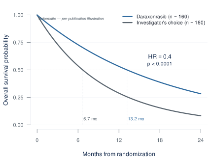
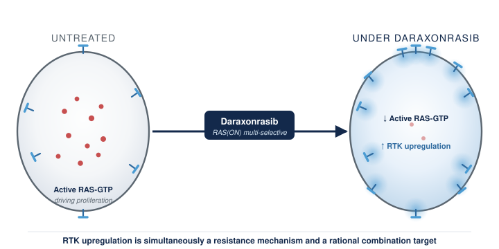
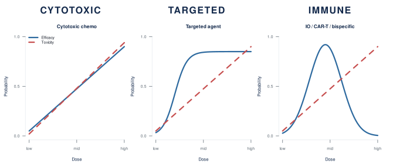
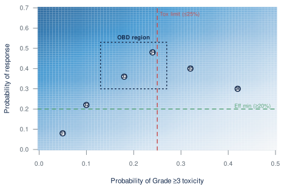
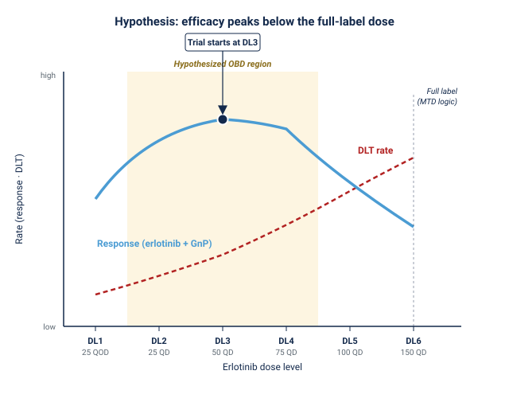
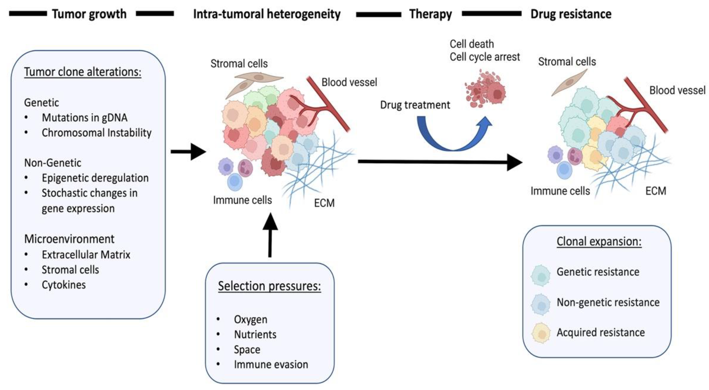
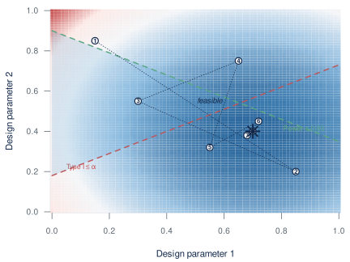

```{r}
#| label: setup
#| include: false
library(ggplot2)
library(gridExtra)
set.seed(2025)
```

## Today's argument {.smaller}

::: {style="font-size: 1.15em; margin-top: 0.6em; color: #13294B;"}
> **New RAS therapies need new kinds of trials.**
:::

::: {.fragment style="margin-top: 0.8em; font-style: italic; color: #5B6670;"}
Methods to optimize combination doses are established. Designs that track resistance and adapt the trial in response are enrolling.
:::

::: {.fragment style="margin-top: 1.2em; padding: 0.7em 1em; background-color: #F8F9FA; border-left: 4px solid #4B9CD3; color: #13294B; font-weight: 600;"}
What's missing is making those designs practical to calibrate and run.
:::

::: {.notes}
The argument of the talk. The science of RAS-era combinations puts real demands on trial design — combination dose-finding under non-monotonic dose-response, and resistance tracking with in-trial adaptation. Modern Bayesian adaptive designs answer both, at different maturity levels: dose-optimization methods are established, resistance-tracking designs are enrolling. What's been missing is the infrastructure to make them practical, and that's where BATON closes the gap. BATON is the closing tool, not the headline. Note the deliberate asymmetry in the fragment — "established" vs "enrolling" — this prevents the resistance-side overclaim that would land badly with a SPORE audience who knows EVOLVE hasn't yet reported.
:::


# The clinical case {.center background-color="#13294B"}

::: {style="color: #FFFFFF; font-size: 0.7em; margin-top: 1em;"}
*Why combinations, and why now?*
:::

::: {.notes}
Three slides on the clinical pressure before we get to design problems.
:::


## The RAS revolution has arrived for PDAC {.smaller}

:::: {.columns}

::: {.column width="55%"}
- Daraxonrasib (RMC-6236): oral, multi-selective RAS(ON) inhibitor
- **RASolute 302** (2L mPDAC) [@rasolute302]:
  - **Median OS: 13.2 vs 6.7 months**
  - **HR 0.40 — 60% reduction in risk of death** (p < 0.0001)
- ASCO 2026 Plenary, May 31 (Wolpin); *NEJM* same day

::: {.slide-refs}
O'Reilly et al., *NEJM* 2026 (RASolute 302) · ASCO Plenary Abstr LBA5
:::
:::

::: {.column width="45%"}
{fig-alt="Schematic KM curve illustrating RASolute 302 OS benefit (13.2 vs 6.7 mo, HR 0.40)"}
:::

::::

::: {.notes}
For pancreatic cancer this is the largest survival signal in a generation. Final analysis was presented at the ASCO Plenary on May 31 and published in *NEJM* the same day. Cite the NEJM paper, not a press release — this room will care about that. Two numbers to have in your pocket for Q&A. Median follow-up was 8.5 months at the February 10 data cutoff, so if anyone presses on maturity that's your number. And the 13.2 vs 6.7 figure is overall ITT; the dual primary endpoint was OS and PFS in the RAS G12-mutant subgroup (228 vs 231 patients), where HR was also 0.40 (P = 5.9e-10). If a discussant draws the ITT-vs-primary distinction, the answer is that the 0.40 benefit held in both — robustness across RAS mutation status is the whole point of a multi-selective RAS(ON) inhibitor. That robustness is a strength to lean on, not a vulnerability. Whatever else you take from this talk, this result will reshape the GI oncology trial landscape over the next two to three years — every program in this room will soon be deciding what to combine with this drug, in which biomarker-defined patients.
:::


## …but monotherapy has visible ceilings {.smaller}

RMC-6236-001 (NEJM 2026) [@daraxonrasib_mono]

::: {.fragment style="margin-top: 0.6em;"}
**Full cohort (n=168 PDAC, doses ≤300 mg):**

| Metric | Value |
|---|---|
| Grade ≥3 TRAEs | **30%** |
:::

::: {.fragment style="margin-top: 0.6em;"}
**At 300 mg (the Phase 3 monotherapy dose):**

| Metric | Value |
|---|---|
| Grade ≥3 TRAEs | **~34%** |
| Required dose modification | **48%** |
| TRAE-related discontinuation | **0%** |
:::

::: {.fragment style="margin-top: 0.6em; padding: 0.5em 0.8em; background-color: #F8F9FA; border-left: 3px solid #4B9CD3; font-size: 0.85em; color: #13294B;"}
**48% is the headroom number.** Every combination partner you add is dose-modification room you no longer have.
:::

::: {.slide-refs}
Wolpin et al., *NEJM* 2026 (RMC-6236-001 PDAC cohort)
:::

::: {.notes}
Three numbers worth keeping in mind. Across the full cohort of 168 patients on doses up to 300 mg, about a third have Grade 3 or worse toxicity. No patient discontinued because of drug toxicity — that's genuinely remarkable for an active drug in this disease. The qualifier matters; everyone with metastatic PDAC eventually comes off for progression, but nobody had to come off this drug for tolerability. Now narrow to the 300 mg dose specifically, which is the Phase 3 monotherapy dose: Grade ≥3 toxicity is closer to 34%, and forty-eight percent of patients required dose modifications. That 48% is the load-bearing number for the rest of this talk. For a drug being positioned as the backbone of future combinations, that's the headroom you start spending the moment you add a partner. The combination already moved to 200 mg — informally acknowledging the same headroom problem without searching for the actual optimum, which is the next slide. The question isn't "is daraxonrasib tolerable as monotherapy?" — clearly it is. The question is "at what dose, on what schedule, with what partners, in which patients?" That's a trial-design question, and the rest of this talk is about answering it.
:::


## Biomarker-driven combinations are the next move {.smaller}

:::: {.columns}

::: {.column width="55%"}
- Daraxonrasib drives **RTK upregulation** on PDAC cell surface (Zhuang/Singh/Aronchik, Revolution Medicines, AACR RAS 2026) [@zhuang2026rtk]
- Their framing: rational, biomarker-driven combinations to *pre-empt or overcome emergent resistance* [@zhuang2026rtk]
- **1L combination cohort** (daraxonrasib **200 mg** + GnP, n=40, AACR 2026) [@rmcgi102]:
  - ORR: **58%** · DCR: **90%** · 6-mo PFS: **84%** · 6-mo OS: **90%**

::: {style="margin-top: 0.25em; font-size: 0.75em; color: #5B6670; font-style: italic; line-height: 1.3;"}
Dose dropped from 300 mg to 200 mg for combination — but RMC-GI-102 fixed daraxonrasib at 200 mg without searching the joint surface. Informal OBD reasoning.
:::
:::

::: {.column width="45%"}
::: {.slide-refs}
Zhuang et al., *Cancer Res* 2026 (AACR RAS) · Wolpin et al., AACR 2026 LB407
:::
{fig-alt="Schematic: daraxonrasib drives RTK upregulation on PDAC cell surface, a compensatory feedback that is both a resistance mechanism and a combination target"}
:::

::::

::: {.notes}
Mallika Singh's group at Revolution Medicines has published the mechanistic case for what comes next. Inhibiting active RAS upregulates receptor tyrosine kinases on the cell surface — which is simultaneously a resistance mechanism and a rational combination target. Their explicit framing is that combinations should be biomarker-driven and resistance-preemptive. This is the manufacturer staking out the next decade of the program. And the first combination cohort has already delivered — 58% ORR with gemcitabine/nab-paclitaxel in first-line metastatic PDAC, 90% disease control, 84% six-month PFS. The combinations are coming. Many of them.
:::


## What 3+3 assumes, and where each breaks for combinations {.smaller}

::: {style="font-size: 1.05em; margin-top: 0.5em;"}
Four assumptions underneath conventional dose-finding. None survive RAS combinations:
:::

::: {.fragment style="margin-top: 0.8em;"}
1. **More is better.** *Often it isn't.*
2. **Toxicity comes from one drug.** *Combinations don't work that way.*
3. **DLTs in Cycle 1 define safety.** *Late-onset toxicity governs long-term tolerability.*
4. **A combination behaves like the sum of its parts.** *It doesn't, on either axis. Synergy can put the optimum below both single-agent doses.*
:::

::: {.fragment style="margin-top: 1.0em; text-align: center; color: #13294B; font-weight: 600; font-size: 0.95em;"}
The next section walks through what replaces each.
:::

::: {.notes}
DELIVERY: this is a ten-second roadmap slide, not a verdict. Move through it fast. The convincing happens on the next slides where I have the examples — sotorasib + pembrolizumab, RMC-GI-102, PANGEA's OBD-below-MTD hypothesis. This slide just tells the audience the shape of the next ten minutes. Frame it as a preview: four assumptions, four places they break for combinations, each one mapped to a slide that replaces it. Assumption 1 maps to Project Optimus and the OBD paradigm. Assumption 2 maps to the sotorasib + pembrolizumab hepatotoxicity story. Assumption 3 maps to the late-onset toxicity finding on the same slide — 88% outside Cycle 1. Assumption 4 maps to PANGEA's central hypothesis, that the optimum sits below both single-agent doses. WHY THIS SCOPING: 3+3 is fine for a cytotoxic — it answered the question it was built to answer. The point is not that it is wrong, it is that the assumptions it rests on mis-specify the problem for RAS combinations. Specifically: "more is better" — the conventional heuristic that MTD is the dose to carry forward — is the one a clinical audience knows is unreliable; OBD on the next slide is what replaces it. The genuinely counterintuitive one is assumption 4. That the combination optimum can sit below both single-agent doses runs against intuition — less of each than you'd give alone — and that is the payload of this slide. The other three are scaffolding. For RAS specifically, the RTK feedback we saw two slides ago is a mechanism for non-additive interaction, so the synergy claim is biologically grounded, not just statistical caution. PANGEA's hypothesis is the local case-study version of assumption 4.
:::


# The dose-finding problem {.center background-color="#13294B"}

::: {style="color: #FFFFFF; font-size: 0.7em; margin-top: 1em;"}
*Why MTD fails, and what replaces it*
:::


## Why combinations break the rules you grew up on {.smaller}

- **3+3 was built for single-agent chemo** [@letourneau2009]. Combinations break its assumptions. Non-monotonic dose-efficacy, joint toxicity, late-onset DLTs.
- **In practice, combination dose-finding collapses to one drug.** Pick agent A's dose, fix it, add agent B. The joint efficacy-toxicity surface is **almost never searched** — in a systematic review of 162 combination trials, **88% used 3+3 and all but one used a single-agent design** [@riviere2015combo; @harrington2013dual].
- **Amgen did exactly this with sotorasib + pembrolizumab.** A Bayesian model guided escalation for the single agent [@hong2020sotorasib]. For the combination they fixed the IO dose, varied only sotorasib, and never modeled the joint surface. The defining toxicity was synergistic and mostly late: **88% of Grade 3-4 hepatotoxicity fell outside the Cycle 1 DLT window** [@codebreak_io2022].

::: {.fragment style="margin-top: 0.7em; padding: 0.6em 0.9em; background-color: #F8F9FA; border-left: 3px solid #4B9CD3; font-size: 0.82em; color: #13294B;"}
**Thall et al.** (*Clinical Trials* 2024, methodologists' response to Project Optimus): conventional Phase I designs cannot reliably identify safe and effective doses [@thall2024optimus].
:::

::: {.slide-refs}
Le Tourneau et al., *JNCI* 2009 · Hong et al., *NEJM* 2020 · Li et al., *JTO* 2022 · Thall et al., *Clin Trials* 2024 · Rivière et al., *Ann Oncol* 2015
:::

::: {.notes}
Q&A POCKET — frequentist alternatives. If a methodologist asks "what about non-Bayesian combination designs?" the honest answer is that very few practical, deployed frequentist combination designs exist. The field has converged on Bayesian / model-assisted designs (POCRM, BOIN-COMB, BLRM, PIPE, surface-free) because combinations require borrowing strength across dose pairs and partial-order constraints — naturally handled by priors and posterior updating, awkwardly handled without them. The cleanest frequentist alternative in the literature is Conaway, Dunbar, & Peddada 2004 (Biometrics 60:661-669), order-restricted isotonic regression for combinations — theoretically clean but not widely deployed. 3+3 generalizations to combinations exist but inherit all the original problems plus combinatorial explosion. Sequential lead-in (find A then add B) is the dominant industry practice — that is what we are criticizing. Q&A POCKET — Rivière backup. The Rivière et al 2015 systematic review of 162 combination phase I trials gives the "almost never" claim a documented count: 88% used 3+3, all but one used a design developed for single-agent evaluation. If anyone challenges "almost never" as an unsupported universal, that is your number. 3+3 answered the question it was built for — the MTD of a cytotoxic under a monotonic toxicity assumption. For RAS combinations none of those assumptions hold. The deeper problem is structural and operational. In practice almost no one searches the joint dose surface. The protocol fixes agent A's dose and adds agent B, so two monotherapy designs run in series and the joint surface is never characterized. The Amgen example is the clean one, and notice it is not a competence problem. Same sponsor used a model-based Bayesian logistic regression for sotorasib monotherapy in CodeBreaK 100, but for the sotorasib + pembrolizumab combination in CodeBreaK 100/101 they fixed the IO dose, explored only sotorasib across cohorts, and never modeled the two-drug surface. And the combination's defining toxicity proved the point twice over: it was severe hepatotoxicity you could not predict from the single agent, and 88% of the Grade 3-4 events landed outside the 21-day DLT window — so a Cycle 1 design would have missed most of it. This single example demonstrates three of the four assumptions failing at once: joint surface unsearched, toxicity non-additive, late-onset toxicity outside Cycle 1. Even sophisticated sponsors collapse the combination to a one-drug search. Thall, Garrett-Mayer, Wages, Halabi, and Cheung made the formal version of this argument in their 2024 *Clinical Trials* paper, the SCT response to Project Optimus: conventional Phase I designs cannot reliably identify safe and effective doses. Next slide covers what replaces 3+3 in the toolkit.
:::


## Project Optimus: the regulatory ground has shifted {.smaller}

- FDA final guidance, 2024 [@fda_optimus_guidance]: *Optimizing the Dosage of Human Prescription Drugs… for the Treatment of Oncologic Diseases*
- **Maximum Tolerated Dose → a dose optimized on benefit-risk (the OBD).**
- The expectation now is to **study more than one dose and justify the choice on efficacy and safety**, with **randomized dosage comparison** as the FDA's recommended approach.

::: {.fragment style="margin-top: 1.2em; padding: 0.7em 1em; background-color: #F8F9FA; border-left: 4px solid #4B9CD3; font-size: 0.92em;"}
This is no longer a methodological preference. It's the regulatory baseline.
:::

::: {.slide-refs}
FDA Guidance for Industry, 2024 (Project Optimus)
:::

::: {.notes}
What you may not have caught is that the FDA has formalized this. The 2024 Project Optimus guidance moves oncology dose-finding from "maximum tolerated dose" to a dose optimized on benefit-risk — what the field calls the OBD. The guidance language is "optimized dosage," and the field's OBD shorthand maps to it directly. If you submit a Phase I protocol today that only characterizes the MTD, your reviewers are going to push back. This is no longer a methodological preference held by biostatisticians; it's the regulatory baseline. Now, on what the guidance actually expects: the FDA's stated default is to take two doses into Phase II — the MTD and a dose below it — and use a randomized comparison to determine which is better on benefit-risk. For a single agent that works. It does not scale to combinations, because you cannot randomize across a two-dimensional joint dose grid. That is exactly where model-based joint designs stop being a preference and start being the only practical way to meet the benefit-risk standard, which is where the rest of this section goes.
:::


## Why MTD fails for targeted agents and immunotherapies {.smaller}

::: {style="text-align: center; margin-top: 0em;"}

:::

::: {.incremental style="margin-top: 0.1em; font-size: 0.68em; line-height: 1.2;"}
- **Pembrolizumab:** flat exposure-response 2→10 mg/kg; MTD never reached, efficacy plateaued at lowest dose tested [@patnaik2015pembro]
- **CAR-T:** non-monotonic; high cell doses drive severe CRS/ICANS without proportional benefit
- **A RAS combination spans both.** Backbone on the plateau, IO/bispecific partner brings the umbrella. Neither rewards titrating to toxicity.
:::

::: {.notes}
The reason MTD fails for these agents is mechanistic, and it has two flavors. I'll illustrate with pembrolizumab and CAR-T — non-RAS examples, but the cleanest in the literature, and the same dose-response shapes show up in the IO and bispecific partners daraxonrasib is going to be combined with. The first flavor you all know from pembrolizumab — the efficacy curve plateaus very early. In the original pembrolizumab studies, response rates across 2 mg/kg, 10 mg/kg every three weeks, and 10 mg/kg every two weeks were statistically indistinguishable. The exposure-response curve was flat. The MTD was never reached because efficacy never improved with dose. The 200 mg flat dose used today was selected by population PK modeling to reproduce the exposures seen at 2 mg/kg in a typical patient — a weight-based-to-flat conversion of the lowest active dose, not a search for the optimum. The second flavor is the umbrella. CAR-T is the canonical case. Very high cell doses unambiguously drive severe CRS and ICANS without proportional benefit. The downslope itself is product-specific — some show a true decline, others a plateau or threshold — but what is universal across CAR-T and bispecifics is the absence of a monotonic increase, and that alone is enough to break titrate-to-toxicity. These are not RAS drugs, but they are the cleanest pictures of the two shapes, and they are the shapes your RAS combinations will actually have. Daraxonrasib is the plateau — its monotherapy program never cleanly reached an MTD, had no DLTs, and 300 mg was selected on tolerability, which is exactly why 300 versus 200 is still a live question. The partners you'll add bring the umbrella. A RAS combination lives across both panels, and that is the whole reason MTD logic cannot find its optimal dose. You need a design that watches both dimensions.
:::


## The cost of MTD-only thinking {.smaller}

::: {style="margin-top: 0.4em; font-size: 1.0em;"}
**Sotorasib was approved at the highest dose tested. A 4× lower dose — never compared during the trial — was later shown to give similar PFS with less toxicity.**
:::

::: {.incremental style="margin-top: 0.6em;"}
- **Sotorasib** (KRAS G12C, first-in-class, approved 2021) [@hong2020sotorasib]:
  - 960 mg selected as the **highest dose tested**, no DLTs — a more-is-better default, not an MTD
  - FDA required a **240 mg vs 960 mg** comparison. **PFS was similar** at one-quarter the exposure [@hochmair2024sotorasib]
- **MTD ≠ optimal dose** for targeted agents and immunotherapies
- **More than 40% of patients** in small-molecule registrational trials require dose reductions or interruptions, a marker of overly aggressive dosing [@fda_aacr_dosing2025]
:::

::: {.fragment style="margin-top: 0.8em; text-align: center; font-size: 1.05em; color: #13294B; font-weight: 600;"}
*Same drug class as daraxonrasib.*
:::

::: {.slide-refs}
Hong et al., *NEJM* 2020 (CodeBreaK 100) · Hochmair et al., *Eur J Cancer* 2024 · FDA–AACR, *Clin Cancer Res* 2025
:::

::: {.notes}
The empirical evidence that this is not just theoretical. The FDA-AACR Strategies for Optimizing Dosages series, published in Clinical Cancer Research in 2025, reports that more than 40% of patients in small-molecule registrational trials require dose reductions or interruptions due to overly aggressive dosing — and links that pattern to potentially accelerated emergence of drug resistance, which quietly foreshadows the back half of this talk. The case you all know best is sotorasib, the first-in-class KRAS G12C inhibitor, approved in 2021. The Phase I program never reached an MTD because there were no DLTs; 960 mg was simply the highest dose tested, a more-is-better default rather than an MTD-driven choice. The FDA later required a post-marketing comparison against 240 mg, a fourfold lower dose. PFS at 240 mg was similar to PFS at 960 mg — the clean evidence that the approved dose was four times higher than needed on the primary endpoint. Note: I am deliberately not folding in the October 2023 ODAC vote on CodeBreaK 200 here. That 10-2 vote was about whether the confirmatory PFS read-out could be reliably interpreted given trial-conduct issues — informative censoring, imbalanced early dropout, investigator-assessed imaging — not about the dose. Conflating it with the dose story is the move a regulatory-savvy attendee will flag. The dose story alone is airtight; keep it that way. For daraxonrasib — same drug class — getting this wrong in Phase I means every combination on top of it inherits an unnecessarily toxic starting point.
:::


## Combination dose selection in RAS is harder {.smaller}

::: {style="margin-top: 0.4em; font-size: 1.0em;"}
**Single agents already broke MTD logic. Combinations make it worse on every axis.**
:::

::: {.incremental style="margin-top: 0.8em;"}
- You are no longer choosing one dose. You are choosing a **joint pair on a surface the single-agent data cannot reconstruct** [@hong2020sotorasib]
- Effects interact on both efficacy and toxicity — the optimum can sit **below either single-agent dose**
- And for RAS, the **toxicity headroom is already spent** at the monotherapy dose [@daraxonrasib_mono]
:::

::: {.fragment style="margin-top: 0.9em; padding: 0.7em 1em; background-color: #F8F9FA; border-left: 4px solid #4B9CD3; color: #13294B; font-weight: 600; font-size: 0.95em;"}
**Fix what you know. Search what you don't.** Reduce to one drug only when the fixed component's dose is externally established — spend the search on the drug whose combination-optimal dose is genuinely uncertain.
:::

::: {.slide-refs}
Hong et al., *NEJM* 2020 · Wolpin et al., *NEJM* 2026 (RMC-6236-001)
:::

::: {.notes}
This is the bridge from the empirical cost — sotorasib at the MTD-only dose, daraxonrasib's already-spent headroom at 300 mg — into the methodological answer that follows. I am deliberately not re-establishing single-agent MTD failure here; the last three slides have already done that work. The job of this slide is to name what changes when you go from one drug to two. Three things. First, you are no longer choosing one dose, you are choosing a joint pair, and the single-agent margins do not reconstruct the surface — sotorasib's 960-versus-240 result tells you the surface looks different from what the single-dose escalation suggested. Second, effects interact on both efficacy and toxicity — the synergy point from assumption 4 — so the joint optimum can sit below either monotherapy dose. Third, and this is the RAS-specific part: the monotherapy toxicity is already substantial, 34% G≥3 at 300 mg, 48% dose modification, so you start the combination with less headroom to spend. The first combination cohort already moved daraxonrasib down to 200 mg with GnP, but we do not know whether 200 mg is right or whether 150 mg or some other dose is right given other partners. That is a dose-finding question that requires designs built for it. Which leads into the next slide.
:::


## Why Bayesian adaptive designs, and a primer on BOIN {.smaller}

:::: {.columns}

::: {.column width="50%"}
**Why Bayesian / model-assisted:**

::: {.incremental}
- Well suited to **small, sequential Phase I decision-making**
- Decision-theoretic framework supports **utility-based dosing**
:::
:::

::: {.column width="50%"}
**BOIN family** [@liu2015boin]:

::: {.incremental}
- Simple as 3+3 (printed decision table)
- Statistically matches model-based designs
- **Targets a specific DLT rate** (e.g., 25%)
- Extends to **BOIN-COMB** [@lin2017boincomb], **TITE-BOIN** [@yuan2018titeboin], **BOIN12** [@lin2020boin12]
- **POCRM** [@wages2011pocrm] and **BLRM** [@neuenschwander2008blrm] are common combination alternatives
:::
:::

::::

::: {style="margin-top: 0.4em; font-size: 0.78em; color: #5B6670; font-style: italic; text-align: center;"}
RAS adoption: sotorasib BLRM [@hong2020sotorasib], adagrasib mTPI (KRYSTAL-1) [@ou2022adagrasib].
:::

::: {.slide-refs}
Liu & Yuan 2015 (BOIN) · Lin & Yin 2017 (BOIN-COMB) · Yuan 2018 (TITE-BOIN) · Lin 2020 (BOIN12) · Wages 2011 (POCRM) · Neuenschwander 2008 (BLRM)
:::

::: {.notes}
Brief framing of the toolkit that replaces 3+3. Two reasons Bayesian/model-assisted designs fit modern Phase I. First, they handle small sequential sample sizes by design — cohort-by-cohort posterior updates are the natural framework for Phase I decision-making. Second, they support utility-based dosing, which is how the OBD paradigm becomes operational: tell the trial up front how to trade off response against toxicity. BOIN, from Liu and Yuan in 2015, is the workhorse of the family. Operationally as simple as 3+3 — printed decision table at the bedside, PI reads off escalate/stay/de-escalate. Statistically matches the best fully model-based designs. And the family extends naturally: BOIN-COMB for drug combinations, TITE-BOIN for late-onset toxicity, BOIN12 for joint toxicity-efficacy. POCRM (Wages and Conaway) and BLRM are the common alternatives for combinations specifically. The bottom note is the credibility line: the leading RAS Phase I programs are already running on Bayesian designs. Sotorasib used a Bayesian Logistic Regression Model (Hong et al. NEJM 2020). Adagrasib used accelerated titration into mTPI in KRYSTAL-1 (Ou et al. JCO 2022 — citation TODO, add when verified). The methodological shift Project Optimus formalized is already industry standard for RAS monotherapy — the question is whether combinations follow.
:::


## The new paradigm: OBD instead of MTD {.smaller}

:::: {.columns}

::: {.column width="45%"}
**Phase I no longer ends with a single MTD; it ends with an OBD.**

**U-BOIN** [@zhou2019uboin]:

- Up front: *"a response is worth this; a Grade 3 toxicity costs this"*
- **Stage 1:** BOIN rules establish the safe envelope (toxicity)
- **Stage 2:** utility-guided allocation finds the OBD *within* that envelope

::: {.fragment style="margin-top: 0.7em; padding: 0.5em 0.8em; background-color: #F8F9FA; border-left: 3px solid #4B9CD3; font-size: 0.88em; color: #13294B;"}
Delivers the OBD Project Optimus calls for [@fda_optimus_guidance] — and reaches it where randomized dose comparison does not scale to combinations.
:::
:::

::: {.column width="55%"}
{fig-alt="U-BOIN utility heatmap: toxicity × efficacy plane with admissibility lines and OBD region marked"}
:::

::::

::: {.notes}
This is the new paradigm in one slide. Phase I trials no longer end with a single MTD that you carry into Phase II hoping for the best. They end with an OBD — an optimal biological dose — that has been characterized for both safety and efficacy during Phase I. U-BOIN is the cleanest example of what this looks like operationally. Before the trial starts, your team sits down and answers a question: how do you trade off response against severe toxicity? Response with no toxicity is the best outcome; severe toxicity without response is the worst; the intermediate combinations get scored in between. Those scores become the navigation system. Stage one uses BOIN's toxicity rules to establish the safe envelope. Stage two — the new part — allocates patients within that envelope to find the dose that maximizes the benefit-risk utility you specified. What comes out of Phase I is not the MTD. It's the OBD — a dose with a characterized benefit-risk profile. That's the dose you carry into Phase II combinations. That's what Project Optimus is asking sponsors to deliver. And in practice, this paradigm is increasingly the expected approach in modern oncology Phase I/II design.
:::


## PANGEA: U-BOIN in basal-like PDAC {.smaller}

:::: {.columns}

::: {.column width="60%"}
- **Trial:** LCCC2220-DCT (Somasundaram, PI), basal-like PDAC by **PurIST** [@purist_rashid2020]
- **Combination:** erlotinib + biweekly gemcitabine/nab-paclitaxel
- **Hypothesis:** lower-dose erlotinib may be more efficacious (OBD-below-MTD) [@cohen2016erlotinib]
- **Six dose levels:** 25 mg QOD → 25 / 50 / 75 / 100 / 150 mg QD; **start at DL3**

::: {.fragment style="margin-top: 0.25em; font-size: 0.78em; line-height: 1.3;"}
**Design:** *Stage 1 BOIN* [@liu2015boin] (target DLT ≤25%, cohorts of 4); *Stage 2 BOIN12-like utility within U-BOIN* [@zhou2019uboin] (tox ≤25%, eff ≥20%).
:::

::: {.fragment style="margin-top: 0.3em; text-align: center; color: #13294B; font-weight: 600; font-size: 0.92em;"}
Up to 52 patients; ~28 at OBD (Scenario 1).
:::

::: {.fragment style="margin-top: 0.3em; padding: 0.45em 0.7em; background-color: #F8F9FA; border-left: 3px solid #4B9CD3; font-size: 0.75em; color: #13294B; line-height: 1.3;"}
**Justified dimensionality reduction:** GnP fixed because the FDA-approved standard-of-care dose is established (MPACT); erlotinib searched because its combination OBD-below-MTD is the genuinely open question.
:::

::: {.slide-refs}
Rashid et al., *Clin Cancer Res* 2020 (PurIST) · Cohen et al., *Cancer Chemo Pharm* 2016 · Liu & Yuan 2015 · Zhou, Lee & Yuan 2019 (U-BOIN)
:::
:::

::: {.column width="40%"}
{fig-alt="Schematic: PANGEA hypothesis. Efficacy curve (combination erlotinib + GnP) rises across low doses, plateaus through DL3 to DL4, and declines toward the full-label dose at DL6. Toxicity curve rises monotonically with erlotinib dose. The hypothesized OBD region (DL2 to DL4) is shaded; the trial starts at DL3, well below the labeled MTD-logic dose."}
:::

::::

::: {.notes}
Here's the design in a real PDAC trial at UNC. PANGEA, led by Ashwin Somasundaram. The population is biomarker-defined — basal-like PDAC by PurIST, a subtype that has historically responded poorly to gemcitabine/nab-paclitaxel. The intervention is adding low-dose erlotinib to that backbone. And here's where the talk's argument lands on a real protocol: the central biological hypothesis of PANGEA is that lower doses of erlotinib may be more efficacious than the labeled dose, when given in combination with chemotherapy. The full-label dose of erlotinib is 150 mg daily. PANGEA tests six dose levels going down to 25 mg every other day. This is the OBD-below-MTD case made concrete — exactly the kind of question 3+3 cannot answer, and exactly the kind of question U-BOIN was built for. Stage 1 uses BOIN-style toxicity rules to establish the safe envelope, with a target DLT rate of 25%. Once we have enough data at any dose, we transition to Stage 2, which uses a utility function — elicited from our clinical team — to find the dose that maximizes the benefit-risk tradeoff. Doses have to clear both toxicity admissibility, no more than 25% DLT, and efficacy admissibility, at least 20% response rate. The trial ends when twenty patients have accumulated at any one dose, or when fifty-two patients have been treated total. Under the most plausible scenario from our simulations, we expect about thirty-eight patients in the U-BOIN phase, with about twenty-eight ultimately treated at the OBD. This is what an OBD-paradigm Phase I trial looks like in basal-like PDAC.
:::


# Resistance is the next problem {.center background-color="#13294B"}

::: {style="color: #FFFFFF; font-size: 0.7em; margin-top: 1em;"}
*Each patient is a moving target.*
:::


## Resistance is a dynamic process {.smaller}

:::: {.columns}

::: {.column width="60%"}
{width=100% fig-alt="Tumor growth, intra-tumoral heterogeneity, therapy, and drug resistance: clonal expansion under selection pressure (genetic and non-genetic mechanisms)"}

::: {style="margin-top: 0.3em; font-size: 0.7em; color: #5B6670; font-style: italic;"}
Schematic adapted from ARPA-H ADAPT program overview materials.
:::
:::

::: {.column width="40%"}
::: {.r-fit-text}
**Resistance mechanisms emerge under RAS-inhibitor pressure**

- Pathway reactivation: KRAS amplification, NRAS / BRAF / MAP2K1
- RTK upregulation and bypass signaling
- Cell-state plasticity (basal ↔ classical, partial EMT)

::: {.fragment}
**Traditional trials fail to capture this**

- Fixed regimens miss the interception window
- Baseline-only biomarkers can't track evolution under therapy
:::
:::
:::

::::

::: {.notes}
Classical trial design treats patients as if they're draws from a fixed distribution — enroll, randomize, administer the regimen, measure outcomes at predefined timepoints. That logic works when the underlying biology is static. Under sustained RAS-inhibitor pressure it doesn't. The tumor evolves. Each patient is a moving target. Resistance signals start appearing weeks into therapy — sometimes earlier. The mechanisms split into a few buckets that the next slide spells out in detail: pathway reactivation through KRAS amplification or downstream NRAS, BRAF, MAP2K1 mutations; RTK upregulation and bypass signaling — that's the Zhuang and Aronchik mechanistic case for combinations; cell-state plasticity between basal-like and classical with partial EMT under therapy — Aguirre's PDAC work. None of these are baseline phenotypes. A fixed-regimen trial with baseline-only biomarkers cannot see them, and even when it captures them retrospectively at progression, it cannot act on them. The design has to become temporal too — that's what the next few slides are about.
:::


## Different resistance mechanisms require different detection strategies {.smaller}

::: {style="margin-top: 0.2em; padding: 0.45em 0.8em; background-color: #F8F9FA; border-left: 4px solid #4B9CD3; font-size: 0.85em; line-height: 1.3;"}
**Genomic** → catchable by **ctDNA** · **Non-genomic / plasticity** → requires **serial biopsies, transcriptomics, imaging** · A resistance-aware trial has to *do both*.
:::

:::: {.columns}

::: {.column width="50%"}
**Genomic resistance**

- **Clinical PDAC** (Aguirre, *Cancer Discovery* 2024): PIK3CA, KRAS amplification, MYC/MET/EGFR/CDK6 amplifications [@aguirre2024resistance]
- **Preclinical RAS(ON)** (Wasko, *Nature* 2024): Myc amplification, PI3K family gains under RMC-7977 [@wasko2024rmc7977]
- **G12C clinical adagrasib** (Awad, *NEJM* 2021): NRAS, BRAF, MAP2K1; ALK/RET/BRAF/RAF1/FGFR3 fusions [@awad2021resistance]
:::

::: {.column width="50%"}
**Non-genomic: cell-state plasticity**

- PDAC cells morph into RAS-independent states [@aguirre2024resistance]
- Dynamic kinome reprogramming (Yeh/Johnson lab, UNC) [@xu2025kinome]
:::

::: {.slide-refs}
Aguirre et al., *Cancer Discov* 2024 · Wasko et al., *Nature* 2024 · Awad et al., *NEJM* 2021 · Xu et al., *Cancer Discov* 2025
:::

::::

::: {.notes}
The resistance landscape splits into two classes, and the audience here will see both of these in their clinics. But the design implication is what I want to lead with: different resistance mechanisms require different detection strategies built into the trial. Genomic resistance — NRAS mutations, MAP2K1 mutations, on-target mutations — is catchable by ctDNA. That's relatively cheap, continuous, easy to add to a trial. Non-genomic resistance — cell-state plasticity, kinome reprogramming, metabolic rewiring — needs serial biopsies, transcriptomic monitoring, sometimes imaging. That's expensive, episodic, hard. A resistance-aware trial has to design for both, because both are happening in your patients simultaneously. Andy Aguirre's group at Dana-Farber has published extensively on the genomic side. Closer to home, the Yeh and Johnson labs here at UNC have shown the non-genomic side at the kinome level. The biology is on the slide as evidence; the design implication is the headline.
:::


## Why classical trial designs miss resistance {.smaller}

- **Classical design was built for static biology** — fixed regimen, fixed endpoint.
- **In practice, resistance is studied retrospectively** — emerging signatures are characterized only after progression and trial closure [@awad2021resistance; @aguirre2024resistance]
- The temporal surface (when resistance emerges, in which patients) is never characterized.

::: {.fragment style="margin-top: 0.6em; padding: 0.6em 0.9em; background-color: #F8F9FA; border-left: 3px solid #4B9CD3; font-size: 0.88em; color: #13294B;"}
**Same structural failure as combination dose-finding:** static designs for a dynamic problem. A resistance-aware trial has to learn during enrollment.
:::

::: {.slide-refs}
Awad et al., *NEJM* 2021 · Aguirre et al., *Cancer Discov* 2024 (both post-progression analyses)
:::

::: {.notes}
The resistance-side parallel to the combination dose-finding critique two sections ago. There, the problem was that 3+3 searches one dose at a time and never characterizes the joint dose surface. Here, the problem is that classical designs measure outcome at fixed endpoints and never characterize the temporal surface — when resistance emerges, in which patients, by which mechanism. The retrospective bullet is itself the evidence: the Awad and Aguirre papers I just cited on the previous slide are post-progression analyses, ctDNA and biopsies collected after patients had already failed therapy. The field's best resistance knowledge was generated exactly the way I'm criticizing — after the fact, outside any prospective design built to catch it. Early signals in molecular subsets dilute into the overall Kaplan-Meier. Heterogeneous response trajectories collapse into summary statistics. None of that is useful for designing the next trial in real time. The same structural failure as the dose problem: static designs for a dynamic problem. Just as the dose problem needed Bayesian designs that handle the joint surface, the resistance problem needs designs that learn during enrollment. Next slide shows what those look like.
:::


## ADAPT / EVOLVE: what a resistance-aware trial looks like {.smaller}

- ARPA-H **ADAPT** program → **EVOLVE trial** in metastatic breast cancer (UNC-led; PI: Carey, Rashid co-PI)
- **Different disease, same design problem:** longitudinal resistance detection + biomarker-guided adaptation. The four axes below are disease-agnostic; a RAS-backbone PDAC combination would need all four for the same reasons.

::: {.fragment style="margin-top: 0.3em; font-size: 0.82em;"}
| Axis | Operationalized as |
|---|---|
| Adaptive stopping | Bayesian futility/efficacy boundaries updated at each interim |
| Real-time biomarker discovery | Pre-specified candidate signatures + agnostic discovery window |
| Longitudinal monitoring | Serial ctDNA, imaging, biopsies on every patient — *the "do both" requirement* |
| In-trial evaluation | Biomarker-guided cohorts within the same protocol — *characterize the temporal surface and act on it* |
:::

::: {.fragment style="margin-top: 0.4em; text-align: center; font-size: 0.95em; color: #13294B; font-weight: 600;"}
This is happening, federally funded, enrolling.
:::

::: {.notes}
This is what a resistance-aware trial actually looks like operationally. ARPA-H — the new Advanced Research Projects Agency for Health — has funded a program called ADAPT specifically to build trials of this kind. Our EVOLVE trial in metastatic breast cancer is one of the first, and the design template generalizes directly to the kind of RAS-backbone combination trial you all are going to be running for PDAC in the next few years. I am showing a breast cancer trial to GI SPORE leaders because the four axes below are disease-agnostic — they're requirements for any resistance-aware trial, not properties of breast biology. A RAS-backbone PDAC combination would need all four for the same reasons. Four axes. Adaptive stopping rules — Bayesian futility and efficacy boundaries that update at every interim look. Real-time biomarker discovery — pre-specified candidate signatures plus an agnostic discovery window so you're not locked into your initial hypothesis. Longitudinal monitoring — serial ctDNA, imaging, biopsies on every patient. This is the "do both" requirement from the mechanisms slide made concrete: ctDNA for the genomic side, biopsies and transcriptomics for the non-genomic plasticity side, on every patient throughout the trial. And in-trial evaluation — biomarker-guided cohorts opened within the same protocol, so when you find a resistance signature you can test the strategy that addresses it during the trial, not as a follow-on study three years later. This is the answer to "characterize the temporal surface and act on it during enrollment" that I named two slides ago. CRITICAL FRAMING DISCIPLINE: the box says "enrolling," not "EVOLVE shows" or "EVOLVE works." This is the resistance-side honesty I committed to in the opening — methods exist and are deployed, not yet completed. If a trialist asks for the readout, the answer is the design exists and is accruing; the readout is what we will report when interim looks are run. Do not let the live delivery drift toward an implied result.
:::


# Putting these into practice {.center background-color="#13294B"}

::: {style="color: #FFFFFF; font-size: 0.7em; margin-top: 1em;"}
*Why don't we see more of these trials?*
:::


## Why don't we see more of these trials? {.smaller}

::: {style="font-size: 0.9em; margin-top: 0.3em; color: #5B6670; font-style: italic;"}
Funding, accrual, and biopsy logistics are real.
:::

::: {style="font-size: 0.95em; margin-top: 0.2em;"}
**But the barrier that quietly kills good designs — and the one we can actually remove — is calibration.**
:::

::: {.fragment style="margin-top: 0.4em; font-size: 0.88em; line-height: 1.35;"}
- Modern designs have many parameters: DLT/efficacy targets, utility weights, stopping rules
- Operating characteristics (Type I, power, N, duration) depend on every parameter, **in interaction**
- Each candidate: thousands of simulated trials × scenarios
- Design space: **8–13 dimensions** for the trials we've calibrated, more for combined dose + resistance. Grid search is infeasible.
- Field has adopted the machinery: Bayesian designs in **48% → 75% of Phase I protocols (2021–2024)**, but dose-optimization plans in only **30%** [@optimus_impact2025]
:::

::: {.fragment style="margin-top: 0.4em; padding: 0.5em 0.9em; background-color: #F8F9FA; border-left: 4px solid #4B9CD3; color: #13294B; font-weight: 600; font-size: 0.88em;"}
**In our group's experience, several months per design.** For combined dose + resistance designs (20+ parameters), hand-tuning is infeasible.
:::

::: {.fragment style="margin-top: 0.7em; text-align: center; font-size: 1.05em; color: #13294B; font-style: italic;"}
> *We could design the science. We could not design the trial.*
:::

::: {.slide-refs}
FDA–AACR Project Optimus impact review, *JCO Onc Adv* 2025 (367 Phase I protocols)
:::

::: {.notes}
This is the slide that opens the BATON section, and I want to land it carefully. Open with the concession explicitly: funding, accrual, biopsy logistics — these are real, and this room has lived them. I am not standing up here telling you the barrier to better trials is statistics, because that would be a biostatistician naming his own contribution as the field's central obstacle, and you would be right to push back. What I am claiming is narrower and more specific: among the barriers, calibration is the one that quietly kills good designs and the one we can actually remove. You have all watched PIs default back to 3+3 even when they knew a better design existed — the calibration cost was the hidden reason, and that is the gap BATON closes. Now the body. The methods I just walked through — modern dose-finding for combinations, longitudinal biomarker-aware adaptive designs — exist. The reason every clinical trial isn't using them is calibration cost. Every modern design has knobs: target DLT and efficacy rates, utility weights, cohort sizes, stopping rules, sample-size caps. Operating characteristics depend on every knob, in interaction. To know whether a design meets Type I, power, expected N, expected duration, OBD-selection accuracy, and biomarker-promotion error control, you simulate thousands of trial replicates per candidate. And you do this across plausible scenarios. The design space is eight to thirteen dimensions for the trials we've calibrated, and twenty-plus when you combine dose-finding with resistance tracking. A grid search is hopeless — both computationally infeasible and statistically wasteful, because most of the parameter space gives bad designs. In my group, calibrating a single modern combination Phase I/II design by hand takes a senior statistician several months of focused work. For trials that handle dose-finding AND resistance tracking simultaneously, you're at twenty-plus parameters with even more constraints. Hand-tuning doesn't just get slower; it gets infeasible. That's the gap BATON closes.
:::


## BATON: the calibration tool {.smaller}

:::: {.columns}

::: {.column width="50%"}
::: {style="margin-top: 0.2em; font-size: 0.92em;"}
**BATON** = **B**ayesian **A**daptive **T**rial **O**ptimizatio**N** [@baton2026]
:::

::: {style="margin-top: 0.4em; color: #5B6670; font-style: italic; font-size: 0.85em;"}
Think of BATON as a navigation system for trial design:
:::

::: {.incremental style="margin-top: 0.4em; font-size: 0.88em; line-height: 1.4;"}
1. **GOAL** — Type I ≤ 0.10, Power ≥ 0.80, minimum N
2. **EXPLORE** — sample candidate designs
3. **LEARN** — model which regions of design space satisfy constraints
4. **FOCUS** — concentrate search on the feasible region
5. **ARRIVE** — calibrated design that meets all targets
:::

::: {.fragment style="margin-top: 0.6em; padding: 0.5em 0.8em; background-color: #F8F9FA; border-left: 3px solid #4B9CD3; font-size: 0.82em; color: #13294B; font-style: italic;"}
Designs that would have taken months to discover — or never been found at all.
:::

::: {.fragment style="margin-top: 0.4em; font-size: 0.72em; color: #5B6670;"}
Under the hood: constrained Bayesian optimization with Gaussian process surrogates. You bring the clinical design; BATON finds the parameter settings that meet your targets. R package: [github.com/naimurashid/BATON](https://github.com/naimurashid/BATON)
:::
:::

::: {.column width="50%"}
{fig-alt="BATON acquisition surface: bowl-shaped objective with two constraint boundaries and feasible region; sequential evaluations converging to the constrained optimum"}

::: {style="margin-top: 0.3em; font-size: 0.72em; color: #5B6670; font-style: italic; text-align: center; line-height: 1.3;"}
Red = high expected N (bad); blue = low. Dashed lines = Type I and Power constraints. Numbered points = BATON's sequential evaluations converging to the constrained optimum (★).
:::

::: {.slide-refs}
Young et al., 2026 (BATON manuscript) · github.com/naimurashid/BATON
:::
:::

::::

::: {.notes}
Think of BATON as GPS for trial design. You tell it the destination — power, type-I error, sample-size targets, expected duration. It explores candidate designs by Monte Carlo simulation. It learns which regions of the parameter space satisfy your constraints. It focuses the search on the feasible region. And it arrives at a calibrated design. Hours instead of months. Under the hood: constrained Bayesian optimization with Gaussian process surrogates, but for this audience what matters is the input and the output. You give BATON a design template, a set of operating-characteristic targets, and a scenario grid. BATON returns a calibrated design that meets your targets. FRAMING DISCIPLINE — and this matters because the next slide is PANGEA: in the BATON manuscript, the worked example is EVOLVE, not PANGEA. BATON was developed and validated during EVOLVE activation, across breast cancer subtrials at 8 to 13 parameters. PANGEA is an application of the same tool, not what the paper reports. If anyone asks "is this published," the clean answer is: the method and its validation are under review at JASA Applications and Case Studies; PANGEA is one application of the same software. Q&A POCKETS, in order of likelihood. (1) "Is BATON really optimal?" Manuscript benchmarked it against Simon two-stage designs where the optimum is known analytically; BATON converges to within 1% of Simon-optimal expected N, hitting the optimum exactly in 8 of 10 seeded runs. So the answer is: it recovers the analytically optimal design on problems where we can check. (2) "Can we use it?" Yes — open-source R package at github.com/naimurashid/BATON, with the companion evolveTrial package. (3) "What's the gain over grid or random search?" The paper has a head-to-head: BATON found feasible designs in 150–200 evaluations where grid and random search often found none at all.
:::


## Grid search vs BATON {.smaller}

```{r}
#| fig.height: 4.4
#| fig.width: 11
#| fig.align: center
set.seed(2025)
grid_x <- rep(1:10, each = 10)
grid_y <- rep(1:10, times = 10)
grid_quality <- 100 - sqrt((grid_x - 7.5)^2 + (grid_y - 6.2)^2) * 8 + rnorm(100, 0, 3)
grid_df <- data.frame(x = grid_x, y = grid_y, q = grid_quality)

bo_points <- data.frame(
  iter = 1:30,
  x = c(5, 3, 7, 8, 6, 7.5, 7.2, 7.8, 7.4, 7.6, 7.55, 7.48, 7.52, 7.51, 7.50,
        7.49, 7.51, 7.50, 7.50, 7.51, 7.50, 7.50, 7.50, 7.50, 7.50, 7.50, 7.50, 7.50, 7.50, 7.50),
  y = c(4, 7, 5, 8, 6, 6, 6.3, 6.1, 6.25, 6.15, 6.22, 6.18, 6.21, 6.20, 6.20,
        6.19, 6.20, 6.20, 6.20, 6.20, 6.20, 6.20, 6.20, 6.20, 6.20, 6.20, 6.20, 6.20, 6.20, 6.20)
)

p_grid <- ggplot() +
  geom_tile(data = grid_df, aes(x = x, y = y, fill = q), alpha = 0.6) +
  geom_point(data = grid_df, aes(x = x, y = y), size = 2, alpha = 0.4) +
  scale_fill_gradient2(low = "#d73027", mid = "#fee090", high = "#1a9850",
                       midpoint = 85, guide = "none") +
  coord_fixed(ratio = 1) +
  labs(title = "Grid search", subtitle = "100 designs evaluated",
       x = "Efficacy threshold", y = "Futility threshold") +
  theme_minimal(base_size = 13) +
  theme(plot.title = element_text(hjust = 0.5, face = "bold", size = 15, color = "#13294B"),
        plot.subtitle = element_text(hjust = 0.5, color = "#5B6670"),
        axis.title = element_text(color = "#444444"),
        axis.text = element_blank(), panel.grid = element_blank())

p_baton <- ggplot() +
  geom_tile(data = grid_df, aes(x = x, y = y, fill = q), alpha = 0.5) +
  geom_path(data = bo_points, aes(x = x, y = y),
            arrow = arrow(length = unit(0.25, "cm"), type = "closed"),
            color = "#4B9CD3", linewidth = 1.8, alpha = 0.85) +
  geom_point(data = bo_points, aes(x = x, y = y, color = iter), size = 3) +
  scale_fill_gradient2(low = "#d73027", mid = "#fee090", high = "#1a9850",
                       midpoint = 85, guide = "none") +
  scale_color_gradient(low = "#7EB8E4", high = "#13294B", guide = "none") +
  coord_fixed(ratio = 1) +
  labs(title = "BATON search", subtitle = "30 designs → same optimum",
       x = "Efficacy threshold", y = "Futility threshold") +
  theme_minimal(base_size = 13) +
  theme(plot.title = element_text(hjust = 0.5, face = "bold", size = 15, color = "#4B9CD3"),
        plot.subtitle = element_text(hjust = 0.5, color = "#5B6670"),
        axis.title = element_text(color = "#444444"),
        axis.text = element_blank(), panel.grid = element_blank())

grid.arrange(p_grid, p_baton, ncol = 2)
```

::: {style="margin-top: 0.4em; text-align: center; font-size: 1.0em; color: #13294B; font-weight: 600;"}
**70% fewer evaluations** — minutes instead of days.
:::

::: {style="margin-top: 0.3em; text-align: center; font-size: 0.75em; color: #5B6670; font-style: italic;"}
Color: design quality at each parameter combination (green = meets OC targets, red = does not). Path: BATON's sequential evaluations converging on the feasible optimum.
:::

::: {.notes}
This is what's happening underneath the GPS metaphor. On the left: a grid search — 100 designs evaluated on a 10-by-10 lattice across two parameters. Most are nowhere near the feasible region. On the right: BATON. Same parameter space, same quality landscape underneath, but BATON only evaluates 30 designs — and it converges on the same optimum because each design choice is informed by what the previous evaluations revealed. Seventy percent fewer evaluations. Each evaluation is thousands of Monte Carlo trial replicates, so saving 70 percent of the search is the difference between hours and weeks. This is a 2D illustration; PANGEA Phase II's design space is 4-dimensional and the EVOLVE designs go up to 8 or 13 dimensions, where the search-efficiency advantage compounds rapidly.
:::


## Traditional calibration vs BATON {.smaller}

:::: {.columns}

::: {.column width="48%"}
::: {style="text-align: center; font-weight: 600; color: #13294B; font-size: 1.0em; margin-bottom: 0.4em;"}
Manual approach
:::

| Aspect | Limitation |
|:---|:---|
| Process | Trial-and-error |
| Duration | Weeks to months |
| Scope | One design at a time |
| Reproducibility | Statistician-dependent |
| Documentation | Often incomplete |
| Regulatory risk | Variable |
:::

::: {.column width="48%"}
::: {.fragment}
::: {style="text-align: center; font-weight: 600; color: #4B9CD3; font-size: 1.0em; margin-bottom: 0.4em;"}
BATON
:::

| Aspect | Capability |
|:---|:---|
| Process | Systematic search |
| Duration | Hours wall-clock |
| Scope | Hundreds evaluated |
| Reproducibility | Deterministic (seeded) |
| Documentation | Complete FDA audit trail |
| Regulatory risk | Documented |
:::
:::

::::

::: {.fragment style="margin-top: 0.9em; text-align: center; font-style: italic; color: #13294B; font-size: 0.95em;"}
Same clinical question. Same statistical constraints. The bottleneck wasn't the design — it was the calibration.
:::

::: {.notes}
Same clinical question. Same statistical constraints. The bottleneck was never the design itself — it was the calibration. Hand-tuning is trial-and-error: takes days to weeks of a senior statistician's time, varies by who's doing it, produces incomplete documentation, leaves regulatory risk on the table. BATON systematically searches hundreds of designs in hours, with deterministic seeding and a complete FDA audit trail. The methodology shift Project Optimus formalized — adaptive Bayesian designs as the standard — is the destination. BATON is what makes getting there feasible at scale.
:::


## BATON's output, framed as patients spared {.smaller}

```{r}
#| fig.height: 4.6
#| fig.width: 11
#| fig.align: center
set.seed(2025)
n_evals <- 100
iterations <- 1:n_evals
fixed_trial_n <- 76  # PANGEA Phase II Max N

# Simulate decreasing expected sample size (improving design)
best_n <- numeric(n_evals)
best_n[1] <- 76
for (i in 2:n_evals) {
  improvement <- min(0, rnorm(1, mean = -0.5, sd = 1.5))
  best_n[i] <- max(53, best_n[i-1] + improvement)  # Converges to EN_null = 53
}

# Patients spared = Max N - Expected N under null
patients_spared <- fixed_trial_n - best_n

# Constraint violations early on
constraint_met <- c(rep(FALSE, 14), rep(TRUE, n_evals - 14))

convergence_data <- data.frame(
  Evaluation = iterations,
  Patients_Spared = patients_spared,
  Feasible = constraint_met
)

ggplot(convergence_data, aes(x = Evaluation, y = Patients_Spared, color = Feasible)) +
  geom_line(linewidth = 1.2, alpha = 0.8) +
  geom_point(size = 2, alpha = 0.7) +
  geom_hline(yintercept = 23, linetype = "dashed", color = "#4B9CD3", linewidth = 1) +
  annotate("text", x = 75, y = 25, label = "Optimal: ~23 patients spared (E[N] = 53 vs Max N = 76)",
           color = "#4B9CD3", size = 4.5, fontface = "bold") +
  annotate("text", x = 30, y = 8, label = "Early designs don't meet\nType I ≤ 0.10 AND Power ≥ 0.80",
           color = "#13294B", size = 4, fontface = "italic") +
  scale_color_manual(values = c("FALSE" = "#13294B", "TRUE" = "#4B9CD3"),
                     labels = c("Doesn't meet FDA OCs", "FDA-compliant")) +
  scale_y_continuous(breaks = seq(-10, 30, 5)) +
  labs(x = "BATON optimization progress (candidate designs evaluated)",
       y = "Patients spared vs traditional fixed-N trial",
       color = NULL) +
  theme_minimal(base_size = 14) +
  theme(legend.position = "right",
        legend.key.size = unit(0.8, "lines"),
        legend.text = element_text(size = 10),
        panel.grid.minor = element_blank())
```

::: {style="margin-top: 0.3em; text-align: center; font-size: 0.95em;"}
**Bottom line:** BATON converges on a design that spares ~23 patients from a potentially-ineffective arm — while meeting Type I ≤ 0.10 AND Power ≥ 0.80.
:::

::: {style="margin-top: 0.2em; text-align: center; font-size: 0.72em; color: #5B6670;"}
Each point = one candidate design evaluated (≈10,000 simulated trials per design).
:::

::: {.notes}
This is the same BATON convergence story you just saw on the grid-vs-BATON slide, but framed in clinically relevant units. Y-axis: patients spared from a potentially-ineffective treatment arm, relative to the traditional fixed-N=76 design. X-axis: BATON's optimization progress — each point is one candidate design that BATON evaluated by simulating ten thousand trials at that parameter combination. Dark-blue points are designs that don't yet meet the FDA operating-characteristic constraints — Type I error ≤ 0.10 AND power ≥ 0.80, simultaneously. Light-blue points are designs that do. BATON enters the feasible region around evaluation 14, then climbs to the optimum near evaluation 75. The horizontal dashed line — about 23 patients spared — is where the optimal calibrated design lands. That's the same point as the achieved expected N of 53 against the calibrated max of 76 that you'll see on the next slide.
:::


## PANGEA Phase II: calibrated by BATON {.smaller}

:::: {.columns}

::: {.column width="55%"}
- After Phase I identifies the OBD, PANGEA continues into a **Phase II Bayesian adaptive randomized trial**: GnP + erlotinib (at OBD) vs GnP alone
- Primary endpoint: PFS. **Design assumes** reference median 5.5 mo [@vonhoff2013mpact]; powered to detect 9.2 mo under H₁ (HR 0.58)
- **BATON-calibrated** four parameters (N, efficacy threshold, futility threshold, futility margin) [@baton2026]
- **Constraints met:** Type I ≤ 0.10, Power ≥ 0.80
:::

::: {.column width="45%"}
::: {.fragment style="font-size: 0.78em;"}
**Achieved operating characteristics:**

| Metric | Value |
|---|---|
| Power | **82.2%** |
| Type I error | 7.0% |
| Max N | 76 |
| Expected N under H₀ | 53.0 |
| Expected N under H₁ | 58.1 |
| Pr(early futility stop \| H₀) | **77.9%** |
| Pr(early efficacy stop \| H₁) | **81.4%** |
| Expected duration | 27.3 mo |
:::
:::

::::

::: {.slide-refs}
Von Hoff et al., *NEJM* 2013 (MPACT) · Young et al., 2026 (BATON manuscript)
:::

::: {.notes}
Once U-BOIN selects the OBD, PANGEA transitions into a Phase II Bayesian adaptive randomized trial — basal-like PDAC patients randomized one-to-one to GnP plus erlotinib at the OBD versus GnP alone, with PFS as the primary endpoint. TENSE DISCIPLINE — this is critical and the slide structure protects it but the live delivery needs to as well. The 5.5-month reference, the 9.2-month alternative, and the HR 0.58 are DESIGN ASSUMPTIONS, not observed results. The 5.5 is the GnP doublet benchmark from MPACT, Von Hoff 2013. The trial is powered to detect a hazard ratio of 0.58, not showing one. The operating characteristics in the right column ARE achieved, because they are the outputs of BATON's calibration — Type I at 7.0%, power at 82.2%, those are properties of the design that BATON found, computed over 10,000 simulated trials per scenario. So: design assumptions on the left, calibrated achievements on the right. Never let "BATON found a design that achieves these OCs" drift to "the trial showed this." The design uses a Bayesian piecewise exponential survival model with interim analyses for early stopping on futility or efficacy. Four design parameters had to be set jointly to meet operating characteristics — the maximum sample size, the efficacy stopping threshold, the futility stopping threshold, and the futility hazard-ratio margin. CONFIRM AGAINST MANUSCRIPT before delivery which exact four BATON searched versus which were fixed by clinical/modeling choice, since a methodologist may ask. BATON found a configuration that meets Type I error at most 0.10 and power at least 0.80, simultaneously. The achieved characteristics are on the slide. Three numbers I want to draw your attention to. First, the power is eighty-two percent at a Type I error of seven percent — solidly within the targets. Second — and this is the clinical payoff — the trial stops early for futility seventy-eight percent of the time when the drug doesn't work. Patients are not being randomized to a losing arm waiting for the readout. Third, the trial stops early for efficacy eighty-one percent of the time when the drug does work. That's how quickly modern adaptive designs can deliver an answer when there's signal. Expected trial duration is twenty-seven months, with expected enrollment of fifty-three patients under the null and fifty-eight under the alternative — well below the calibrated max of seventy-six. (Note: the protocol narrative carries 82 as the accrual target with buffer; 76 is the calibrated design maximum. If anyone asks, "76 is the calibrated maximum, 82 is the accrual goal." Action item for me separately: reconcile the protocol so a reader does not catch the discrepancy.) This entire calibration was done by BATON. Hand-tuning a design with these four interacting parameters against two simultaneous operating-characteristic constraints, across thousands of simulated trials, is the work I was describing earlier as several months of senior statistician time. BATON delivered this configuration in hours.
:::


<!-- TODO: Optional EVOLVE BATON calibration slide goes here once numbers are available.
     Per build spec: default action is to omit until real EVOLVE calibration results exist.
     If reinstated, mirror the PANGEA Phase II structure (design params → OC constraints
     → achieved characteristics table) and add an entry to the acknowledgments
     funding line if needed. -->


## What BATON changed for PANGEA Phase II {.smaller}

:::: {.columns}

::: {.column width="48%"}
::: {style="text-align: center; font-weight: 600; color: #5B6670; font-size: 0.95em; margin-bottom: 0.4em;"}
Without BATON
:::

::: {style="font-size: 0.86em; line-height: 1.55;"}
- Months of senior-statistician hand-tuning
- Four interacting parameters; designs typically fail Type I ≤ 0.10 **and** Power ≥ 0.80 simultaneously
- No reproducibility guarantee; no audit trail
- Activation slips, *or* design ships under-validated
:::
:::

::: {.column width="48%"}
::: {.fragment}
::: {style="text-align: center; font-weight: 600; color: #4B9CD3; font-size: 0.95em; margin-bottom: 0.4em;"}
With BATON
:::

::: {style="font-size: 0.86em; line-height: 1.55;"}
- **150–200 evaluations**, hours wall-clock
- All four parameters jointly calibrated against both constraints
- Deterministic, FDA-grade audit trail
- Achieved OCs from the previous slide — power 82.2%, type I 7.0%, expected duration 27.3 mo
:::
:::
:::

::::

::: {.fragment style="margin-top: 0.9em; padding: 0.7em 1em; background-color: #F8F9FA; border-left: 4px solid #4B9CD3; color: #13294B; text-align: center; font-weight: 600;"}
PANGEA Phase II is the proof: a calibrated, FDA-defensible adaptive design — delivered in days, not months.
:::

::: {.slide-refs}
Young et al., 2026 (BATON)
:::

::: {.notes}
This is the practical-impact slide. Without BATON: months of a senior statistician's time hand-tuning, designs that typically fail to hit Type I ≤ 0.10 AND Power ≥ 0.80 simultaneously across the four interacting parameters, no reproducibility guarantee, no audit trail — so either activation slips or the design ships under-validated. With BATON: 150 to 200 evaluations, hours of wall-clock time, all four parameters jointly calibrated against both constraints, deterministic seeded output, FDA-grade audit trail. The achieved operating characteristics on the previous slide — power 82.2%, type I 7.0%, expected duration 27.3 months — those came out of BATON, not out of months of manual iteration. Delivered in days, not months. The argument is not "the statistics got fancier"; the argument is "the bottleneck moved." Calibration used to be the choke point. BATON moves it.
:::


## What this means for a PDAC patient {.smaller}

::: {style="font-size: 0.85em;"}
:::: {.columns}

::: {.column width="50%" .fragment}
**Traditional fixed Phase II**

*Mr. Hernandez, 62, mPDAC, basal-like by PurIST, progressed on 1L GnP*

- Enrolls in standard randomized Phase II of GnP + erlotinib vs GnP alone
- Trial enrolls all **76 patients** before final analysis
- Three-plus years to read out
- Drug effect (if any) discovered only at study end
:::

::: {.column width="50%" .fragment}
**PANGEA Phase II (BATON-calibrated)**

*Mr. Hernandez, 62, mPDAC, basal-like by PurIST, progressed on 1L GnP*

- Same randomization; interim analyses on accumulating PFS events
- **78% chance** of early futility stop if erlotinib adds nothing
- Expected enrollment: **~53 patients** (H₀) / **~58** (H₁)
- Expected duration: **27.3 months**
:::
::::
:::

::: {.fragment style="margin-top: 0.6em; padding: 0.6em 1em; background-color: #EDF0F2; border-left: 4px solid #4B9CD3; text-align: center;"}
**Bottom line:** ~23 fewer patients on potentially-ineffective therapy. Answer in 27.3 months instead of 36+.
:::

::: {.notes}
This is what calibrated PANGEA Phase II means for a real patient. Pick someone in your clinic. A 62-year-old with metastatic PDAC, basal-like by PurIST, progressed on first-line gemcitabine plus nab-paclitaxel. In a traditional fixed Phase II of GnP plus erlotinib versus GnP alone, that patient enrolls into a trial that will run all 76 patients before anyone learns whether erlotinib adds anything. Three-plus years to read out. In PANGEA Phase II, calibrated by BATON: same randomization, but interim analyses run as PFS events accumulate. The design has a seventy-eight percent chance of stopping early for futility if erlotinib adds nothing — patients are not randomized to an inactive arm beyond what's needed to learn that. Expected enrollment is around 53 patients under H0 and 58 under H1. Expected duration: 27.3 months, not 36-plus. About 23 fewer patients exposed to a potentially-ineffective therapy. That is the clinical payoff of calibrating with BATON instead of shipping a fixed-N design that learns slowly. This is one trial. When the calibration becomes routine for the GI portfolio, the savings compound across every adaptive trial we activate.
:::


## An unexpected finding {.smaller .center}

::: {style="max-width: 85%; margin: 0 auto;"}
BATON surfaced a hidden trade-off during PANGEA Phase II calibration:

::: {.fragment style="margin-top: 0.6em; padding: 0.7em 1em; background-color: #F8F9FA; border-left: 4px solid #4B9CD3; color: #13294B; font-weight: 600; font-style: italic;"}
> Pushing the max N too low can *prevent* patients from learning sooner that the treatment works.
:::

::: {.fragment style="margin-top: 0.6em; font-size: 0.95em;"}
Caps set too aggressively suppress early-efficacy declarations — patients wait until the final analysis for an answer.
:::

::: {.fragment style="margin-top: 0.6em; font-size: 0.95em;"}
**Why it matters:** BATON surfaced this *before* the design was finalized, recommending a slightly higher cap that preserves early efficacy stopping while still bounding worst-case enrollment.
:::
:::

::: {.notes}
A discovery story from PANGEA's BATON calibration. We started this design with an instinct toward a tight max N — strict capacity, minimize regret if the drug doesn't work. BATON identified a non-obvious trade-off: pushing the cap too aggressively didn't just constrain the worst case, it actively suppressed the early-efficacy declarations. Caps set too low force the trial to wait for the final analysis before being able to claim efficacy. Patients wait longer for an answer when the drug DOES work. This was not a tuning preference; it was a structural property of the design space that BATON surfaced because it explored the full feasible region, not just one corner of it. The recommendation was a slightly higher cap that preserves the futility-stopping rate while also preserving early-efficacy declarations. This is the kind of insight manual calibration misses because manual calibration anchors on the first feasible design it finds. BATON returns the Pareto frontier; you choose where on it to land. The 76 you saw on the PANGEA OCs slide is that choice.
:::


## Where this is going {.smaller}

::: {style="margin-top: 0.2em; font-size: 0.9em;"}
**Three design philosophies, in plain language.** BATON calibrates each:
:::

::: {.incremental style="margin-top: 0.4em; font-size: 0.85em; line-height: 1.45;"}
- **Aggressive** — minimize expected N; find active drugs fastest *(statistical name: Optimal / Fleming)*
- **Conservative** — bounded max N; strict capacity *(Minimax)*
- **Balanced** — Pareto-optimal compromise between the two *(Admissible)*
:::

::: {.fragment style="margin-top: 0.5em; padding: 0.5em 0.8em; background-color: #F8F9FA; border-left: 3px solid #4B9CD3; font-size: 0.82em; color: #13294B; font-style: italic;"}
Every point on the Pareto frontier is a valid design. The choice is about what your program needs most.
:::

::: {.fragment style="margin-top: 0.6em; font-size: 0.88em;"}
**Where this lands in GI:**
:::

::: {.incremental style="margin-top: 0.3em; font-size: 0.82em; line-height: 1.45;"}
- **PDAC** — RAS-backbone combinations; U-BOIN / BOIN12 Phase I OBD selection
- **CRC** — joint-surface combinations (POCRM [@wages2011pocrm], BOIN-COMB [@lin2017boincomb], BLRM [@neuenschwander2008blrm]) for novel-novel RAS doublets (e.g., daraxonrasib + elironrasib)
- **Basket / umbrella / platform** — biomarker-stratified subtrials with shared decision rules
- **Robust calibration (CARBO)** — designs that hold up when trial assumptions are uncertain
:::

::: {.fragment style="margin-top: 0.7em; text-align: center; font-size: 1.0em; color: #13294B; font-weight: 600;"}
Could BATON become standard infrastructure for adaptive trial design in GI oncology?
:::

::: {.slide-refs}
Young et al., 2026 (BATON) · Wages 2011 (POCRM) · Lin & Yin 2017 (BOIN-COMB) · Neuenschwander 2008 (BLRM)
:::

::: {.notes}
Q&A POCKET — non-RAS examples of joint-surface combination dose-finding. If anyone asks "do any trials actually use joint-surface combination designs": yes, two clean concrete answers. (1) POCRM: the Embolden trial (NCT03240211) at UVA — pembrolizumab + pralatrexate/decitabine combination Phase Ib in T cell lymphomas, published implementation by Mozgunov et al, Stat Med 2022. (2) BLRM: Novartis Oncology has used BLRM as its standard Phase I design for over a decade and now exclusively for Phase 1 — including combination trials via the dual-agent extension. So joint-surface designs are not theoretical — they have published RCT deployments and one of the largest oncology developers in the world uses BLRM by default. The RAS-specific gap is that novel-novel RAS doublets like elironrasib + daraxonrasib are in the clinic but have not yet adopted these methods. That gap is exactly where BATON's joint-design extension lands. Where this is going, in two pieces. First, what's done. BATON has calibrated both EVOLVE — the single-arm, between-arm, and seamless two-stage breast cancer subtrials reported in the BATON manuscript — and PANGEA Phase II, the calibration you just saw. Two trials, two diseases, same tool. Second, the extensions in flight. The methodological move that matters most for this audience is bringing BATON's constrained-Bayesian-optimization machinery to the Phase I family — U-BOIN and BOIN12 — for OBD selection. PANGEA Phase I uses U-BOIN today, calibrated with the standard online software; the next step is doing that calibration under BATON so the multi-parameter Phase I design space stops being the bottleneck. That's how the calibration cost that has historically pushed PIs back toward 3+3 disappears. The second extension is CARBO — Context-Aware Robust Bayesian Optimization — which calibrates against a range of plausible trial assumptions rather than a single point estimate. This matters when the assumption was X but the trial actually enrolled at half the rate with 60% of the assumed biomarker prevalence; CARBO makes the design robust to that uncertainty. Mention CARBO in Q&A territory if time permits. The bigger point: when a modern Phase I/II design can be calibrated in days instead of months, the design choice becomes about what's right for the trial, not what's feasible in the timeline. The next generation of GI oncology trials should not be limited by what a statistician can hand-tune. We have the methods to do better, and the infrastructure to deploy them.
:::


## The new GI oncology trial template {.smaller .center}

```{r}
#| fig.height: 3.6
#| fig.width: 11
#| fig.align: center
steps <- data.frame(
  x = c(1.2, 3.1, 5.0, 6.9),
  y = rep(1.5, 4),
  header = c("DOSE", "COMBINE", "ADAPT", "CALIBRATE"),
  line1 = c("OBD selection,", "Joint-surface", "Resistance-aware", "Hours, not"),
  line2 = c("not MTD", "designs for RAS", "longitudinal", "months — with"),
  line3 = c("(U-BOIN, BOIN12)", "combinations", "monitoring", "FDA audit trail"),
  fill = c("#4B9CD3", "#13294B", "#4B9CD3", "#13294B")
)
arrows <- data.frame(x = c(2.15, 4.05, 5.95), y = rep(1.5, 3))

ggplot() +
  geom_tile(data = steps, aes(x = x, y = y, fill = fill), width = 1.6, height = 1.1,
            color = "white", linewidth = 1.5) +
  scale_fill_identity() +
  geom_text(data = steps, aes(x = x, y = y + 0.30, label = header),
            size = 6, color = "white", fontface = "bold") +
  geom_text(data = steps, aes(x = x, y = y + 0.04, label = line1),
            size = 4, color = "white") +
  geom_text(data = steps, aes(x = x, y = y - 0.13, label = line2),
            size = 4, color = "white") +
  geom_text(data = steps, aes(x = x, y = y - 0.30, label = line3),
            size = 4, color = "white") +
  geom_text(data = arrows, aes(x = x, y = y), label = "→", size = 9, color = "#888888") +
  scale_x_continuous(limits = c(0.1, 8.0), expand = c(0, 0)) +
  scale_y_continuous(limits = c(0.8, 2.2), expand = c(0, 0)) +
  theme_void()
```

::: {style="margin-top: 0.4em; text-align: center; font-size: 0.95em; color: #13294B;"}
Each piece is mature methodology. The gap was infrastructure — and we're closing it.
:::

::: {.notes}
Visual summary of the talk in four boxes. DOSE — select on biology and benefit-risk, not toxicity alone. U-BOIN and BOIN12 deliver the OBD that Project Optimus is asking for. COMBINE — when you go from one drug to two, search the joint surface. POCRM, BOIN-COMB, BLRM, not sequential lead-ins. ADAPT — monitor for resistance during the trial, not after. ctDNA, serial biopsies, biomarker-stratified subtrials. CALIBRATE — BATON makes the parameter calibration tractable so the methods become deployable. Each piece is mature methodology. The gap was never the statistics; the gap was the infrastructure to deploy what we already had. We're closing it.
:::


## Take-home {.smaller}

::: {style="margin-top: 0.4em;"}
1. **The RAS era needs new kinds of trials.** Biomarker-guided, dose-optimized below MTD, resistance-aware.
2. **The methods exist.** Bayesian adaptive designs handle non-monotonic dosing, combinations, and biomarker-guided adaptation.
3. **BATON closes the deployment gap.** Days instead of months.
:::

::: {.fragment style="margin-top: 1.2em; padding: 0.8em 1em; background-color: #F8F9FA; border-left: 4px solid #4B9CD3; color: #13294B; font-style: italic;"}
*New RAS therapies need new kinds of trials. Methods to optimize combination doses are established. Designs that track resistance and adapt the trial in response are enrolling. What's missing is making them practical to calibrate and run.*
:::

::: {.notes}
Three things to leave with. First, the RAS era needs a new generation of trials: biomarker-guided combinations, dose-optimized below the MTD where non-monotonic dose-response makes the MTD the wrong target anyway, and resistance-aware because patients fail therapy and we need to see it happen during the trial, not after. Second, the methods to run those trials exist. Bayesian adaptive designs are the tool family — they handle non-monotonic dose-response through utility-based OBD-finding, they handle combinations through joint admissibility on toxicity and efficacy, and they handle in-trial biomarker adaptation through pre-specified rules with simulation-calibrated error control. Third, the bottleneck has been making these designs practical to deploy. BATON is our answer to that. It calibrates the parameter settings against your operating-characteristic targets in days instead of months, so design choices become about what's right for the trial rather than what's feasible in the timeline. The thesis I opened with: new RAS therapies need new kinds of trials. Methods exist. The bottleneck is making those designs practical to calibrate and run. Thank you.
:::


## Acknowledgments {.smaller}

::: {style="font-size: 0.85em; line-height: 1.35;"}

:::: {.columns}

::: {.column width="34%"}
**Clinical collaborators**

- Lisa Carey (UNC, EVOLVE PI)
- Channing Der (UNC, NEJM editorial [@der2026editorial])
- Jen Jen Yeh (UNC Surgery, SToP SPORE PI · NEJM editorial · PDAC collaborator)
- Ashwin Somasundaram (PANGEA PI)

**EVOLVE MPI team**

- Charles Perou (UNC) · Ian Krop, Eric Winer (Yale) · Antonio Wolff (Hopkins)
:::

::: {.column width="33%"}
**Methods collaborators**

- Stephen Bates (MIT) · Ying Yuan (MD Anderson) · Qian Cao (FDA CDRH)

**EVOLVE Statistical Working Group**

- Susan Hilsenbeck (Baylor) · Nabihah Tayob (DFCI) · Ruizhe Chen (Hopkins)
:::

::: {.column width="33%"}
**Rashid Lab**

- **Amber Young**, Tyler Humpherys, Dinelka Nanayakkara, Jialiu Xie, Andrew Walther

**Funding**

- **NCI P50-CA257911** — UNC **SToP** SPORE
- ARPA-H 140D042590009
- DOD HT9425241103100121
- NCI U01-CA274298
:::

::::

:::

::: {.slide-refs}
Der & Yeh, *NEJM* 2026 (editorial)
:::

::: {.notes}
Acknowledgments. EVOLVE is led by Lisa Carey at UNC, with co-PIs Charles Perou at UNC, Ian Krop and Eric Winer at Yale, Antonio Wolff at Hopkins, and me. PANGEA is Ashwin Somasundaram's trial. Channing Der and Jen Jen Yeh co-authored the NEJM editorial — "Advances in RAS Therapeutics for Pancreatic Cancer," NEJM 394:1857-1861 — that accompanied the daraxonrasib monotherapy paper I leaned on for context, and Yeh is also the PI of our SPORE. On the statistical methods side, Stephen Bates at MIT and Ying Yuan at MD Anderson on the BOIN family and anytime-valid inference; Qian Cao at FDA CDRH on regulatory-grade calibration. The EVOLVE Statistical Working Group — Susan Hilsenbeck at Baylor, Nabihah Tayob at DFCI, and Ruizhe Chen at Hopkins — built out the operating characteristics for the trial. My lab, led on the BATON side by Amber Young, did the design and validation. Funding from the Selective Targeting of Pancreatic Cancer (SToP) SPORE — P50-CA257911, Yeh PI — which is the SPORE this audience represents; ARPA-H ADAPT; DOD PCARP; and an NCI U01 on pancreatic methods.
:::


## References {.smaller .scrollable}

::: {#refs}
:::


# Questions {.center .closing-slide background-color="#13294B"}

::: {.notes}
Thanks. Happy to take questions.
:::
