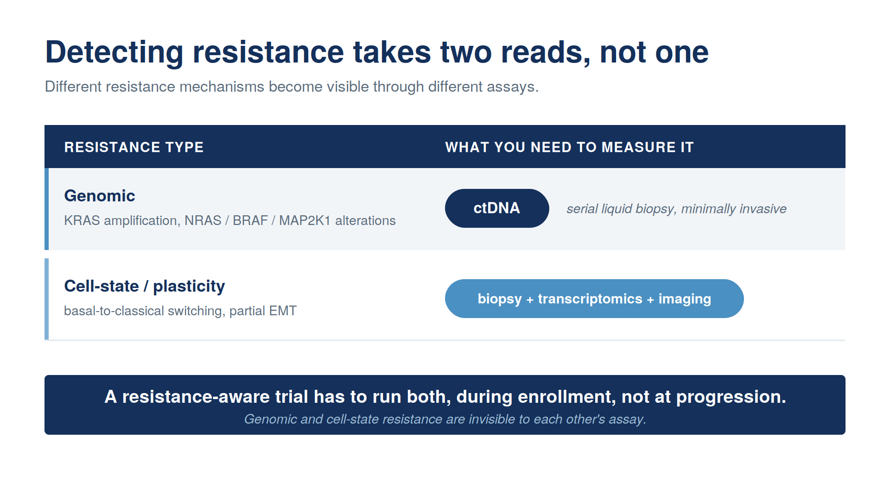
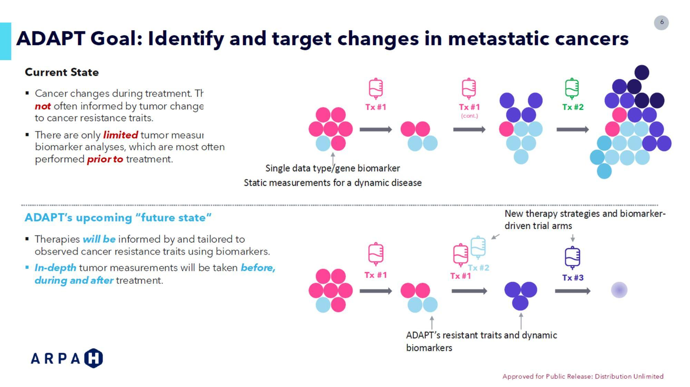
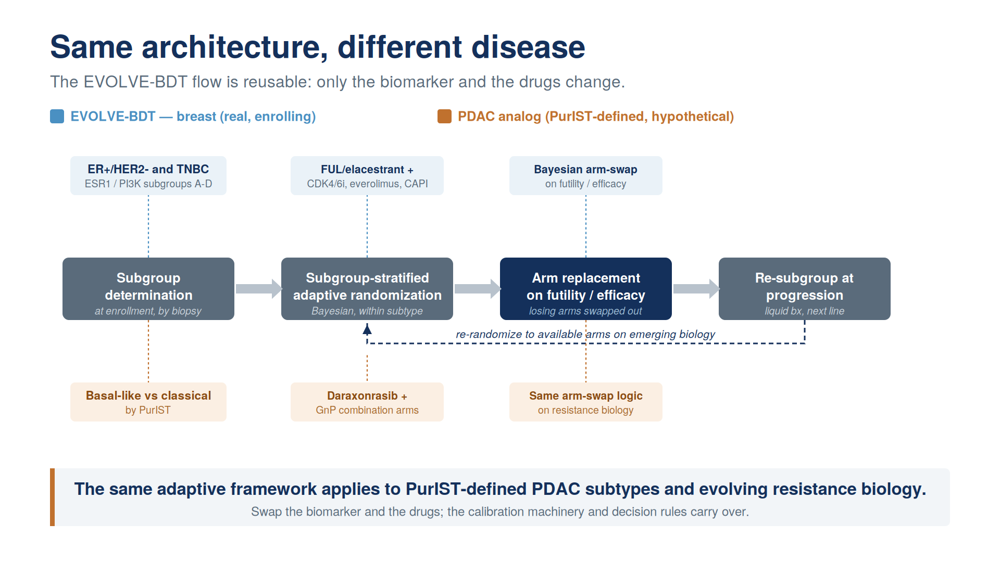

```{r}
#| label: setup
#| include: false
library(ggplot2)
library(gridExtra)
set.seed(2025)
```

## Today's argument {.smaller}

::: {style="font-size: 1.15em; margin-top: 0.6em; color: #13294B;"}
> **New RAS therapies in PDAC need new kinds of trials.**
:::

::: {.fragment style="margin-top: 0.8em; color: #13294B;"}
We know how to **optimize combination doses**.
:::

::: {.fragment style="margin-top: 0.4em; color: #13294B;"}
We know how to **adapt trials to emerging resistance**.
:::

::: {.fragment style="margin-top: 1.0em; padding: 0.7em 1em; background-color: #F8F9FA; border-left: 4px solid #4B9CD3; color: #13294B; font-weight: 600;"}
The challenge is making these designs practical enough to launch.
:::

::: {.notes}
**Pull-from-if-needed**

- Argument: RAS-era combinations create two trial-design demands — combination dose-finding under non-monotonic dose-response, and resistance tracking with in-trial adaptation
- Bayesian adaptive designs answer both, at different maturity: dose-optimization methods **established**; resistance-tracking designs **enrolling**
- BATON is the closing tool, not the headline — what's been missing is the infrastructure to make these designs practical

**Q&A pockets**

- *Q: Has EVOLVE reported yet?*
  A: No — it's enrolling. The "established vs enrolling" asymmetry is deliberate. Don't let live delivery drift toward an implied result; the readout is what we'll report when interim looks are run.

**Delivery**: The asymmetry is on purpose for this SPORE audience. Methods *established* vs designs *enrolling* — don't overclaim the resistance side.
:::


# The clinical case {.center background-color="#13294B"}

::: {style="color: #FFFFFF; font-size: 0.7em; margin-top: 1em;"}
*Why combinations, and why now?*
:::

::: {.notes}
**Pull-from-if-needed**

- Three-slide arc: largest PDAC survival signal in a generation (RASolute) → narrow tolerability margin → biomarker-driven combinations are the next move
- Establishes clinical pressure before pivoting to design problems

**Delivery**: One-line transition. Don't linger.
:::


## The RAS revolution has arrived for PDAC {.smaller}

::: {style="margin-top: 0.1em; text-align: center; font-size: 1.0em; color: #13294B; font-weight: 600;"}
A major survival signal from direct RAS inhibition in PDAC.
:::

:::: {.columns}

::: {.column width="55%"}
- **RASolute 302** (2L mPDAC, *NEJM* 2026) [@rasolute302]:
  - **Median OS: 13.2 vs 6.7 months**
  - **HR 0.40, 60% reduction in risk of death** (p < 0.0001)
- Daraxonrasib (RMC-6236), oral, multi-selective RAS(ON) inhibitor
- ASCO 2026 Plenary, May 31 (Wolpin)

::: {.slide-refs}
O'Reilly et al., *NEJM* 2026 (RASolute 302) · ASCO Plenary Abstr LBA5
:::
:::

::: {.column width="45%"}
{fig-alt="Schematic KM curve illustrating RASolute 302 OS benefit (13.2 vs 6.7 mo, HR 0.40)"}
:::

::::

::: {.notes}
**Pull-from-if-needed**

- Largest PDAC survival signal in a generation. Cite NEJM, not press release — this room will care
- Final analysis presented at ASCO Plenary May 31, *NEJM* same day
- 13.2 vs 6.7 mo OS is the overall **ITT** figure
- Dual primary endpoint = OS + PFS in the RAS G12-mutant subgroup (228 vs 231 patients); HR also 0.40, P = 5.9e-10
- Median follow-up 8.5 months at Feb 10 data cutoff (use this if anyone presses on maturity)
- Implication for the room: every program here will soon be deciding what to combine and in which biomarker-defined patients

**Q&A pockets**

- *Q: How mature is the follow-up?*
  A: 8.5 months median at the Feb 10 cutoff.
- *Q: Is 13.2 vs 6.7 the primary endpoint?*
  A: That's ITT. Dual primary was OS + PFS in the RAS G12-mutant subgroup (228 vs 231), where HR was also 0.40 (P = 5.9e-10).
- *Q: Doesn't the ITT-vs-primary distinction weaken it?*
  A: No. The 0.40 benefit held in both. Robustness across RAS mutation status is the whole point of a multi-selective RAS(ON) inhibitor — a strength to lean on, not a vulnerability.

**Delivery**: Don't undersell. This reshapes the GI oncology trial landscape over the next 2-3 years.
:::


## …but monotherapy has a narrow tolerability margin {.smaller}

::: {style="margin-top: 0.2em; text-align: center; font-size: 0.9em; color: #5B6670; font-style: italic;"}
RMC-6236-001 (PDAC cohort, *NEJM* 2026) [@daraxonrasib_mono]
:::

::: {.fragment style="margin-top: 0.5em;"}
```{r}
#| fig.height: 3.0
#| fig.width: 9
#| fig.align: center
#| fig.alt: "Horizontal bar chart of daraxonrasib monotherapy tolerability (RMC-6236-001 PDAC cohort): 0% TRAE-related discontinuation at 300 mg; 30% Grade ≥3 TRAEs in the full cohort (n=168, doses ≤300 mg); 34% Grade ≥3 TRAEs at 300 mg; 48% required dose modification at 300 mg."
library(ggplot2)
toxdata <- data.frame(
  metric = factor(c("TRAE-related discontinuation\n(300 mg)",
                    "Grade ≥3 TRAEs\n(full cohort, n=168, ≤300 mg)",
                    "Grade ≥3 TRAEs\n(300 mg)",
                    "Required dose modification\n(300 mg)"),
                  levels = c("Required dose modification\n(300 mg)",
                             "Grade ≥3 TRAEs\n(300 mg)",
                             "Grade ≥3 TRAEs\n(full cohort, n=168, ≤300 mg)",
                             "TRAE-related discontinuation\n(300 mg)")),
  pct = c(0, 30, 34, 48),
  fill = c("#4B9CD3", "#5B6670", "#5B6670", "#C75050")
)
ggplot(toxdata, aes(x = metric, y = pct, fill = fill)) +
  geom_col(width = 0.6) +
  geom_text(aes(label = paste0(pct, "%")),
            hjust = -0.2, size = 5, fontface = "bold", color = "#13294B") +
  scale_fill_identity() +
  scale_y_continuous(limits = c(0, 65), expand = c(0, 0)) +
  coord_flip() +
  labs(x = NULL, y = NULL) +
  theme_minimal(base_size = 11) +
  theme(panel.grid = element_blank(),
        axis.text.x = element_blank(),
        axis.ticks = element_blank(),
        axis.text.y = element_text(face = "bold", color = "#13294B", size = 11))
```
:::

::: {.fragment style="margin-top: 0.6em; padding: 0.5em 0.8em; background-color: #F8F9FA; border-left: 3px solid #4B9CD3; font-size: 0.9em; color: #13294B;"}
**48% of monotherapy patients require dose modification at 300 mg**, a strong signal of **limited tolerability margin**. Combinations can layer **overlapping, non-additive** toxicity that single-agent data don't reliably predict, which is why the combination needs its own dose-finding.
:::

::: {.slide-refs}
Wolpin et al., *NEJM* 2026 (RMC-6236-001 PDAC cohort)
:::

::: {.notes}
**Pull-from-if-needed**

- Full cohort (n=168, ≤300 mg): ~30% Grade ≥3 toxicity
- 0% TRAE-related discontinuation — remarkable for an active PDAC drug. Qualifier: progression eventually pulls everyone off; nobody pulled off for tolerability
- **At 300 mg** (Phase 3 monotherapy dose): G≥3 ~34%, **48% required dose modification** — the load-bearing number for the rest of the talk
- Combination already moved to 200 mg — informally acknowledging the same headroom problem without searching for the optimum (sets up next slide)

**Q&A pockets**

- *Q: So is daraxonrasib tolerable?*
  A: As monotherapy, yes — clearly. The real question is at what dose, what schedule, what partners, in which patients. That's a trial-design question; the rest of the talk answers it.
- *Q: Why anchor on 48%?*
  A: It's the headroom you start spending the moment you add a partner. For a drug positioned as the combination backbone, 48% dose-modification at the monotherapy dose is the load-bearing tolerability signal.

**Delivery**: 48% is the load-bearing number. Don't lead with 0% discontinuation — acknowledge in passing, don't headline.
:::


## Biomarker-driven combinations are the next move {.smaller}

:::: {.columns}

::: {.column width="50%"}
::: {.incremental style="font-size: 0.92em; line-height: 1.5;"}
- Daraxonrasib drives **RTK pathway activation** on PDAC cells, through cell-surface upregulation [@zhuang2026rtk] and recurrent genomic alterations [@aguirre2024resistance], the mechanistic case for biomarker-driven, resistance-preemptive combinations
- **1L combination cohort** (daraxonrasib **200 mg** + GnP, n=40) [@rmcgi102]:
  - ORR: **58%** · DCR: **90%** · 6-mo PFS: **84%** · 6-mo OS: **90%**
:::
:::

::: {.column width="50%"}
{width=100% fig-align="center" fig-alt="Schematic: daraxonrasib drives RTK cell-surface expression upregulation on PDAC cells, a compensatory feedback that is both a resistance mechanism and a combination target"}
:::

::::

::: {.fragment style="margin-top: 0.5em; padding: 0.5em 0.8em; background-color: #F8F9FA; border-left: 3px solid #4B9CD3; font-size: 0.95em; color: #13294B; text-align: center; font-style: italic;"}
The same adaptation that creates resistance may create a therapeutic vulnerability.
:::

::: {style="margin-top: 0.4em;"}
::: {.slide-refs}
Zhuang et al., *Cancer Res* 2026 (AACR RAS) · Aguirre et al., *Cancer Discov* 2024 · Wolpin et al., AACR 2026 LB407
:::
:::

::: {.notes}
**Pull-from-if-needed**

- Mallika Singh's group at Revolution Medicines made the mechanistic case for what comes next
- RAS inhibition upregulates RTKs on the cell surface — simultaneously a resistance mechanism AND a rational combination target
- Manufacturer's explicit framing: combinations should be biomarker-driven and resistance-preemptive — they're staking out the next decade
- First combination cohort (daraxonrasib 200 mg + GnP, 1L mPDAC, n=40): **58% ORR, 90% DCR, 84% 6-mo PFS, 90% 6-mo OS**

**Q&A pockets**

- *Q: Is RTK upregulation well-supported as a mechanism?*
  A: Two complementary streams — cell-surface upregulation (Zhuang 2026 AACR RAS) and recurrent genomic alterations (Aguirre 2024). Same combination rationale from both angles.
- *Q: Why qualify "RTK pathway activation" instead of just "RTK upregulation"?*
  A: Because the mechanism is broader than cell-surface upregulation alone — the pathway is activated by multiple resistance routes (cell-surface, genomic, ligand). Yeh flagged this; the slide language carries the qualifier.

**Delivery**: The combinations are coming. Many of them.
:::


# The dose-finding problem {.center background-color="#13294B"}

::: {style="color: #FFFFFF; font-size: 0.7em; margin-top: 1em;"}
*Why MTD only may not be best for RAS combinations, and what replaces it.*
:::


## Why combinations break the rules you grew up on {.smaller}

::: {.incremental}
- **Rivière's 2015 review of 162 pre-2015 combination Phase I trials: 88% used 3+3** even when both drugs were escalated [@riviere2015combo; @harrington2013dual].
- **Why 3+3 doesn't fit combinations.** Built for single-agent cytotoxics [@letourneau2009], it assumes monotonic dose-toxicity, Cycle-1-observable DLTs, and a single dose dimension, combinations strain all three (e.g., **immune toxicities often emerge weeks later, outside the DLT window**).
- **The two-drug dose map is rarely built.** In practice: pick A's dose, fix it, add B. The joint surface goes unexplored for two reasons: **regulatory anchoring** of approved-agent doses, and the **calibration burden** of dual-agent designs.
:::

::: {style="margin-top: 0.6em; font-size: 0.78em; color: #13294B; font-style: italic; text-align: center;"}
*Two-drug dose map: how efficacy and toxicity change across every (A, B) dose pair, not just along one drug's axis.*
:::

::: {.slide-refs}
Le Tourneau et al., *JNCI* 2009 · Rivière et al., *Ann Oncol* 2015
:::

::: {.notes}
**Pull-from-if-needed**

- 3+3 answered the question it was built for — MTD of a cytotoxic under monotonic toxicity. For RAS combinations none of those assumptions hold
- **Verbal translation** for "the two-drug dose map is rarely built": *"In other words, we often never learn where the best combination actually is."* Slide phrasing is methodologist-friendly; spoken line lands it for clinicians
- Structural problem: protocol fixes A and adds B → two monotherapy designs run in series; joint surface never characterized
- Formal argument: Thall, Garrett-Mayer, Wages, Halabi, Cheung (*Clin Trials* 2024, SCT response to Optimus): conventional Phase I designs cannot reliably identify safe and effective doses

**Q&A pockets**

- *Q: You're lumping CRM/BLRM/mTPI/BOIN with 3+3 — they're more sophisticated.*
  A: Agree they target a toxicity interval rather than a single point (BLRM especially), but they still drive selection by toxicity rather than benefit-risk. That's the framing this section contrasts against OBD. The MTD paradigm = optimize-against-toxicity, not just 3+3.
- *Q: What about non-Bayesian / frequentist combination designs?*
  A: Few practical deployed ones exist. Field converged on Bayesian / model-assisted (POCRM, BOIN-COMB, BLRM, PIPE, surface-free) because combinations need strength borrowed across dose pairs and partial-order constraints — natural with priors. Cleanest frequentist alternative: Conaway, Dunbar & Peddada 2004 (Biometrics 60:661-669), order-restricted isotonic regression — theoretically clean but not widely deployed. Sequential lead-in (find A, add B) is dominant industry practice — that's what we're criticizing.
- *Q: "Almost never" — is that documented?*
  A: Rivière et al 2015 systematic review of 162 combination Phase I trials: 88% used 3+3; all but one used a design developed for single-agent evaluation.

**Delivery**: Land the verbal translation: "*we often never learn where the best combination actually is.*" Next slide makes it concrete with Amgen.
:::


## The Amgen case: sotorasib + pembrolizumab {.smaller}

::: {style="margin-top: 0.1em; text-align: center; font-size: 0.95em; color: #13294B; font-style: italic;"}
A real-world example of why combination toxicity can surprise us.
:::

::: {style="margin-top: 0.4em; font-size: 1.0em;"}
**Same sponsor, two different designs:**
:::

- **Monotherapy (CodeBreaK 100):** Bayesian model-based, single-agent surface
- **Combination:** IO dose fixed, only sotorasib varied, joint surface never modeled

::: {.fragment style="margin-top: 0.6em;"}
The defining toxicity:

- Severe **immune-mediated** hepatotoxicity, not predictable from the single agent
- **88%** of Grade 3-4 events outside the Cycle 1 DLT window [@codebreak_io2022]
:::

::: {.fragment style="margin-top: 0.5em; margin-bottom: 0.4em; padding: 0.5em 0.8em; background-color: #F8F9FA; border-left: 3px solid #4B9CD3; color: #13294B; font-size: 0.85em; text-align: center;"}
**What MTD-only dose-finding was never built to handle, all at once:** joint surface unsearched, non-additive toxicity, late-onset toxicity.
:::

::: {.slide-refs}
Hong et al., *NEJM* 2020 (CodeBreaK 100) · Li et al., *JTO* 2022 (WCLC OA03.06)
:::

::: {.notes}
**Pull-from-if-needed**

- Same sponsor (Amgen) used model-based BLRM for sotorasib monotherapy (CodeBreaK 100) — not a competence problem
- Combination (sotorasib + pembro, CodeBreaK 100/101): fixed IO dose, explored only sotorasib across cohorts, never modeled the two-drug surface
- Severe hepatotox: 22/25 (88%) Grade 3-4 events landed *outside* the 21-day DLT window — a Cycle 1 design would have missed most of it
- Hypothesized mechanism: **immune-mediated**, not pharmacologic. Sotorasib's pro-inflammatory effect on the TME re-activates the latent T-cell response pembro left in place. Biopsies: patterns consistent with ICI-induced hepatitis
- Sequencing matters: real-world series shows 58% Grade ≥3 hepatotox when sotorasib started within 30 days of prior ICI
- Same immune mechanism explains *both* "unpredictable from single agent" and "late-onset" — ICI-mediated toxicity has weeks-to-months kinetics, not days

**Q&A pockets**

- *Q: Where does 88% come from?*
  A: Li et al., WCLC 2022 OA03.06 / JTO 2022 supplement. 22/25 is the audit-ready numerator/denominator.
- *Q: Why didn't they use a late-onset-aware design?*
  A: TITE-BOIN (Yuan 2018) and TITE-CRM (Cheung 2000) have existed >5 yrs. No published RAS Phase I has adopted them: sotorasib BLRM/21-day; adagrasib mTPI/Cycle-1; daraxonrasib standard Bayesian/21-day. Adoption is the gap, not method.
- *Q: Doesn't BLRM handle combinations?*
  A: Yes — Neuenschwander 2015 / Cotterill 2015 dual-agent extensions with interaction term + EWOC overdose control. Amgen didn't deploy it for sotorasib+pembro because pembro 200 mg is the **regulatory anchor**; sponsors don't routinely re-derive approved IO doses. That's a sponsor-FDA conversation, not a methodology problem. BATON's dual-agent value lands cleanly in **novel-novel doublets** (e.g., elironrasib + daraxonrasib, slide 32 CRC tile), where neither drug has a regulatory anchor and the barrier left is calibration cost.
- *Q: Does this violate monotonic dose-toxicity?*
  A: Don't claim that — they didn't search the surface, so non-monotonicity isn't demonstrable here. Stick to joint-surface-unsearched + non-additive + late-onset.
- *Q: What's the mechanism for the hepatotox?*
  A: Immune-mediated. Sources: Begum et al *JTO* 2023 brief report; *JCO PO* 2024 case series on adagrasib after sotorasib-related hepatotox.

**Delivery**: One example demonstrates everything 3+3 was never built for, all at once: joint surface unsearched, toxicity non-additive, late-onset outside Cycle 1.
:::


## Why MTD-only dose-finding doesn't fit targeted agents and immunotherapies {.smaller}

::: {style="text-align: center; margin-top: 0em;"}

:::

::: {.incremental style="margin-top: 0.4em; font-size: 0.85em; line-height: 1.35;"}
- **Pembrolizumab**, efficacy plateaus at the lowest dose tested; MTD never reached [@patnaik2015pembro]
- **CAR-T**, efficacy *rises then falls* (umbrella); high doses drive severe CRS/ICANS, not benefit
- **A RAS combination spans both shapes.** Neither rewards titrating to toxicity.
:::

::: {.notes}
**Pull-from-if-needed**

- MTD fails for two mechanistic reasons, both visible in the trio
- **Plateau** (pembrolizumab): RR across 2 mg/kg, 10 mg/kg q3w, 10 mg/kg q2w were statistically indistinguishable; exposure-response flat; MTD never reached. 200 mg flat dose was PK-derived to reproduce 2 mg/kg exposures in a typical patient — weight-based-to-flat conversion of the lowest active dose, not a search for the optimum
- **Umbrella** (CAR-T): very high cell doses drive severe CRS/ICANS without proportional benefit. Downslope is product-specific (true decline, plateau, or threshold) but absence of monotonic increase is universal across CAR-T and bispecifics — enough to break titrate-to-toxicity
- Daraxonrasib = plateau (monotherapy never cleanly reached MTD, no DLTs, 300 mg selected on tolerability — exactly why 300 vs 200 is still a live question)
- Partners bring the umbrella

**Q&A pockets**

- *Q: Why use non-RAS examples to make a RAS point?*
  A: Pembro and CAR-T are the cleanest published examples of the two shapes. The same shapes show up in the IO and bispecific partners daraxonrasib will be combined with.
- *Q: Where was the pembro flat exposure-response documented?*
  A: Patnaik et al 2015 — the original dose-finding studies.

**Delivery**: A RAS combination lives across both panels. That alone breaks titrate-to-toxicity. You need a design that watches both dimensions.
:::


## The cost of MTD-only dose-finding {.smaller}

::: {.incremental style="margin-top: 0.5em;"}
- **Sotorasib** (KRAS G12C, first-in-class, approved 2021) [@hong2020sotorasib]:
  - 960 mg selected as the **highest dose tested**, no DLTs, a more-is-better default, not an MTD
- **More than 40% of patients** in small-molecule registrational trials require dose reductions or interruptions [@fda_aacr_dosing2025]
:::

::: {.fragment style="margin-top: 0.6em; text-align: center; font-size: 1.6em; color: #C75050; font-weight: 700;"}
240 mg ≈ 960 mg on PFS
:::

::: {.fragment style="margin-top: 0.1em; text-align: center; font-size: 0.85em; color: #5B6670; font-style: italic;"}
FDA-required post-marketing comparison: similar PFS at **one-quarter** the exposure [@hochmair2024sotorasib].
:::

::: {.fragment style="margin-top: 0.5em; text-align: center; font-size: 1.0em; color: #13294B; font-weight: 600;"}
*Same drug class as daraxonrasib.*
:::

::: {.slide-refs}
Hong et al., *NEJM* 2020 (CodeBreaK 100) · Hochmair et al., *Eur J Cancer* 2024 · FDA–AACR, *Clin Cancer Res* 2025
:::

::: {.notes}
**Pull-from-if-needed**

- FDA-AACR *Clin Cancer Res* 2025: >40% of patients in small-molecule registrational trials require dose reductions/interruptions from overly aggressive dosing
- Same series links that pattern to potentially accelerated emergence of drug resistance — quietly foreshadows the back half
- Sotorasib (first-in-class KRAS G12C, 2021): Phase I never reached MTD because no DLTs; 960 mg was simply the highest dose tested — more-is-better default
- FDA post-marketing requirement: 240 mg vs 960 mg head-to-head. PFS similar at 240 mg, i.e. approved dose was 4× higher than needed on the primary endpoint
- Daraxonrasib is the same drug class — getting this wrong in Phase I means every combination on top inherits an unnecessarily toxic starting point

**Q&A pockets**

- *Q: Doesn't the October 2023 ODAC vote on CodeBreaK 200 muddy this?*
  A: Deliberately not folding it in. The 10-2 vote was about whether the confirmatory PFS read-out could be reliably interpreted given trial-conduct issues (informative censoring, imbalanced early dropout, investigator-assessed imaging) — **not** about the dose. Conflating them is the move a regulatory-savvy attendee will flag. The dose story alone is airtight; keep it that way.

**Delivery**: The 240 vs 960 PFS-similar comparison is the clean evidence. Don't drift into ODAC territory unless asked.
:::


## Project Optimus: the regulatory ground has shifted {.smaller}

::: {style="margin-top: 0.4em;"}
- FDA final guidance, 2024 [@fda_optimus_guidance]
- Sponsors must **study more than one dose** and justify on efficacy and safety
- **Maximum Tolerated Dose → Optimal Biological Dose (OBD)**, a dose optimized on benefit-risk
:::

::: {style="margin-top: 0.6em; padding: 0.55em 1em; background-color: #F8F9FA; border-left: 4px solid #4B9CD3; font-size: 0.92em; color: #13294B;"}
**OBD** = the dose that **optimizes the efficacy–toxicity trade-off**, chosen by weighing the value of a response against the cost of toxicity, not by escalating until DLTs cap the dose [@zhou2019uboin; @lin2020boin12].
:::

::: {style="margin-top: 0.4em; padding: 0.5em 0.9em; background-color: #F8F9FA; border-left: 3px solid #4B9CD3; font-size: 0.85em; color: #13294B;"}
**Thall et al.** *Clin Trials* 2024: conventional Phase I designs cannot reliably identify safe and effective doses [@thall2024optimus].
:::

::: {.slide-refs}
FDA Guidance for Industry, 2024 (Project Optimus) · Thall et al., *Clin Trials* 2024
:::

::: {.notes}
**Pull-from-if-needed**

- 2024 Project Optimus guidance formalized the move from "maximum tolerated dose" to a dose optimized on benefit-risk
- Guidance language is "optimized dosage"; field's OBD shorthand maps to it directly
- No longer a biostatistician preference — it's the FDA's stated preference. Submit an MTD-only Phase I today, your reviewers will push back
- FDA's stated default: take two doses into Phase II (MTD + one below), randomize, compare benefit-risk
- Works for single agent. Does **not** scale to combinations — you can't randomize across a 2D joint dose grid

**Q&A pockets**

- *Q: Doesn't FDA's two-dose default solve this?*
  A: For single agents, yes. For combinations, no — you can't randomize across the joint grid. That's where model-based joint designs stop being a preference and become the only practical way to meet the benefit-risk standard. Next slide goes there.
- *Q: Is OBD the same as the FDA's "optimized dosage"?*
  A: Yes — the field's OBD is shorthand for what the guidance calls "optimized dosage."

**Delivery**: Lands directly on the MTD problems we just walked through. This is the regulatory ground shifting under sponsors who only characterize MTD.
:::


## How OBD selection actually works {.smaller}

:::: {.columns}

::: {.column width="50%"}
::: {style="margin-top: 0.4em; font-size: 1.05em; color: #13294B; font-weight: 600;"}
**Instead of escalating until toxicity, choose the dose with the best benefit-risk profile.**
:::

::: {style="margin-top: 0.6em; font-size: 0.95em; color: #13294B;"}
*"How much efficacy would you trade for additional toxicity?"*
:::

::: {style="margin-top: 0.4em; font-size: 0.88em; line-height: 1.45;"}
The team writes that utility table down up front. The design then searches inside the safe envelope for the dose that **maximizes benefit-risk**, not toxicity.
:::

::: {.fragment style="margin-top: 0.5em; font-size: 0.78em;"}
**Elicited utility table** (Zhou 2019 framework) [@zhou2019uboin]:

|              |   Tox  | No tox |
|:-------------|:------:|:------:|
| **Response** |  40    | **100** |
| No response  |   **0**   |  60    |

::: {style="margin-top: 0.4em; font-size: 0.88em; color: #13294B; font-style: italic; text-align: center;"}
*A tolerated non-response (60) is preferred to a toxic response (40).*
:::
:::

:::

::: {.column width="50%"}
```{r}
#| fig.height: 5.4
#| fig.width: 6.6
#| fig.align: center
#| fig.alt: "U-BOIN utility surface: toxicity probability (x-axis, 0-0.5) vs efficacy probability (y-axis, 0-0.6). Background heatmap shades utility across the plotted region from ~30 at the lower-right (high toxicity, low efficacy) to ~84 at the upper-left (low toxicity, high efficacy); the legend extends 0-100 to anchor the full elicited utility range. Red dashed lines mark admissibility cutoffs (max acceptable toxicity 25%, min required efficacy 20%). Six dose levels DL1-DL6 plotted as points; admissible doses are navy, inadmissible doses are gray, and the OBD (admissible dose with highest utility) is highlighted as a red diamond with an OBD label and leader arrow to the northwest."
library(ggplot2)

# Elicited utilities (per U-BOIN framework, Zhou 2019)
u_no_no   <- 60    # no response, no DLT
u_yes_no  <- 100   # response, no DLT  <- best
u_no_yes  <- 0     # no response, DLT  <- worst
u_yes_yes <- 40    # response, DLT

# Utility surface u(tox_prob, eff_prob) under outcome independence
util_fn <- function(tox, eff) {
  (1 - eff) * (1 - tox) * u_no_no +
  eff * (1 - tox) * u_yes_no +
  (1 - eff) * tox * u_no_yes +
  eff * tox * u_yes_yes
}

tox_seq <- seq(0, 0.5, length = 100)
eff_seq <- seq(0, 0.6, length = 100)
util_grid <- expand.grid(tox = tox_seq, eff = eff_seq)
util_grid$utility <- util_fn(util_grid$tox, util_grid$eff)

# Candidate dose levels
doses <- data.frame(
  dl  = c("DL1", "DL2", "DL3", "DL4", "DL5", "DL6"),
  tox = c(0.05, 0.10, 0.18, 0.27, 0.35, 0.42),
  eff = c(0.10, 0.26, 0.40, 0.45, 0.42, 0.34)
)
tox_max <- 0.25
eff_min <- 0.20
doses$admissible <- doses$tox <= tox_max & doses$eff >= eff_min
doses$utility    <- util_fn(doses$tox, doses$eff)
doses$is_obd     <- FALSE
if (any(doses$admissible)) {
  doses$is_obd[ which(doses$admissible)[which.max(doses$utility[doses$admissible])] ] <- TRUE
}

obd_x <- doses$tox[doses$is_obd]
obd_y <- doses$eff[doses$is_obd]

ggplot() +
  geom_tile(data = util_grid, aes(x = tox, y = eff, fill = utility)) +
  scale_fill_gradientn(
    colors  = c("#FFFFFF", "#FFFFFF", "#E0EDF6", "#A4C8E1", "#1F4E79", "#0A1F38"),
    values  = c(0.00, 0.42, 0.48, 0.66, 0.88, 1.00),
    name    = "Utility",
    limits  = c(0, 100), breaks = c(0, 25, 50, 75, 100)
  ) +
  # Admissibility lines
  geom_vline(xintercept = tox_max, color = "#C75050",
             linewidth = 1.3, linetype = "dashed") +
  geom_hline(yintercept = eff_min, color = "#C75050",
             linewidth = 1.3, linetype = "dashed") +
  annotate("label", x = tox_max - 0.005, y = 0.595,
           label = "Max acceptable toxicity (25%)",
           color = "#C75050", hjust = 1, fontface = "bold",
           size = 3.0, label.size = 0, fill = "#FFFFFF") +
  annotate("label", x = 0.495, y = eff_min - 0.005,
           label = "Min required efficacy (20%)",
           color = "#C75050", hjust = 1, vjust = 1, fontface = "bold",
           size = 3.0, label.size = 0, fill = "#FFFFFF") +
  # Non-OBD dose points
  geom_point(data = doses[!doses$is_obd, ],
             aes(x = tox, y = eff, color = admissible),
             shape = 19, size = 10) +
  scale_color_manual(values = c("TRUE" = "#13294B", "FALSE" = "#5B6670"),
                     guide = "none") +
  # OBD diamond
  geom_point(data = doses[doses$is_obd, ],
             aes(x = tox, y = eff),
             shape = 23, fill = "#C75050", color = "white",
             size = 14, stroke = 2) +
  # Dose-level labels inside each point
  geom_text(data = doses, aes(x = tox, y = eff, label = dl),
            color = "white", size = 3.2, fontface = "bold") +
  # OBD leader arrow + label, NW of DL3 (away from DL4)
  annotate("segment",
           x = obd_x - 0.07, y = obd_y + 0.085,
           xend = obd_x - 0.02, yend = obd_y + 0.022,
           color = "#C75050", linewidth = 0.9,
           arrow = arrow(length = unit(0.25, "cm"), type = "closed")) +
  annotate("label",
           x = obd_x - 0.075, y = obd_y + 0.090,
           label = "OBD", color = "#C75050",
           size = 6.5, fontface = "bold", hjust = 1,
           label.size = 0, fill = "#FFFFFF") +
  labs(x = "Toxicity probability",
       y = "Efficacy probability") +
  scale_x_continuous(limits = c(0, 0.5), expand = c(0, 0),
                     breaks = seq(0, 0.5, by = 0.1)) +
  scale_y_continuous(limits = c(0, 0.62), expand = c(0, 0),
                     breaks = seq(0, 0.6, by = 0.1)) +
  theme_minimal(base_size = 12) +
  theme(panel.grid = element_blank(),
        # Solid black axes + prominent tick marks
        axis.line = element_line(color = "#000000", linewidth = 0.7),
        axis.ticks = element_line(color = "#000000", linewidth = 0.6),
        axis.ticks.length = unit(0.18, "cm"),
        axis.title = element_text(face = "bold", color = "#13294B", size = 12),
        axis.text = element_text(color = "#13294B", size = 10),
        legend.position = "right",
        legend.title = element_text(face = "bold", color = "#13294B", size = 11),
        legend.text = element_text(color = "#13294B", size = 9),
        legend.key.height = unit(1.1, "cm"),
        legend.key.width = unit(0.45, "cm"))
```

::: {style="margin-top: 0.2em; font-size: 0.7em; color: #5B6670; font-style: italic; text-align: center; line-height: 1.3;"}
**OBD** = admissible dose (inside red lines) with the highest utility.
:::
:::

::::

::: {.slide-refs}
Liu & Yuan 2015 · Zhou, Lee & Yuan 2019 (U-BOIN) · FDA Optimus Guidance
:::

::: {.notes}
**Pull-from-if-needed**

- One-sentence how: before the trial starts, the team writes down a **utility** (how to weigh a response against a Grade 3 toxicity), and the design searches inside the safe toxicity envelope for the dose that maximizes that utility
- Previous slide established the **what** (Optimus); this slide answers the **how**
- The utility is the navigation system. Bayesian / model-assisted rules keep the trial inside the safe envelope. Output: an OBD with a characterized benefit-risk profile, not an MTD
- **Predates Optimus** — important to land verbally: U-BOIN 2019, BOIN 2015, TITE-BOIN 2018, POCRM 2011, BLRM 2008. Optimus is 2021/2024. Optimus didn't create these designs; it codified what the field was already doing. The regulatory shift validated 5–15 years of methodological work
- **Credibility line**: leading RAS Phase I programs already run on Bayesian designs — sotorasib BLRM in CodeBreaK 100; adagrasib mTPI in KRYSTAL-1
- One-sentence takeaway: modern Phase I optimizes benefit-risk instead of maximizing toxicity. Don't recite the acronym list out loud

**Q&A pockets**

- *Q: Which design family — be specific?*
  A: BOIN family is the workhorse. BOIN (Liu & Yuan 2015) single-agent; BOIN-COMB combinations; TITE-BOIN late-onset toxicity; BOIN12 utility-based Phase I/II; U-BOIN two-stage utility. POCRM (Wages & Conaway) and BLRM (Neuenschwander, Branson, Gsponer) are the established combination alternatives. mTPI another model-assisted variant; PIPE (Mander 2015) dual-agent product-of-independent-Betas.
- *Q: Which one is actually used?*
  A: In U.S. / academic, BOIN/U-BOIN dominate for the printed-decision-table operational simplicity. Novartis uses BLRM by default. The rest are specialty tools for specific constraints.
- *Q: Why aren't RAS Phase I trials using TITE-variants given the sotorasib+pembro late-tox finding?*
  A: They're not — all RAS Phase I uses Cycle-1 windows. That's the deployment-gap thesis: tools exist, adoption lags. Connects to slide 9 Q&A.

**Delivery**: One-sentence takeaway only. Acronyms are Q&A pockets, not slide content.
:::


## Combination dose selection in RAS is harder {.smaller}

::: {style="margin-top: 0.3em; font-size: 1.1em; text-align: center; color: #13294B; font-weight: 700;"}
**Combinations make MTD-only dose-finding worse on every axis.**
:::

:::: {.columns}

::: {.column width="55%"}
```{r}
#| fig.height: 4.4
#| fig.width: 5.6
#| fig.align: center
library(ggplot2)
n <- 60
grid <- expand.grid(A = seq(0, 1, length = n), B = seq(0, 1, length = n))
grid$eff <- pmax(0, 0.85 - 1.6 * ((grid$A - 0.32)^2 + (grid$B - 0.42)^2))
mono_A <- data.frame(A = 0.68, B = 0.02, lab = "Monotherapy A\nOBD")
mono_B <- data.frame(A = 0.02, B = 0.75, lab = "Monotherapy B\nOBD")
combo  <- data.frame(A = 0.32, B = 0.42, lab = "Combination\nOBD")

ggplot() +
  geom_tile(data = grid, aes(x = A, y = B, fill = eff)) +
  scale_fill_gradient(low = "#FFFFFF", high = "#4B9CD3", guide = "none") +
  geom_contour(data = grid, aes(x = A, y = B, z = eff),
               color = "#13294B", linewidth = 0.3, alpha = 0.4, bins = 6) +
  # mono A on x-axis
  geom_point(data = mono_A, aes(x = A, y = B), shape = 21, fill = "#5B6670",
             color = "white", size = 6, stroke = 2) +
  geom_segment(aes(x = 0.68, xend = 0.68, y = 0.08, yend = 0.02),
               arrow = arrow(length = unit(0.18, "cm"), type = "closed"),
               color = "#5B6670", linewidth = 0.8) +
  geom_text(data = mono_A, aes(x = A, y = B + 0.09, label = lab),
            color = "#5B6670", size = 4.2, hjust = 0.5, vjust = 0,
            fontface = "bold", lineheight = 0.9) +
  # mono B on y-axis
  geom_point(data = mono_B, aes(x = A, y = B), shape = 21, fill = "#5B6670",
             color = "white", size = 6, stroke = 2) +
  geom_segment(aes(x = 0.08, xend = 0.02, y = 0.75, yend = 0.75),
               arrow = arrow(length = unit(0.18, "cm"), type = "closed"),
               color = "#5B6670", linewidth = 0.8) +
  geom_text(data = mono_B, aes(x = A + 0.10, y = B, label = lab),
            color = "#5B6670", size = 4.2, hjust = 0, vjust = 0.5,
            fontface = "bold", lineheight = 0.9) +
  # combination optimum
  geom_point(data = combo, aes(x = A, y = B), shape = 23, fill = "#C75050",
             color = "white", size = 9, stroke = 3) +
  geom_segment(aes(x = 0.55, xend = 0.39, y = 0.65, yend = 0.47),
               arrow = arrow(length = unit(0.22, "cm"), type = "closed"),
               color = "#C75050", linewidth = 1) +
  geom_text(aes(x = 0.55, y = 0.69, label = "Combination\nOBD"),
            color = "#C75050", size = 4.6, hjust = 0, vjust = 0,
            fontface = "bold", lineheight = 0.9) +
  # dotted projections from combo optimum to axes
  geom_segment(aes(x = 0.32, xend = 0.32, y = 0, yend = 0.42),
               color = "#C75050", linetype = "dotted", linewidth = 0.6) +
  geom_segment(aes(x = 0, xend = 0.32, y = 0.42, yend = 0.42),
               color = "#C75050", linetype = "dotted", linewidth = 0.6) +
  labs(x = "Drug A dose →", y = "Drug B dose →") +
  scale_x_continuous(limits = c(0, 1), breaks = NULL, expand = c(0, 0)) +
  scale_y_continuous(limits = c(0, 1), breaks = NULL, expand = c(0, 0)) +
  coord_fixed(clip = "off") +
  theme_minimal(base_size = 11) +
  theme(panel.grid = element_blank(),
        axis.title.x = element_text(face = "bold", color = "#13294B", size = 11),
        axis.title.y = element_text(face = "bold", color = "#13294B", size = 11))
```

::: {style="margin-top: 0.1em; font-size: 0.7em; color: #5B6670; font-style: italic; text-align: center;"}
Conceptual schematic of the benefit-risk surface. The combination OBD sits below both single-agent OBDs; single-agent data alone cannot reconstruct the contour.
:::
:::

::: {.column width="45%"}
::: {.fragment style="margin-top: 0.6em; font-size: 0.92em; line-height: 1.5;"}
- The combination OBD can sit **below both single-agent OBDs**
- Single-agent data **cannot reconstruct** the joint surface
- For RAS, the **tolerability margin is already limited** at the monotherapy dose
:::

::: {.fragment style="margin-top: 0.8em; padding: 0.6em 0.9em; background-color: #F8F9FA; border-left: 4px solid #4B9CD3; color: #13294B; font-weight: 600; font-size: 0.95em; text-align: center;"}
**Fix what you know. Search what you don't.**
:::

::: {.fragment style="margin-top: 0.5em; font-size: 0.78em; color: #5B6670; font-style: italic; line-height: 1.35;"}
RMC-GI-102 (daraxonrasib + GnP) fixed daraxonrasib at 200 mg without searching the joint surface [@rmcgi102].
:::
:::

::::

::: {.slide-refs}
Hong et al., *NEJM* 2020 · Wolpin et al., *NEJM* 2026 (RMC-6236-001) [@hong2020sotorasib; @daraxonrasib_mono]
:::

::: {.notes}
**Pull-from-if-needed**

- Three things to land verbally:
  1. You're no longer choosing one dose — you're choosing a joint pair (A, B). Single-agent OBDs do not reconstruct the joint surface (sotorasib 960-vs-240 already showed the surface differs from what single-dose escalation suggested)
  2. Effects interact on both efficacy and toxicity, so the joint OBD can sit **below** either monotherapy OBD on each axis (dotted projections in the schematic)
  3. RAS-specific: monotherapy toxicity is already substantial (34% G≥3 at 300 mg, 48% dose mod) — you start the combination with less margin to spend
- First combination cohort moved daraxonrasib to 200 mg with GnP, but we don't know whether 200 mg is right vs 150 mg or other partners
- **"Fix what you know, search what you don't"** = operational rule. Reduce to one drug *only* when the fixed component's dose is externally established
- PANGEA's GnP backbone = FDA-approved SoC dose = legitimate regulatory anchor → single-axis search justified
- **Schematic discipline**: chart shows efficacy contours only as a conceptual proxy for benefit-risk. Actual OBD is on the benefit-risk surface (slide 13). Don't claim the chart shows literal joint efficacy-toxicity utility — it's a 1D visual reduction

**Q&A pockets**

- *Q: Isn't fixing one drug exactly what you criticized two slides ago?*
  A: Two cases. **With** a regulatory or externally-established anchor on one drug (PANGEA: GnP at FDA-approved SoC) → single-axis search is justified. **Without** one → joint-surface search is the right move. The antipattern is fixing a drug whose combination dose is *not* externally established just because escalating both is harder. BATON's dual-agent calibration makes joint-surface search operationally tractable for the case without an anchor.
- *Q: Why isn't the schematic showing the actual benefit-risk surface?*
  A: One-dimensional reduction for visual purposes — efficacy contour as proxy. The real OBD is on the joint efficacy-toxicity utility (slide 13's heatmap), not this one.

**Delivery**: Verbal callout for the rule: "Fix what you know, search what you don't" — and clarify "what you know" can be a regulatory anchor.
:::


## Finding the right erlotinib dose in basal-like PDAC {.smaller}

:::: {.columns}

::: {.column width="60%"}
::: {.incremental style="margin-top: 0.4em; font-size: 0.95em; line-height: 1.45;"}
- **Clinical question.** Could *lower*-dose erlotinib work *better* than full-dose erlotinib in basal-like PDAC, when combined with GnP?
- **Design.** First find the safe dose range, then choose the dose with the best response/toxicity trade-off [@liu2015boin; @zhou2019uboin].
- **Why it matters.** This is an OBD-below-MTD question; 3+3 cannot answer it.
:::

::: {.fragment style="margin-top: 0.4em; font-size: 0.78em; color: #5B6670;"}
**Trial:** LCCC2220-DCT (Somasundaram, PI), basal-like PDAC by PurIST [@purist_rashid2020] · combination erlotinib + biweekly GnP · OBD-below-MTD hypothesized from prior data [@cohen2016erlotinib] · **up to 52 patients; ~28 expected at the OBD.**
:::

::: {.slide-refs}
Rashid et al., *Clin Cancer Res* 2020 (PurIST) · Cohen et al., *Cancer Chemo Pharm* 2016 · Liu & Yuan 2015 · Zhou, Lee & Yuan 2019 (U-BOIN)
:::
:::

::: {.column width="40%"}
{fig-alt="Schematic: PANGEA hypothesis. Efficacy curve (combination erlotinib + GnP) rises across low doses, plateaus through DL3 to DL4, and declines toward the full-label dose at DL6. Toxicity curve rises monotonically with erlotinib dose. The hypothesized OBD region (DL2 to DL4) is shaded; the trial starts at DL3, well below the labeled MTD-logic dose."}
:::

::::

::: {.notes}
**Pull-from-if-needed**

- PANGEA = real PDAC trial at UNC, led by Ashwin Somasundaram
- Population: biomarker-defined basal-like PDAC by PurIST — subtype that has historically responded poorly to GnP
- Intervention: adding low-dose erlotinib to GnP backbone
- Central biological hypothesis: *lower* doses of erlotinib may be more efficacious than the labeled dose when given in combination with chemo. Label is 150 mg daily; PANGEA tests down to 25 mg every other day
- This is the **OBD-below-MTD case made concrete** — exactly what 3+3 cannot answer and what U-BOIN was built for

**Q&A pockets — DESIGN PARAMETERS (ready to recite)**

- *Q: What are the design parameters?*
  A: **Stage 1**: BOIN, cohorts of 4, target DLT ≤25%. **Stage 2**: U-BOIN admissibility tox ≤25% AND eff ≥20%. **Six dose levels**: 25 mg QOD → 25/50/75/100/150 mg QD, starting at DL3. **Stopping**: 20 patients at any one dose OR 52 total. **Expected**: ~38 in U-BOIN phase; ~28 at OBD under Scenario 1.
- *Q: How do you transition Stage 1 → Stage 2?*
  A: Stage 1 establishes the safe envelope (target DLT 25%). When enough data accumulate at any dose, transition to Stage 2 — a utility elicited from the clinical team finds the dose that maximizes benefit-risk. Doses must clear both toxicity (≤25% DLT) and efficacy (≥20% RR) admissibility.

**Q&A pockets — design defense**

- *Q: Why are you only searching erlotinib, not the joint surface?*
  A: GnP fixed because FDA-approved SoC dose is established (MPACT). Erlotinib searched because its combination OBD-below-MTD is the genuinely open question. Justified single-axis search inside a two-drug regimen — **not** a regression to the fix-A-add-B antipattern.

**Delivery**: This is what an OBD-paradigm Phase I trial looks like in basal-like PDAC.
:::


# Resistance is the next problem {.center background-color="#13294B"}

::: {style="color: #FFFFFF; font-size: 0.7em; margin-top: 1em;"}
***Phase 2 onward:*** *each patient is a moving target*
:::


## Resistance is a dynamic process {.smaller}

:::: {.columns}

::: {.column width="70%"}
{width=100% fig-alt="Tumor growth, intra-tumoral heterogeneity, therapy, and drug resistance: clonal expansion under selection pressure (genetic and non-genetic mechanisms)"}

::: {style="margin-top: 0.3em; font-size: 0.7em; color: #5B6670; font-style: italic;"}
Adapted from Karagiannis & Rampias, *Cancers* 2022 [@karagiannis2022cancer].
:::
:::

::: {.column width="30%"}
**Resistance mechanisms emerge under RAS-inhibitor pressure**

::: {.fragment style="margin-top: 0.4em; padding: 0.5em 0.7em; background-color: #EDF0F2; border-left: 4px solid #4B9CD3; color: #13294B; font-size: 0.92em;"}
**Daraxonrasib monotherapy in mPDAC** (n=44, paired ctDNA): **59% show RAS-pathway resistance at progression, KRAS amplification in 36%** [@aronchik2025ena]
:::

:::

::::

::: {.notes}
**Pull-from-if-needed**

- Classical design treats patients as draws from a fixed distribution — enroll, randomize, measure at predefined timepoints. Works when biology is static. Under sustained RAS-inhibitor pressure, it doesn't. Each patient is a moving target
- **Headline anchor**: Aronchik ENA 2025, paired-ctDNA on daraxonrasib (the slide-4 drug). **59% of PDAC monotherapy patients develop detectable RAS-pathway resistance alterations at progression; KRAS amplification in 36%**. n=44 with paired pre/end-of-treatment ctDNA. Same drug from RASolute 302, same disease
- Resistance signals start appearing weeks into therapy, sometimes earlier
- **Mechanism buckets**:
  - **Pathway reactivation**: KRAS amplification, downstream NRAS/BRAF/MAP2K1 (Aguirre PDAC clinical work; Awad adagrasib resistance series)
  - **Downstream amplification**: MYC, PI3K family — Wasko preclinical RMC-7977 finding (prevalent in-vivo mechanism in KPC tumors; NOT pathway reactivation per se — pERK remained suppressed)
  - **RTK upregulation & bypass signaling**: Zhuang, Aronchik (mechanistic case for combinations)
  - **Cell-state plasticity** (basal ↔ classical, partial EMT): Aguirre; Yeh and Johnson labs at UNC

**Q&A pockets**

- *Q: How early do you see resistance signals?*
  A: Weeks into therapy, sometimes earlier. Not a progression-only phenomenon.
- *Q: Is any of this baseline (pre-existing) vs acquired?*
  A: None of these are baseline phenotypes — the biology is genuinely dynamic. That's why a baseline-biomarker trial can't catch it.

**Delivery**: Set up the design problem the next slide solves. Land the 59% / 36% as the empirical anchor.
:::


## Why classical trial designs miss resistance {.smaller}

::: {style="text-align: center; margin-top: 0.4em;"}

:::

::: {.slide-refs}
Awad et al., *NEJM* 2021 · Aguirre et al., *Cancer Discov* 2024
:::

::: {.notes}
**Pull-from-if-needed**

- Schematic names the **timing** failure
  - Top row (static): one biomarker read at baseline → treatment → resistance emerges → progression → trial closes with biology already changed
  - Bottom row (resistance-aware): serial reads with re-randomization back into the treatment loop on emerging biology — *"in time to act"*
- Three things to land verbally:
  1. Fixed regimens miss the interception window
  2. Baseline-only biomarkers can't track evolution under therapy
  3. Resistance is characterized retrospectively — only after progression (the Awad and Aguirre papers cited are themselves post-progression analyses)
- Integrated callout = the headline: *"A static read measures a moving target; longitudinal detection + biomarker-guided arm-swaps keep the trial in step with the tumor."*
- Empirical anchor: Aronchik ENA 2025 paired-ctDNA on daraxonrasib — KRAS amplification (36%), BRAF, MAP2K1, emerging at progression in 59% of PDAC monotherapy patients

**Q&A pockets**

- *Q: How is this different from a traditional Phase II with a translational arm?*
  A: Traditional translational arms collect serial samples but don't act on them mid-trial. Resistance-aware = arm-swap decisions made *during* enrollment using the emerging biology. The schematic's dashed feedback loop is the operational difference.

**Delivery**: Set up next slide — same problem in the **modality** dimension (it takes two assays).
:::


## &nbsp; {.smaller .hide-title}

::: {style="text-align: center; margin-top: -1.5em;"}
{width=98% fig-alt="Title: Detecting resistance takes two reads, not one. Subtitle: Different resistance mechanisms become visible through different assays. Two-row table. Row 1, Genomic resistance (KRAS amplification, NRAS/BRAF/MAP2K1 alterations): ctDNA, serial liquid biopsy, minimally invasive. Row 2, Cell-state / plasticity resistance (basal-to-classical switching, partial EMT): biopsy + transcriptomics + imaging. Bottom navy callout: A resistance-aware trial has to run both, during enrollment, not at progression. Genomic and cell-state resistance are invisible to each other's assay."}
:::

::: {.slide-refs}
Awad et al., *NEJM* 2021 · Aguirre et al., *Cancer Discov* 2024
:::

::: {.notes}
**Pull-from-if-needed**

- This is the **modality** slide that pairs with the timing slide before it
- Previous slide: a static read can't catch resistance in time to act
- This slide: even if you read serially, no single assay catches everything
- **Genomic resistance** (KRAS amp, NRAS/BRAF/MAP2K1 from Awad/Aguirre series) → ctDNA. Cheap, continuous, minimally invasive
- **Cell-state / plasticity resistance** (basal↔classical, partial EMT — Yeh and Johnson labs at UNC) → serial tumor biopsies, transcriptomics, sometimes imaging
- The two assays don't substitute. They don't even see each other's signal
- Deployment requirement (the callout): run both, prospectively, during enrollment — not after progression
- This is the "do both" requirement made concrete. Exactly what EVOLVE was built to do (next slide)

**Q&A pockets**

- *Q: Can't you wait for biopsy at progression and just intensify ctDNA in the meantime?*
  A: No — that's exactly the failure mode the previous slide named. Cell-state plasticity is invisible to ctDNA; by progression the biology has already shifted. You need the serial biopsy *during* therapy to catch a non-genomic mechanism while there's still a chance to act on it.

**Delivery**: Land the "two assays, two signals, neither substitutes" point. Sets up EVOLVE.
:::


## ADAPT / EVOLVE: what a resistance-aware trial looks like {.smaller}

:::: {.columns}

::: {.column width="30%"}
::: {style="margin-top: 0.6em; text-align: left; font-size: 1.05em; color: #13294B; font-weight: 700;"}
ARPA-H's resistance-tracking template.
:::

::: {style="margin-top: 0.2em; text-align: left; font-size: 0.78em; color: #5B6670; font-style: italic;"}
ARPA-H's flagship adaptive resistance-monitoring platform.
:::

::: {.incremental style="margin-top: 0.7em; font-size: 0.92em; line-height: 1.6;"}
- Longitudinal resistance detection
- Biomarker-guided adaptation
- Adaptive arm-swaps on emerging biology
:::

::: {.fragment style="margin-top: 0.9em; font-size: 0.8em; color: #13294B; font-style: italic;"}
ARPA-H **ADAPT** → **EVOLVE** (UNC-led; Carey MPI, Rashid MPI). **Enrolling.**
:::
:::

::: {.column width="70%"}
{fig-align="center" fig-alt="Two-panel ARPA-H ADAPT schematic: current static-biomarker state (top) vs dynamic-biomarker state (bottom)."}

::: {style="margin-top: 0.2em; text-align: center; font-size: 0.68em; color: #5B6670; font-style: italic;"}
ARPA-H ADAPT, current state (top) vs dynamic-biomarker state (bottom).
:::
:::

::::

::: {.notes}
**Pull-from-if-needed**

- ARPA-H = new Advanced Research Projects Agency for Health. Funded the **ADAPT** program specifically to build resistance-aware trials
- Figure (two panels):
  - **Top, current state**: single static biomarker; sequential treatments Tx 1 → Tx 1 continued → Tx 2; resistant subclones persist into final cell mix
  - **Bottom, ADAPT future state**: in-depth dynamic biomarkers; treatments switched in response to observed resistance traits; eventual clearance
- Our **EVOLVE** trial in metastatic breast cancer is one of the first to operationalize this
- Template generalizes directly to RAS-backbone PDAC combination trials over the next few years

**Q&A pockets**

- *Q: What's EVOLVE showing?*
  A: It's enrolling — the readout is what we'll report when interim looks are run. Methods exist and are deployed; the trial hasn't yet completed.

**Delivery — FRAMING DISCIPLINE**: Closer says "enrolling," not "EVOLVE shows" or "EVOLVE works." Don't let live delivery drift toward an implied result. This is the resistance-side honesty committed to in the opening.
:::


## &nbsp; {.smaller .hide-title}

::: {style="text-align: center; margin-top: -1.5em;"}
{width=98% fig-alt="Title: Same architecture, different disease. Subtitle: The EVOLVE-BDT flow is reusable; only the biomarker and the drugs change. A four-stage spine of architecture boxes (Subgroup determination at enrollment by biopsy → Subgroup-stratified adaptive randomization between regimens → Arm replacement on futility/efficacy as data accumulate → Re-subgroup at progression by liquid biopsy) with two instantiations layered on top and below. Top row (EVOLVE-BDT, real, breast cancer): ER+/HER2- and TNBC subgroups A-D defined by ESR1/PI3K, randomization to fulvestrant + elacestrant or alpelisib + CDK4/6i + everolimus + CAPI, Bayesian arm-swap on futility/efficacy, re-randomize to available arms on emerging biology. Bottom row (PDAC analog, PurIST-defined, hypothetical): Basal-like vs classical by PurIST, randomization to daraxonrasib + GnP combination arms, same arm-swap logic on resistance biology. Bottom callout: The same adaptive framework applies to PurIST-defined PDAC subtypes and evolving resistance biology. Swap the biomarker and the drugs; the calibration machinery and decision rules carry over."}
:::

::: {.notes}
**Pull-from-if-needed**

- Load-bearing slide for "could we actually do this in PDAC?"
- **Architecture spine** (middle): subgroup determination at enrollment → subgroup-stratified adaptive randomization → arm replacement on futility/efficacy → re-subgroup at progression
- **Above** = real **EVOLVE-BDT** (TBCRC's enrolling platform in 2L mBC). ER+/HER2− and TNBC subgroups by ESR1, PI3K/AKT/PTEN, PD-L1, AR — all biomarkers already driving breast oncology practice. Bayesian arm-swap on the decision rule
- **Below** = PDAC translation. Basal-like vs classical by PurIST. Subgroups by KRAS amp, RTK upregulation, partial EMT — Aronchik's 59% resistance data gives these subgroups empirical basis. Daraxonrasib + GnP-style combinations on each arm
- Bottom callout names the principle: **swap the biomarker and the drugs; the calibration machinery and decision rules carry over**
- This is not a hypothetical needing new science. It's the deployment problem — which is exactly what BATON solves

**Q&A pockets**

- *Q: How is this different from a basket trial?*
  A: Basket = same drug across multiple biomarker subgroups. Here we're inside one disease (PDAC), randomizing within subtype-stratified subgroups across competing combinations, with adaptive arm-swaps on emerging biology. Basket and platform are related but distinct architectures.
- *Q: Does the PurIST classifier port directly?*
  A: PurIST is validated in PDAC; the classifier itself ports. What's still under development is the resistance-subgroup biomarker panel — that's where the Aronchik/Aguirre/Yeh work feeds in.

**Delivery**: Pause briefly before moving on. This slide does heavy lifting for the deployment thesis.
:::


## What it would take to actually run these trials {.smaller}

::: {style="margin-top: 0.3em; font-size: 1.0em; text-align: center; color: #13294B; font-weight: 600;"}
Four things any such trial has to do at once.
:::

::: {.fragment}
```{r}
#| fig.height: 3.0
#| fig.width: 10
#| fig.align: center
library(ggplot2)
pillars <- data.frame(
  x = c(1, 2, 3, 4),
  y = rep(1, 4),
  header = c("Stop ineffective\ntherapies\nearlier",
             "Learn who benefits\nwhile the trial\nis running",
             "Track resistance\nas it\nemerges",
             "Test several\nbiomarker groups\nunder one protocol"),
  detail = c("Bayesian futility /\nefficacy boundaries\nat each interim",
             "Pre-specified signatures\n+ agnostic\ndiscovery window",
             "Serial ctDNA,\nimaging, biopsies\non every patient",
             "Biomarker-guided\ncohorts within the\nsame protocol"),
  fill = c("#13294B", "#4B9CD3", "#13294B", "#4B9CD3")
)
ggplot() +
  geom_tile(data = pillars, aes(x = x, y = y, fill = fill),
            width = 0.85, height = 1.6, color = "white", linewidth = 2) +
  scale_fill_identity() +
  geom_text(data = pillars, aes(x = x, y = y + 0.45, label = header),
            color = "white", size = 4.0, fontface = "bold", lineheight = 0.95) +
  geom_text(data = pillars, aes(x = x, y = y - 0.32, label = detail),
            color = "white", size = 3.0, lineheight = 1.05) +
  scale_x_continuous(limits = c(0.45, 4.55), expand = c(0, 0)) +
  scale_y_continuous(limits = c(0.1, 1.95), expand = c(0, 0)) +
  theme_void()
```
:::

::: {.fragment}
<div style="margin-top: 0.6em; padding: 0.8em 1em; background-color: #13294B; color: #FFFFFF; font-size: 1.05em; text-align: center; font-weight: 600;">
<span style="color: #FFFFFF;">Everything I've just described already exists statistically.</span> <strong style="color: #FFFFFF;">So why don't we see these trials everywhere?</strong>
</div>
:::

::: {.notes}
**Pull-from-if-needed**

- Four axes are **disease-agnostic** — requirements for any resistance-aware trial, not breast-specific. A RAS-backbone PDAC combination needs all four
- **(1) Adaptive stopping rules**: Bayesian futility/efficacy boundaries that update at every interim look
- **(2) Real-time biomarker discovery**: pre-specified candidate signatures + agnostic discovery window so you're not locked into the initial hypothesis
- **(3) Longitudinal monitoring**: serial ctDNA, imaging, biopsies on every patient — the "do both" requirement from the modality slide made concrete (genomic + plasticity, on every patient throughout)
- **(4) In-trial evaluation**: biomarker-guided cohorts opened *within* the same protocol — when you find a resistance signature, test the strategy that addresses it *during* the trial, not as a follow-on study three years later

**Setup for the next section (load-bearing)**

- Continual learning during enrollment is not a tweak to a Phase II — it's a structurally different kind of trial
- Each axis adds interacting parameters: interim look timing, posterior-probability thresholds, biomarker decision rules, randomization-weight updating, cohort-opening logic
- Bayesian adaptive designs that handle this **exist**: posterior-probability monitoring, simulation-based OCs, the whole toolkit
- What does NOT routinely exist: the **infrastructure** to make those designs deployable — to calibrate against OC targets the trial team and FDA agree on. That's the gap

**Q&A pockets**

- *Q: Why is "continual learning" structurally different from a Phase II with an interim look?*
  A: An interim look is one decision point. Continual learning is decisions across multiple correlated dimensions (stopping, randomization weights, cohort opening, biomarker rules) with their joint operating characteristics calibrated against regulatory targets. That joint calibration is the cost driver.

**Delivery**: Land the gap-naming sentence verbally. Next section closes it.
:::


# Putting these into practice {.center background-color="#13294B"}


## Why don't we see more of these trials? {.smaller}

::: {style="font-size: 0.78em; margin-top: 0.1em; color: #5B6670; font-style: italic; text-align: center;"}
Funding, accrual, and biopsy logistics are real. **But the barrier we can actually remove is calibration.**
:::

::: {style="margin-top: 0.2em; font-size: 0.72em; color: #13294B; text-align: center; line-height: 1.4;"}
Before an adaptive trial can open, **thousands of simulations** are needed to prove it is safe, efficient, and scientifically reliable. *That process, not the design itself, is often the bottleneck.*
:::

:::: {.columns}

::: {.column width="42%"}
::: {.fragment}
```{r}
#| fig.height: 3.6
#| fig.width: 4.2
#| fig.align: center
library(ggplot2)
funnel <- data.frame(
  y = 6:1,
  x = rep(1, 6),
  label = c("Clinical question",
            "Adaptive design",
            "10+ interacting\nparameters",
            "Thousands of\nsimulations × scenarios",
            "Calibration\nbottleneck",
            "BATON"),
  fill = c("#13294B", "#13294B", "#4B9CD3", "#4B9CD3", "#C75050", "#4B9CD3"),
  width = c(2.6, 2.4, 2.0, 1.6, 1.1, 2.0)
)
ggplot() +
  geom_tile(data = funnel, aes(x = x, y = y, fill = fill, width = width),
            height = 0.72, color = "white", linewidth = 2) +
  scale_fill_identity() +
  geom_text(data = funnel, aes(x = x, y = y, label = label),
            color = "white", size = 4.0, fontface = "bold", lineheight = 0.92) +
  geom_segment(data = data.frame(x = 1, xend = 1, y = 6:2 - 0.4, yend = 5:1 + 0.4),
               aes(x = x, xend = xend, y = y, yend = yend),
               arrow = arrow(length = unit(0.22, "cm"), type = "closed"),
               color = "#5B6670", linewidth = 1.4) +
  scale_x_continuous(limits = c(-0.6, 2.6), expand = c(0, 0)) +
  scale_y_continuous(limits = c(0.3, 6.7), expand = c(0, 0)) +
  theme_void()
```
:::
:::

::: {.column width="58%"}
::: {.fragment style="margin-top: 0.6em;"}
```{r}
#| fig.height: 1.4
#| fig.width: 5.6
#| fig.align: center
library(ggplot2)
adopt <- data.frame(
  metric = factor(c("Use Bayesian dose-escalation", "Include a dose-optimization plan"),
                  levels = c("Include a dose-optimization plan", "Use Bayesian dose-escalation")),
  pct = c(75, 30),
  fill = c("#4B9CD3", "#13294B")
)
ggplot(adopt, aes(x = metric, y = pct, fill = fill)) +
  geom_col(width = 0.5) +
  geom_text(aes(label = paste0(pct, "%")),
            hjust = -0.2, size = 4.5, fontface = "bold", color = "#13294B") +
  scale_fill_identity() +
  scale_y_continuous(limits = c(0, 95), expand = c(0, 0)) +
  coord_flip() +
  labs(x = NULL, y = NULL,
       caption = "Phase I protocols, 2021-2024 (n=367)") +
  theme_minimal(base_size = 11) +
  theme(panel.grid = element_blank(),
        axis.text.x = element_blank(),
        axis.ticks = element_blank(),
        axis.text.y = element_text(face = "bold", color = "#13294B", size = 11),
        plot.caption = element_text(color = "#5B6670", size = 8,
                                    face = "italic", hjust = 0.5,
                                    margin = margin(t = 4)))
```

::: {.fragment style="margin-top: 0.4em; text-align: center; font-size: 0.82em; color: #13294B; font-style: italic;"}
The **methodology** is being adopted; the **dose-optimization deliverable** is lagging. That gap is what calibration cost looks like.
:::

:::
:::

::::

::: {.fragment style="margin-top: 0.7em; padding: 0.6em 1em; background-color: #F8F9FA; border-left: 4px solid #4B9CD3; color: #13294B; font-weight: 600; font-size: 0.95em; text-align: center;"}
**Our group: several months per design, hand-tuning quickly becomes infeasible.**
:::

::: {.slide-refs}
FDA–AACR Project Optimus impact review, *JCO Onc Adv* 2025 (367 Phase I protocols)
:::

::: {.notes}
**Pull-from-if-needed — opening concession (delivery script)**

- Open with the concession explicitly: funding, accrual, biopsy logistics are real, and this room has lived them. **I am not claiming the barrier to better trials is statistics** — that would be a biostatistician naming his own contribution as the central obstacle
- The claim is narrower: among the barriers, **calibration is the one that quietly kills good designs and the one we can actually remove**
- You have all watched PIs default back to 3+3 even when they knew a better design existed — calibration cost was the hidden reason. That's the gap BATON closes

**Pull-from-if-needed — body**

- Modern dose-finding for combinations and longitudinal biomarker-aware adaptive designs exist. Reason every trial isn't using them: calibration cost
- Every modern design has knobs: target DLT and efficacy rates, utility weights, cohort sizes, stopping rules, sample-size caps. OCs depend on every knob *in interaction*
- To verify Type I / power / expected N / expected duration / OBD-selection accuracy / biomarker-promotion error: simulate thousands of trial replicates per candidate, across plausible scenarios
- Dimensionality: **8–13 dimensions** for the trials we've calibrated; **20+** when you combine dose-finding with resistance tracking
- Grid search is hopeless — computationally infeasible AND statistically wasteful (most of the parameter space gives bad designs)
- In my group: calibrating a single modern combination Phase I/II by hand takes a senior statistician **several months** of focused work. For dose-finding + resistance tracking simultaneously, hand-tuning gets infeasible

**Pull-from-if-needed — clinical contrast (verbal landing)**

- Most clinicians know Simon two-stage and frequentist designs where Type I, power, and N come from a closed-form calculation — plug in assumptions, design comes out
- For adaptive Bayesian designs there is **no such formula**. You pick a candidate (efficacy thresholds, max N, cohort size, stopping rules, null/alternative assumptions), run thousands of simulated trials to measure actual Type I and power. That's just ONE candidate
- OCs depend on all parameters in interaction — you can't isolate one knob and tune it. This is what makes complex designs actually complex: not the math, the lack of a single formula

**Q&A pockets**

- *Q: Isn't this just a "biostatistics is hard" pitch?*
  A: No — the concession at the open says explicitly that statistics is not the central obstacle. The narrower claim is that calibration is one specific barrier we can remove. Funding, accrual, and biopsy logistics are still the bigger ones; BATON addresses the one a biostatistician can actually solve.

**Delivery**: Open with the concession. Don't let this come across as a biostatistician inflating his contribution.
:::


## Calibration has to hit four goals at once {.smaller}

::: {style="margin-top: 0.2em; text-align: center; font-size: 0.92em; color: #13294B;"}
A trial design has to clear **FDA Type I and Power**, **minimize patients**, **stop bad arms early**, and **accelerate good arms**, all four at once.
:::

```{r}
#| fig.height: 4.0
#| fig.width: 9
#| fig.align: center
#| fig.alt: "Scatter plot of about a thousand candidate trial designs across two calibration parameters. The vast majority are gray (failing one or more of the four operating-characteristic constraints). A small cluster near the upper-right is highlighted in blue, representing the rare designs that satisfy FDA compliance, minimize patients, stop bad early, and accelerate good simultaneously. A red label flags this region as the feasible region (about 1 to 7 percent of designs)."
library(ggplot2)
set.seed(42)
n <- 1000
df <- data.frame(
  x = runif(n, 0, 1),
  y = runif(n, 0, 1)
)
df$d2 <- (df$x - 0.78)^2 + (df$y - 0.72)^2
df$ok <- df$d2 < 0.012
df$cls <- ifelse(df$ok, "feasible", "infeasible")

ggplot(df, aes(x = x, y = y, color = cls)) +
  geom_point(size = 1.7, alpha = 0.7) +
  scale_color_manual(values = c("feasible" = "#4B9CD3", "infeasible" = "#C8D0D6"),
                     guide = "none") +
  annotate("path",
           x = 0.78 + 0.135 * cos(seq(0, 2 * pi, length.out = 80)),
           y = 0.72 + 0.135 * sin(seq(0, 2 * pi, length.out = 80)),
           color = "#C75050", linewidth = 0.9, linetype = "dashed") +
  annotate("segment", x = 0.43, xend = 0.66, y = 0.92, yend = 0.83,
           arrow = arrow(length = unit(0.22, "cm"), type = "closed"),
           color = "#C75050", linewidth = 0.7) +
  annotate("label", x = 0.40, y = 0.95,
           label = "Feasible region\n(rare: ~1-7% of designs)",
           color = "#C75050", fontface = "bold", size = 4.0,
           hjust = 1, fill = "#FFFFFF", label.size = 0, lineheight = 1.0) +
  annotate("text", x = 0.05, y = 0.05, hjust = 0, vjust = 0,
           label = "Each dot = one candidate trial design",
           color = "#5B6670", fontface = "italic", size = 3.5) +
  coord_fixed() +
  scale_x_continuous("Futility threshold",
                     limits = c(0, 1), expand = c(0.01, 0.01),
                     breaks = c(0.05, 0.95), labels = c("low", "high")) +
  scale_y_continuous("Efficacy threshold",
                     limits = c(0, 1), expand = c(0.01, 0.01),
                     breaks = c(0.05, 0.95), labels = c("strict", "lenient")) +
  theme_minimal(base_size = 11) +
  theme(panel.grid.minor = element_blank(),
        panel.grid.major = element_line(color = "#EDF0F2"),
        axis.title = element_text(color = "#13294B", face = "bold", size = 10),
        axis.text = element_text(color = "#5B6670", size = 8),
        axis.ticks = element_line(color = "#5B6670", linewidth = 0.4),
        axis.ticks.length = unit(0.12, "cm"),
        axis.line = element_line(color = "#5B6670", linewidth = 0.4))
```

::: {.fragment style="margin-top: 0.4em; text-align: center; font-size: 0.95em; color: #13294B; font-style: italic;"}
Out of thousands of plausible designs, only a small fraction satisfies all four, and you cannot find it by hand.
:::

::: {.notes}
**Pull-from-if-needed — the four goals (where they come from)**

- Four goals come from the design problem itself, not a methodologist's preference
- **(1) FDA compliance**: regulatory floor on Type I and power. Without this, no IND, no protocol
- **(2) Minimize patients**: smallest expected N consistent with the other constraints — PDAC patients are scarce and time-critical
- **(3) Stop bad early**: when the drug isn't working, futility stopping protects patients from staying on an inactive arm
- **(4) Accelerate good**: when the drug works, efficacy stopping gets the answer to the field faster

**Pull-from-if-needed — failure modes (the visual point)**

- Hits FDA OCs but enrolls 200 patients → fails goal 2
- Minimizes N but doesn't meet power → fails goal 1
- Stops bad early but never declares efficacy → fails goal 4
- Calibration = finding the corner of parameter space where ALL four are satisfied simultaneously

**Pull-from-if-needed — the punchline**

- Of thousands of plausible parameter combinations, typically **1–10%** meet all four. Exact fraction depends on the design and OC targets
- Symposium-version line: "out of 1,000 possible designs, only ~70 satisfy all four requirements"

**Q&A pockets**

- *Q: Aren't the four goals just standard trial-design considerations?*
  A: Yes — what's new is that they have to be hit *jointly* under realistic interactions among the parameters. Standard practice tunes one at a time; the calibration problem is finding where all four agree at once. That's what BATON has to find.

**Delivery**: Land "out of thousands, only a small fraction." Pivot to BATON.
:::


## &nbsp; {.center}

::: {style="text-align: center; padding-top: 2em; font-size: 2.0em; color: #13294B; font-style: italic; font-weight: 700; line-height: 1.5;"}
"We knew what trial to run.
:::

::: {style="text-align: center; font-size: 2.0em; color: #13294B; font-style: italic; font-weight: 700; line-height: 1.5; margin-top: 0.2em;"}
We needed a way to make it launchable."
:::

::: {.notes}
**Pull-from-if-needed**

- This is the **pivot of the talk** — pause, let the line land
- Everything before: methods exist (combination dose-finding, OBD selection, resistance-aware longitudinal designs). ADAPT and EVOLVE prove they're deployable
- During EVOLVE's activation: team kept hitting the same wall — we knew what trial we wanted, we knew the statistical machinery existed, but we still couldn't get a calibrated, FDA-defensible design out the door
- Methods existed. Deploying them did not. That's the gap

**Delivery**: Pause. Let it land. Then BATON.
:::


## BATON: a way to make adaptive trials launchable {.smaller}

::: {style="margin-top: 0.2em; text-align: center; font-size: 1.0em; color: #13294B; font-weight: 600;"}
BATON automatically searches thousands of candidate designs and identifies those that meet FDA, efficiency, and scientific goals.
:::

::: {style="margin-top: 0.3em; text-align: center; font-size: 0.82em; color: #5B6670;"}
**BATON** = **B**ayesian **A**daptive **T**rial **O**ptimizatio**N** [@baton2026]
:::

::: {.fragment}
```{r}
#| fig.height: 3.6
#| fig.width: 11
#| fig.align: center
library(ggplot2)
flow <- data.frame(
  x = c(1.0, 3.4, 5.8, 8.2),
  y = rep(1, 4),
  label = c("Design template\n+ scenario grid",
            "OC targets\n(Type I, Power, min N)",
            "BATON",
            "Calibrated design\n+ regulatory-ready\naudit trail"),
  fill = c("#5B6670", "#5B6670", "#13294B", "#4B9CD3"),
  is_baton = c(FALSE, FALSE, TRUE, FALSE)
)
ggplot() +
  geom_tile(data = flow, aes(x = x, y = y, fill = fill),
            width = 2.0, height = 1.2,
            color = "white", linewidth = 2.5) +
  scale_fill_identity() +
  geom_text(data = flow, aes(x = x, y = y, label = label),
            color = "white", size = ifelse(flow$is_baton, 6.0, 4.2),
            fontface = ifelse(flow$is_baton, "bold", "plain"),
            lineheight = 0.95) +
  geom_segment(data = data.frame(x = c(1.0, 3.4, 5.8) + 1.0,
                                  xend = c(3.4, 5.8, 8.2) - 1.0,
                                  y = rep(1, 3), yend = rep(1, 3)),
               aes(x = x, xend = xend, y = y, yend = yend),
               arrow = arrow(length = unit(0.32, "cm"), type = "closed"),
               color = "#13294B", linewidth = 1.8) +
  scale_x_continuous(limits = c(-0.2, 9.4), expand = c(0, 0)) +
  scale_y_continuous(limits = c(0.2, 1.8), expand = c(0, 0)) +
  theme_void()
```

::: {style="margin-top: 0.4em; text-align: center; font-size: 0.92em; color: #13294B; font-weight: 600;"}
You bring the clinical inputs. BATON returns the calibration.
:::
:::

::: {.fragment style="margin-top: 0.4em; text-align: center; font-size: 0.78em; color: #5B6670; font-style: italic;"}
You bring the clinical design; BATON evaluates hundreds of candidates *by simulation* and returns the ones that meet your targets. R package available with the methods paper (in review). [@baton2026]
:::

::: {.notes}
**Pull-from-if-needed**

- BATON = **GPS for trial design**. Tell it the destination (power, Type I, N targets, expected duration); it explores candidates by MC simulation; learns which regions of parameter space satisfy constraints; focuses search on the feasible region; arrives at a calibrated design. Hours instead of months
- Under the hood: **constrained Bayesian optimization with Gaussian process surrogates** over the OC landscape. For this audience what matters is input → output: design template + OC targets + scenario grid → calibrated design

**Pull-from-if-needed — FRAMING DISCIPLINE (matters because next slide is PANGEA)**

- In the BATON manuscript, the worked example is **EVOLVE**, not PANGEA. BATON was developed and validated during EVOLVE activation across breast cancer subtrials at 8-13 parameters
- PANGEA is an *application* of the same tool, not what the paper reports
- If asked "is this published": the method and its validation are **under review at JASA Applications and Case Studies**; PANGEA is one application of the same software

**Q&A pockets (in likelihood order)**

- *Q: Is BATON really optimal?*
  A: Manuscript benchmarked against Simon two-stage designs where the optimum is known analytically. BATON converges to within 1% of Simon-optimal expected N, hitting the optimum exactly in 8 of 10 seeded runs. It recovers the analytically optimal design on problems where we can check.
- *Q: Can we use it / is the package available?*
  A: Not public yet — the R package (with companion evolveTrial package) is being released alongside the methods paper, under review at JASA ACAS. Happy to share early access on request.
- *Q: What's the gain over grid or random search?*
  A: Head-to-head in the paper: BATON found feasible designs in **150–200 evaluations** where grid and random search often found none at all.
- *Q: Why isn't a good statistician enough?*
  A: BATON IS the statistician's tool. Senior statistician with BATON > same statistician without. What BATON removes is the months-of-recalibration tax that makes the right designs operationally infeasible — teams can't commit to deliver a calibrated, defensible design within the trial timeline. Manual calibration also returns one design and you hope it's robust; BATON returns the **feasible region** and lets you pick the most defensible point.

**Delivery**: GPS metaphor first. Constrained-BO / GP surrogate language only for the methodologist who asks.
:::


## Why BATON beats grid search and manual tuning {.smaller}

::: {style="margin-top: 0.2em; text-align: center; font-size: 0.92em; color: #13294B;"}
The problem: thousands of candidate designs, a tiny feasible region. The question is how you search.
:::

```{r}
#| fig.height: 3.4
#| fig.width: 11
#| fig.align: center
#| fig.alt: "Two-panel scatter comparing search strategies. Left panel (grid search): about 200 evenly-spaced gray dots on a lattice across the design space, with only 2-3 dots happening to land in the small red-dashed feasible region in the upper-right. Right panel (BATON): about 30 dots, the early ones spread out and the later ones clustering tightly inside the feasible region as the model learns where the feasible designs are."
library(ggplot2)
library(gridExtra)
set.seed(7)

# Shared landscape: feasible region as a small disk in upper-right
cx <- 0.78; cy <- 0.72; rad <- 0.13

# Grid panel: even lattice, many points, few feasible
grid_pts <- expand.grid(x = seq(0.05, 0.95, length.out = 15),
                        y = seq(0.05, 0.95, length.out = 15))
grid_pts$d <- sqrt((grid_pts$x - cx)^2 + (grid_pts$y - cy)^2)
grid_pts$ok <- grid_pts$d < rad

# BATON panel: simulated trajectory — exploration → exploitation
n_baton <- 30
baton_x <- c(runif(8, 0.05, 0.95))
baton_y <- c(runif(8, 0.05, 0.95))
for (i in 9:n_baton) {
  # converging toward feasible region
  baton_x <- c(baton_x, cx + rnorm(1, 0, rad * 0.7) * (1 - (i - 8) / (n_baton - 8) * 0.6))
  baton_y <- c(baton_y, cy + rnorm(1, 0, rad * 0.7) * (1 - (i - 8) / (n_baton - 8) * 0.6))
}
baton_pts <- data.frame(x = baton_x, y = baton_y, ord = 1:n_baton)
baton_pts$d <- sqrt((baton_pts$x - cx)^2 + (baton_pts$y - cy)^2)
baton_pts$ok <- baton_pts$d < rad

feasible_ring <- data.frame(
  th = seq(0, 2 * pi, length.out = 100)
)
feasible_ring$x <- cx + rad * cos(feasible_ring$th)
feasible_ring$y <- cy + rad * sin(feasible_ring$th)

p_grid <- ggplot() +
  geom_path(data = feasible_ring, aes(x = x, y = y),
            color = "#C75050", linewidth = 0.8, linetype = "dashed") +
  geom_point(data = grid_pts,
             aes(x = x, y = y, color = ok),
             size = 1.6, alpha = 0.85) +
  scale_color_manual(values = c("TRUE" = "#4B9CD3", "FALSE" = "#C8D0D6"),
                     guide = "none") +
  annotate("segment", x = 0.45, xend = 0.66, y = 0.93, yend = 0.83,
           arrow = arrow(length = unit(0.20, "cm"), type = "closed"),
           color = "#C75050", linewidth = 0.6) +
  annotate("label", x = 0.42, y = 0.96,
           label = "Feasible region\n(~1-7% of designs)",
           color = "#C75050", fontface = "bold", size = 3.0,
           hjust = 1, fill = "#FFFFFF", label.size = 0, lineheight = 1.0) +
  annotate("text", x = 0.04, y = 0.05, hjust = 0, vjust = 0,
           label = "Each dot = one candidate design",
           color = "#5B6670", fontface = "italic", size = 2.9) +
  coord_fixed() +
  scale_x_continuous("Futility threshold",
                     limits = c(0, 1), expand = c(0.01, 0.01),
                     breaks = c(0.05, 0.95), labels = c("low", "high")) +
  scale_y_continuous("Efficacy threshold",
                     limits = c(0, 1), expand = c(0.01, 0.01),
                     breaks = c(0.05, 0.95), labels = c("strict", "lenient")) +
  labs(title = "Grid search",
       subtitle = "~225 designs on a lattice; most wasted") +
  theme_minimal(base_size = 11) +
  theme(panel.grid = element_blank(),
        plot.title = element_text(hjust = 0.5, face = "bold",
                                  color = "#13294B", size = 13),
        plot.subtitle = element_text(hjust = 0.5, color = "#5B6670",
                                     size = 10),
        axis.title = element_text(color = "#13294B", face = "bold", size = 10),
        axis.text = element_text(color = "#5B6670", size = 8),
        axis.ticks = element_line(color = "#5B6670", linewidth = 0.4),
        axis.ticks.length = unit(0.12, "cm"),
        axis.line = element_line(color = "#5B6670", linewidth = 0.4))

p_baton <- ggplot() +
  geom_path(data = feasible_ring, aes(x = x, y = y),
            color = "#C75050", linewidth = 0.8, linetype = "dashed") +
  geom_point(data = baton_pts,
             aes(x = x, y = y, color = ord),
             size = 2.2, alpha = 0.9) +
  scale_color_gradient(low = "#C8D0D6", high = "#13294B", guide = "none") +
  annotate("text", x = 0.04, y = 0.05, hjust = 0, vjust = 0,
           label = "Light dots tried early, dark dots tried later",
           color = "#5B6670", fontface = "italic", size = 2.9) +
  coord_fixed() +
  scale_x_continuous("Futility threshold",
                     limits = c(0, 1), expand = c(0.01, 0.01),
                     breaks = c(0.05, 0.95), labels = c("low", "high")) +
  scale_y_continuous("Efficacy threshold",
                     limits = c(0, 1), expand = c(0.01, 0.01),
                     breaks = c(0.05, 0.95), labels = c("strict", "lenient")) +
  labs(title = "BATON search",
       subtitle = "first ~30 designs; model already learning where feasibility lives") +
  theme_minimal(base_size = 11) +
  theme(panel.grid = element_blank(),
        plot.title = element_text(hjust = 0.5, face = "bold",
                                  color = "#4B9CD3", size = 13),
        plot.subtitle = element_text(hjust = 0.5, color = "#5B6670",
                                     size = 10),
        axis.title = element_text(color = "#13294B", face = "bold", size = 10),
        axis.text = element_text(color = "#5B6670", size = 8),
        axis.ticks = element_line(color = "#5B6670", linewidth = 0.4),
        axis.ticks.length = unit(0.12, "cm"),
        axis.line = element_line(color = "#5B6670", linewidth = 0.4))

grid.arrange(p_grid, p_baton, ncol = 2)
```

::: {.fragment style="margin-top: 0.3em; padding: 0.5em 0.9em; background-color: #F8F9FA; border-left: 4px solid #4B9CD3; color: #13294B; font-size: 0.82em; text-align: center;"}
**After each design, BATON builds a model of which parameters meet your targets**, then picks the next design where the model says feasible designs likely live. Grid ignores prior results; manual tuning does this by intuition.
:::

::: {.notes}
**Pull-from-if-needed — three claims to land verbally**

1. Calibration is a **search problem in high-dimensional parameter space** — every design tried costs thousands of MC simulations
2. **Grid search** treats every region equally, evenly spaced, no learning between evaluations — wastes most of its budget on regions you already know are bad
3. **BATON** uses constrained Bayesian optimization. After each evaluation, updates a probabilistic model (GP surrogate) of which parameter combinations are likely to meet ALL OC constraints simultaneously. Next evaluation chosen where the model says feasible designs are most likely — an acquisition function balancing exploration (try unexplored regions) and exploitation (focus where promising)
- Practical consequence: BATON converges in 150-200 evaluations where grid search often finds **zero** feasible designs in the same budget

**Pull-from-if-needed — pushback framing**

- "Is it magic?" → *"It's not magic, it's GPS. After a few visits it learns where the destination region is and steers there."*
- Manual tuning does this informally in a statistician's head — slowly, irreproducibly, without returning the feasible region as a set
- BATON automates the same logic at machine speed and gives you the whole feasible set to choose from

**Q&A pockets**

- *Q: Does BATON solve the regulatory hurdle for combinations?*
  A (tight defense, live delivery): *"No, BATON does not solve the regulatory hurdle. If one drug has an approved dose like pembrolizumab 200 mg, changing that dose in a combination is a sponsor-FDA evidence question. BATON does not change that. What BATON solves is a different barrier: calibration. Even when both agents are investigational and there is no approved-label anchor, sponsors often still fix one drug and vary the other because jointly calibrating a dual-agent design is hard and time-consuming. BATON makes that search tractable. So BATON doesn't decide whether FDA will accept a dose strategy; it makes it practical to evaluate scientifically reasonable dose strategies in the first place."*
- *Q: Why is the regulatory-vs-calibration separation important?*
  A: It's what makes the dual-agent BATON claim honest. Slide 32's CRC tile (novel-novel doublets) is the case where BATON's combination value lands cleanest — no regulatory anchor to negotiate.

**Delivery**: GPS metaphor first, regulatory-vs-calibration separation if asked. Don't claim BATON is universal.
:::


## A BATON-calibrated design hits all four goals, for PANGEA Phase II {.smaller}

```{r}
#| fig.height: 4.4
#| fig.width: 10
#| fig.align: center
#| fig.alt: "Four-box layout echoing the calibration-challenge slide, now showing the BATON-calibrated design's achieved values for PANGEA Phase II. Box 1: FDA compliance checkmark, Type I 7.0% (target ≤10%) and Power 82.2% (target ≥80%). Box 2: Minimize patients checkmark, ~23 spared, avg N 53 vs Max N 76. Box 3: Stop bad early checkmark, 78% futility stop when drug inactive. Box 4: Accelerate good checkmark, 81% efficacy stop when drug active."
library(ggplot2)
delivered <- data.frame(
  x = c(1, 2, 1, 2),
  y = c(2, 2, 1, 1),
  header = c("1. FDA compliance  ✓",
             "2. Minimize patients  ✓",
             "3. Stop bad early  ✓",
             "4. Accelerate good  ✓"),
  detail = c("Type I 7.0% (target ≤10%)\nPower 82.2% (target ≥80%)",
             "~23 patients spared\n(avg N 53 vs Max N 76)",
             "78% early futility stop\nwhen drug is inactive",
             "81% early efficacy stop\nwhen drug works"),
  fill = c("#13294B", "#4B9CD3", "#4B9CD3", "#13294B")
)
ggplot() +
  geom_tile(data = delivered, aes(x = x, y = y, fill = fill),
            width = 0.92, height = 0.85, color = "white", linewidth = 2) +
  scale_fill_identity() +
  geom_text(data = delivered, aes(x = x, y = y + 0.26, label = header),
            color = "white", size = 5.2, fontface = "bold") +
  geom_text(data = delivered, aes(x = x, y = y - 0.13, label = detail),
            color = "white", size = 3.8, lineheight = 1.0) +
  coord_fixed(ratio = 0.6) +
  scale_x_continuous(limits = c(0.4, 2.6), expand = c(0, 0)) +
  scale_y_continuous(limits = c(0.4, 2.6), expand = c(0, 0)) +
  theme_void()
```

::: {.fragment style="margin-top: 0.5em; text-align: center; font-size: 0.85em; color: #13294B;"}
**Far fewer evaluations than grid search**, finds feasible designs grid search often misses entirely.
:::

::: {.fragment style="margin-top: 0.4em; padding: 0.55em 1em; background-color: #13294B; text-align: center; font-size: 1.05em;"}
<span style="color: #FFFFFF; font-weight: 600;">For this 4-parameter design:</span> <strong style="color: #FFFFFF;">manual calibration takes days · BATON takes minutes</strong> <span style="color: #FFFFFF; font-weight: 600;">- with a regulatory-ready audit trail.</span>
:::

::: {.notes}
**Pull-from-if-needed — read in order**

- Structural mirror of slide 20 (four competing goals). This slide shows the BATON-calibrated PANGEA Phase II design hitting all four
- **(1) FDA compliance**: Type I 7.0%, Power 82.2% — both inside target boundaries
- **(2) Minimize patients**: ~23 patients spared on average (expected N 53 vs max 76) vs a fixed-N trial
- **(3) Stop bad early**: trial stops early for futility **78%** of the time when the drug is inactive — patients aren't randomized to a losing arm
- **(4) Accelerate good**: trial stops early for efficacy **81%** of the time when the drug works — answer reaches the field faster

**Pull-from-if-needed — footer scope qualifier**

- Land: *"For PANGEA Phase II's four-parameter design, BATON found feasible designs that a grid search would have missed entirely. Calibration that took days by hand now runs in minutes, with a regulatory-ready audit trail."*
- Scope qualifier matters: slide 19 said *months* per design — that referred to higher-dim adaptive designs like EVOLVE (8-13 parameters). A 4-param design is the easier end; days/minutes fits there. BATON's value compounds with dimension

**Q&A pockets**

- *Q: When you say "converges to the optimum," what's the supported claim?*
  A: Two supported claims: (a) feasible-design recovery in 150-200 evaluations where grid/random often recover none, and (b) within 1% of Simon-optimal expected N, exact match in 8 of 10 seeded runs. Footer leans on (a) because it's more clinically meaningful for this audience.
- *Q: Aren't these four achievements just properties of the adaptive design itself, not BATON?*
  A: Correct, and that's the credit discipline. The four achievements are properties of the calibrated adaptive design class. BATON's contribution is finding the parameter configuration that delivers them. Say "BATON-calibrated design delivers..." not "BATON delivers..."
- *Q: Can I see the head-to-head Grid-vs-BATON figure or the manual-vs-BATON table?*
  A: Both in the BATON manuscript (Young et al., 2026). This slide merged the two previous slides (heatmap + patients-spared) to consolidate around the four-goal frame.

**Delivery**: Don't walk through a chart — the footer is the line. Credit "BATON-calibrated design," not BATON.
:::


## What this means for a PDAC patient {.smaller}

::: {style="margin-top: 0.3em; text-align: center; font-size: 0.95em; color: #13294B; font-style: italic;"}
Mr. Hernandez, 62, mPDAC, basal-like by PurIST, progressed on 1L GnP.
:::

::: {style="font-size: 0.9em;"}
:::: {.columns}

::: {.column width="50%" .fragment}
::: {style="text-align: center; font-weight: 600; color: #5B6670; margin-bottom: 0.3em;"}
Traditional fixed Phase II
:::

- All **76 patients** enrolled before any look
- Drug effect discovered only at study end
- **~36+ months** to read out
:::

::: {.column width="50%" .fragment}
::: {style="text-align: center; font-weight: 600; color: #4B9CD3; margin-bottom: 0.3em;"}
PANGEA Phase II (BATON-calibrated)
:::

- **78% chance** of early futility stop **when the drug is inactive**
- Average patients enrolled: **~53** if inactive / **~58** if active
- **27.3 months** expected duration
:::
::::
:::

::: {.fragment style="margin-top: 0.7em; padding: 0.6em 1em; background-color: #EDF0F2; border-left: 4px solid #4B9CD3; text-align: center;"}
**Sooner answers. Fewer patients exposed to ineffective therapy. No sacrifice in statistical rigor.**
:::

::: {.notes}
**Pull-from-if-needed**

- Pick someone in your clinic: 62-yr-old mPDAC, basal-like by PurIST, progressed on 1L GnP
- **Traditional fixed Phase II** (GnP + erlotinib vs GnP alone): enrolls all 76 patients before anyone learns whether erlotinib adds anything. 3+ years to read out
- **PANGEA Phase II, BATON-calibrated**: same randomization, but interim analyses run as PFS events accumulate
  - **78%** chance of early futility stop if erlotinib adds nothing → patients not randomized to an inactive arm beyond what's needed to learn that
  - Expected enrollment: ~53 under H₀, ~58 under H₁
  - Expected duration: **27.3 months**, not 36+
  - About **23 fewer patients** exposed to potentially-ineffective therapy
- Clinical payoff of calibrating with BATON instead of shipping a fixed-N design that learns slowly
- This is one trial. Routine calibration across the GI portfolio compounds the savings across every adaptive trial activated

**Q&A pockets**

- *Q: How does the 78% early-stop translate to actual patient exposure savings?*
  A: 78% × (76 − 53) = on average ~18 patients spared when the drug is inactive. The overall ~23 number averages across H₀ and H₁ scenarios.
- *Q: Does the patient know they're in an adaptive design?*
  A: Yes — informed consent covers interim analyses and early stopping. The clinical advantage of the design (faster answer, fewer patients on ineffective therapy) is part of the consent discussion.

**Delivery**: Make Mr. Hernandez real. The numbers tell the story; the patient frame makes it land.
:::


## PANGEA Phase II: calibrated by BATON {.smaller}

::: {style="margin-top: 0.2em; text-align: center; font-size: 0.95em; color: #13294B; font-weight: 600;"}
BATON identified a design that preserves power, controls false positives, and allows early stopping when erlotinib isn't helping.
:::

:::: {.columns}

::: {.column width="42%"}
- After Phase I OBD → **Phase II Bayesian adaptive RCT:** GnP + erlotinib (at OBD) vs GnP alone, primary PFS
- **Design assumes** reference 5.5 mo → 9.2 mo (HR 0.58) [@vonhoff2013mpact]
- **BATON-calibrated** four parameters under Type I ≤ 0.10, Power ≥ 0.80 [@baton2026]
:::

::: {.column width="58%"}
::: {.fragment style="text-align: center; font-size: 0.92em; font-weight: 700; color: #13294B; margin-bottom: 0.4em;"}
Achieved operating characteristics
:::

::: {.fragment style="font-size: 0.78em;"}
| Metric | Value |
|---|---|
| Power | **82.2%** |
| Type I error | 7.0% |
| Max N | **76** (82 accrual w/ buffer) |
| Expected N under H₀ | 53.0 |
| Expected N under H₁ | 58.1 |
| Pr(early futility stop \| H₀) | **77.9%** |
| Pr(early efficacy stop \| H₁) | **81.4%** |
| Expected duration | 27.3 mo |
:::
:::

::::

::: {style="margin-top: 0.3em; font-size: 0.72em; color: #13294B; font-style: italic; text-align: center;"}
H₀ = drug inactive · H₁ = drug active (HR 0.58). *Read as: 78% early-stop when inactive; 81% early-stop when it works.*
:::

::: {.fragment style="margin-top: 0.3em; padding: 0.4em 0.8em; background-color: #EDF0F2; border-left: 4px solid #4B9CD3; color: #13294B; font-size: 0.78em; font-style: italic;"}
**Why max N = 76, not lower:** caps set too low silently suppress early-efficacy stopping. BATON surfaced the trade-off curve; we chose 76 to preserve it.
:::

::: {.slide-refs}
Von Hoff et al., *NEJM* 2013 (MPACT) · Young et al., 2026 (BATON manuscript)
:::

::: {.notes}
**Pull-from-if-needed — the design**

- Once U-BOIN selects the OBD, PANGEA transitions to Phase II Bayesian adaptive RCT
- 1:1 randomization: GnP + erlotinib at OBD vs GnP alone; primary endpoint PFS
- BATON jointly calibrated 4 parameters: max N, efficacy stopping threshold, futility stopping threshold, futility hazard-ratio margin (confirm against manuscript which exact 4 vs fixed by clinical choice)

**Pull-from-if-needed — three numbers to land**

- Power 82% at Type I 7%
- 78% early futility stop under H₀ → patients not randomized to a losing arm
- 81% early efficacy stop under H₁ → answer reaches field faster
- Expected duration **27.3 months**; expected N 53 under H₀, 58 under H₁, well below max 76

**Pull-from-if-needed — UNEXPECTED FINDING (verbal script for "Why max N = 76, not lower")**

- Land out loud: *"This is the part that surprised us. The intuitive move is to cap enrollment as low as possible to spare patients. But below a certain cap, the design loses the statistical room to declare efficacy early — so even when the drug clearly works, you're stuck waiting for the final analysis to announce it. A hand-tuned search would never have seen this, because you stop the moment you hit a design that meets your constraints. BATON gave us the whole trade-off curve, and the slightly larger cap actually gets patients a faster answer when the drug works."*
- Counterintuitive beat the room remembers: **bigger cap → faster answer when the drug works**

**Q&A pockets**

- *Q (TENSE DISCIPLINE, critical): Are these results from the trial?*
  A: **No.** 5.5 mo, 9.2 mo, and HR 0.58 are **design assumptions**, not observed results. 5.5 is the GnP doublet benchmark from MPACT (Von Hoff 2013). The trial is *powered to detect* HR 0.58, not showing one. The right-column OCs ARE achieved — they're outputs of BATON's calibration, computed over 10,000 simulated trials per scenario. Never let "BATON found a design that achieves these OCs" drift to "the trial showed this."
- *Q: Why is the protocol 82 patients but max N = 76?*
  A: 76 is the calibrated max; 82 is the accrual goal with buffer.
- *Q: Without/with BATON, quick comparison?*
  A: Without: days of hand-tuning for this 4-param design; four interacting parameters that rarely hit both constraints simultaneously; no reproducibility, no audit trail. With: ~200 evaluations in minutes; joint calibration against both constraints; deterministic seeded output; regulatory-ready audit trail. Higher-dim designs like EVOLVE (8-13 params): months by hand, hours with BATON. **The argument isn't "statistics got fancier"; it's "the bottleneck moved."**

**Delivery — DISCIPLINE**: Do NOT walk through every OC — you'll lose half the room. Lead with: *"The important point isn't the exact numbers. The important point is that BATON found a design that hits power, controls false positives, stops early when the drug fails, and stops early when it succeeds."* Then mention 1-2 numbers (power 82%, duration 27 mo). Methodologists can read the rest on their own.
:::


<!-- TODO: Optional EVOLVE BATON calibration slide goes here once numbers are available.
     Per build spec: default action is to omit until real EVOLVE calibration results exist.
     If reinstated, mirror the PANGEA Phase II structure (design params → OC constraints
     → achieved characteristics table) and add an entry to the acknowledgments
     funding line if needed. -->


## What becomes possible {.smaller}

::: {style="margin-top: 0.3em; text-align: center; font-size: 0.95em; color: #13294B;"}
BATON calibrates **aggressive**, **conservative**, or **balanced** designs, and ports across GI applications:
:::

```{r}
#| fig.height: 2.8
#| fig.width: 9
#| fig.align: center
library(ggplot2)
gi <- data.frame(
  x = c(1, 2, 1, 2),
  y = c(2, 2, 1, 1),
  header = c("PDAC", "CRC",
             "Basket / umbrella", "Robust calibration"),
  detail = c("RAS-backbone\ncombinations\nOBD selection",
             "Joint-surface\nnovel-novel\ndoublets",
             "Biomarker-stratified\nsubtrials\nshared decision rules",
             "Designs robust to\nuncertain trial\nassumptions"),
  fill = c("#13294B", "#4B9CD3", "#4B9CD3", "#13294B")
)
ggplot() +
  geom_tile(data = gi, aes(x = x, y = y, fill = fill),
            width = 0.92, height = 0.85, color = "white", linewidth = 2) +
  scale_fill_identity() +
  geom_text(data = gi, aes(x = x, y = y + 0.25, label = header),
            color = "white", size = 4.8, fontface = "bold") +
  geom_text(data = gi, aes(x = x, y = y - 0.10, label = detail),
            color = "white", size = 3.4, lineheight = 1.0) +
  coord_fixed(ratio = 0.55) +
  scale_x_continuous(limits = c(0.4, 2.6), expand = c(0, 0)) +
  scale_y_continuous(limits = c(0.4, 2.6), expand = c(0, 0)) +
  theme_void()
```

::: {.fragment style="margin-top: 0.4em; margin-bottom: 0.5em; text-align: center; font-size: 0.95em; color: #13294B; font-weight: 600;"}
BATON is the infrastructure that makes adaptive trial design routine across the GI portfolio.
:::

::: {.fragment style="margin-top: 0.2em; text-align: center; font-size: 0.88em; color: #13294B; font-style: italic;"}
Adaptive, resistance-aware trials as the routine standard across GI, not the exception.
:::

::: {.notes}
**Pull-from-if-needed — what's done**

- BATON has calibrated: **EVOLVE** (single-arm, between-arm, seamless two-stage breast cancer subtrials reported in the manuscript) AND **PANGEA Phase II** (calibration you just saw)
- Two trials, two diseases, same tool

**Pull-from-if-needed — extensions in flight**

- **Biggest move for this audience**: bringing BATON's constrained-BO machinery to the Phase I family — **U-BOIN and BOIN12 for OBD selection**. PANGEA Phase I uses U-BOIN today, calibrated with standard online software; next step is doing that calibration under BATON so the multi-parameter Phase I design space stops being the bottleneck. That's how the calibration cost that has historically pushed PIs back to 3+3 disappears
- **CARBO** = Context-Aware Robust Bayesian Optimization. Calibrates against a range of plausible trial assumptions rather than a single point estimate. Matters when the assumption was X but the trial actually enrolled at half the rate with 60% of the assumed biomarker prevalence. Q&A territory if time permits

**Q&A pockets**

- *Q: Do any trials actually use joint-surface combination designs?*
  A: Yes, two clean concrete answers:
    1. **POCRM**: Embolden trial (NCT03240211) at UVA — pembrolizumab + pralatrexate/decitabine combination Phase Ib in T cell lymphomas. Published implementation: Mozgunov et al, *Stat Med* 2022.
    2. **BLRM**: Novartis Oncology has used BLRM as its standard Phase I design for >10 years (now exclusively for Phase 1), including combination trials via the dual-agent extension.
  - So joint-surface designs aren't theoretical — they have published RCT deployments and one of the largest oncology developers uses BLRM by default
  - The RAS-specific gap: novel-novel RAS doublets like elironrasib + daraxonrasib are in the clinic but haven't adopted these methods. That gap is exactly where BATON's joint-design extension lands

**Delivery**: The bigger point — when a modern Phase I/II design can be calibrated in days instead of months, the design choice becomes about what's right for the trial, not what's feasible in the timeline. Land the close: methods exist, infrastructure to deploy them exists.
:::


## Take-home {.smaller}

::: {.incremental style="margin-top: 0.6em; font-size: 1.05em; line-height: 1.7;"}
1. **The RAS era needs new kinds of trials**, biomarker-guided, dose-optimized, resistance-aware.
2. **The methods exist.** Bayesian adaptive designs can handle dose optimization, biomarker guidance, and resistance-aware adaptation.
3. **BATON removes one of the major barriers preventing these designs from reaching patients.**
:::

::: {.notes}
**Pull-from-if-needed — three things to leave with**

1. **RAS era needs a new generation of trials**: biomarker-guided combinations, dose-optimized below the MTD (non-monotonic dose-response makes the MTD the wrong target anyway), resistance-aware (patients fail therapy; we need to see it happen *during* the trial, not after)
2. **Methods exist**. Bayesian adaptive designs handle non-monotonic dose-response (utility-based OBD), combinations (joint admissibility on toxicity and efficacy), and in-trial biomarker adaptation (pre-specified rules with simulation-calibrated error control)
3. **Bottleneck has been deploying them**. BATON is our answer. Calibrates parameters against OC targets in days instead of months → design choices become about what's right for the trial, not what's feasible in the timeline

**Delivery**: Mirror the opening thesis. "New RAS therapies need new kinds of trials. Methods exist. The bottleneck is making those designs practical to calibrate and run. Thank you."
:::


## Acknowledgments {.smaller}

::: {style="font-size: 0.85em; line-height: 1.35;"}

:::: {.columns}

::: {.column width="34%"}
**Clinical collaborators**

- Jen Jen Yeh (UNC Surgery, SToP SPORE PI · PDAC collaborator)
- Ashwin Somasundaram (PANGEA PI)

**EVOLVE MPI team**

- Lisa Carey (UNC) · Charles Perou (UNC) · Ian Krop, Eric Winer (Yale) · Antonio Wolff (Hopkins)
:::

::: {.column width="33%"}
**EVOLVE Statistical Working Group**

- Susan Hilsenbeck (Baylor) · Nabihah Tayob (DFCI) · Ruizhe Chen (Hopkins)

**Rashid Lab**

- **Amber Young**, Tyler Humpherys, Dinelka Nanayakkara, Jialiu Xie, Andrew Walther
:::

::: {.column width="33%"}
**Funding**

- **NCI P50-CA257911**, UNC **SToP** SPORE
- ARPA-H 140D042590009
- DOD HT9425241103100121
- NCI U01-CA274298
:::

::::

:::

::: {.slide-refs}
Der & Yeh, *NEJM* 2026 (editorial)
:::

::: {.notes}
**Pull-from-if-needed — trial PIs**

- EVOLVE: Lisa Carey at UNC (lead), with co-PIs Charles Perou (UNC), Ian Krop & Eric Winer (Yale), Antonio Wolff (Hopkins), and me
- PANGEA: Ashwin Somasundaram's trial
- Jen Jen Yeh: PI of the SPORE this audience represents (SToP, P50-CA257911)

**Pull-from-if-needed — statistical collaborators (informal credits, off-slide)**

- BOIN family and anytime-valid inference: Stephen Bates (MIT), Ying Yuan (MD Anderson)
- Regulatory-grade calibration perspective: Qian Cao (FDA CDRH)
- EVOLVE Statistical Working Group built the OCs for the trial: Susan Hilsenbeck (Baylor), Nabihah Tayob (DFCI), Ruizhe Chen (Hopkins)
- My lab — Amber Young led the BATON design and validation

**Pull-from-if-needed — funding line, in order**

- **NCI P50-CA257911**, UNC SToP SPORE (Yeh PI) — the SPORE this audience represents
- ARPA-H ADAPT (140D042590009)
- DOD PCARP (HT9425241103100121)
- NCI U01 on pancreatic methods (U01-CA274298)

**Delivery**: Name SToP first verbally — this room represents it.
:::


## References {.smaller .scrollable}

::: {#refs}
:::


# Questions {.center .closing-slide background-color="#13294B"}

::: {.notes}
**Delivery**: Thanks. Happy to take questions.

(All slide-by-slide Q&A pockets are organized in the speaker notes above. Common cross-slide hits: BLRM-handles-combinations defense → slide 7. TITE-BOIN adoption gap → slide 7. Regulatory-anchor vs calibration-cost distinction → slides 7, 12, 24. "Is BATON optimal?" → slide 23. "Is BATON published?" → slide 23 / under review at JASA ACAS. Joint-surface design real-world deployments (Embolden, Novartis BLRM) → slide 28. EVOLVE readout → slide 17, "enrolling.")
:::
