## The first end is that phase III comes in weaker than planned

82 of 143 primary or coprimary survival endpoints, across 111 phase III oncology trials, had observed hazard ratios weaker than those assumed in the power calculations [@jnci2025expected].

::: {.notes}
Delivery. Two published findings sit at the two ends of a development program, and this is the far end. Do not preview the second one, it lands better as its own slide.

Guardrail. Do not imply that dose finding explains phase III failure. This is one mechanism by which early decisions can create late-visible problems.

Pull-from-if-needed. These are observed hazard ratios against the ones assumed in the power calculations, so the comparison is against each trial's own design assumption rather than against a common benchmark.
:::

## The second end is that dose questions outlive approval

24 dose-optimization postmarketing requirements were issued for 21 of 138 newly approved oncology drugs. Among requirements that had resolved, the median time from issuance to fulfillment or release was 6 years [@fda2023pmranalysis].

::: {.fragment}
Our work identifies one mechanism by which early decisions can create problems that surface later.
:::

::: {.notes}
Q&A pocket. *Is the six-year figure current?* A later FDA and AACR presentation carries a higher number on the same fulfil-or-release estimand. I use the published abstract vintage deliberately.

Delivery. Say fulfillment OR RELEASE. It is not a median time to fulfil, and someone in this room will know the difference. Then name the pair out loud, one end is the confirmatory readout and the other is the dose question that survives approval, because the two slides are one observation.

Guardrail. Same as the previous slide. One mechanism, never a cause.
:::
## The thesis

We have been treating dose finding, phase II efficacy evaluation, and confirmation as three separate statistical problems.

::: {.fragment}
Our results identify a **mechanism** by which optimizing those stages separately produces problems that only become visible later.
:::

::: {.fragment}
Weaker-than-expected confirmatory efficacy. Late-stage failure. Dose questions that survive into the post-approval setting.
:::

::: {.notes}
Pull-from-if-needed. Everything here is simulation, not retrospective clinical data.

Delivery. Say the three clauses slowly. This sentence returns verbatim at the end and the audience should recognise it when it does.
:::

## What I am not arguing

::: {.incremental}
- **Not** that poor dose finding explains phase III failure.
- **Not** that every phase boundary is unnecessary.
- **Not** that simulation itself is inadequate.
:::

::: {.fragment}
What I am arguing is narrower. Conventional development fixes architecture and tuning **before** asking which decisions and which evidence the final claim actually requires.
:::

::: {.notes}
Delivery. This slide is insurance. The epidemiology I just showed invites a causal reading I do not claim, so refuse it before anyone has to ask.
:::

## How a drug-development program usually works

  
<strong>Choose a dose</strong>Which dose should move forward?

  
&rarr;

  
<strong>Look for an efficacy signal</strong>Is it promising enough to continue?

  
&rarr;

  
<strong>Confirm efficacy</strong>Can we establish that it works?

  
&rarr;

  
<strong>Approval</strong>The dose question does not always end here.

::: {.fragment}
**Phase boundary.** Where one development stage ends and the next begins.
:::

::: {.fragment}

Each transition fixes decisions and changes what evidence is still available later.

:::

::: {.notes}
Delivery. Thirty seconds, no more. Everyone in the room knows this, but not everyone holds it as a sequence of transitions rather than a sequence of trials, and the whole talk is about the transitions. Point at each arrow as you say the question.

Pull-from-if-needed. Confirm means establish efficacy at the end of the middle stage. A phase boundary is the point where one stage ends and the next begins, and the reason it matters is that the transition is where evidence stops being available, not merely where a trial stops.
:::

# If a design's name does not determine its behaviour, what does? {.center background-color="#13294B"}

::: {style="color:#E6EAEF; font-style: italic; text-align:center;"}
Question 1 of 4
:::

## What did we actually simulate?

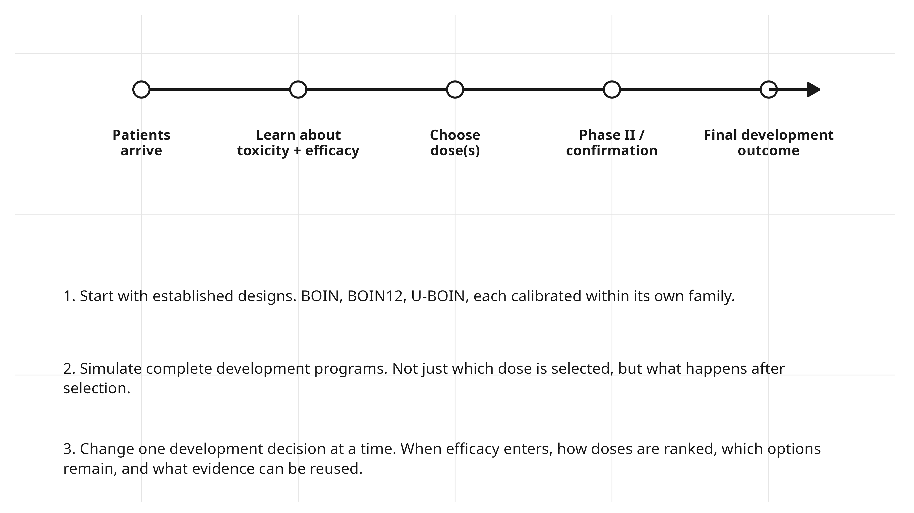{fig-align="center" height="560"}

::: {.notes}
Pull-from-if-needed. We started with established dose-finding designs, calibrated each within its own family to satisfy common operating requirements, then followed the resulting decisions farther downstream than we normally do. In some experiments we changed a component inside the design. In others we held the selected strategy fixed and changed what happened after selection.
:::

## Two questions, two levels of evaluation

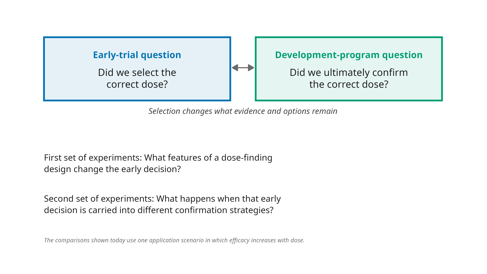{fig-align="center" height="560"}

::: {.notes}
Delivery. Land the asymmetry. Almost every dose-finding paper answers the left question and stops.
:::

## What the design never knows {.smaller}

:::: {.columns}
::: {.column width="49%"}
**Clinical scenario.** An assumed truth about the drug, the true toxicity and efficacy probability at every dose.
:::
::: {.column width="49%"}
**Correct dose.** The dose with the best true benefit-risk tradeoff. Known to the simulation because the scenario specifies it. Never known to the design.
:::
::::

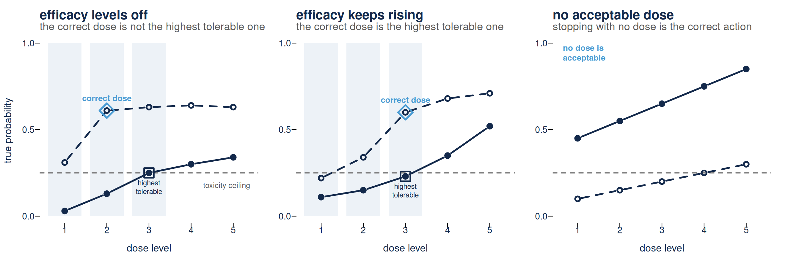{fig-align="center" height="365"}

The scenarios the calibration ran on, drawn from the frozen definitions rather than redrawn by hand. Solid line and filled circles, true toxicity. Dashed line and open circles, true efficacy. Shaded, the acceptable doses.

::: {.notes}
Delivery. Walk the three panels left to right and say the one sentence that makes the whole talk necessary. In the first panel the correct dose is not the highest tolerable one. That is the case conventional dose finding was not built to find, and it is why Project Optimus exists.

Pull-from-if-needed. The scenario shapes were taken from the dose-response biology of the agent classes these designs name in their own titles, targeted and immune therapies, rather than from arbitrary curves. The downstream study adds further shapes to this set, including a best dose adjacent to a sharply worse one and a drug whose efficacy declines from the lowest dose.

Q&A pocket. *Why only three?* These are the frozen scenarios the calibration itself ran on. The later study widens the set, and the figure does not claim to be the whole grid.

Vocabulary. The diamond is the quantity the paper calls the optimal biological dose and the square is the maximum tolerated dose. The figure draws both in plain words on purpose, so say them in plain words too and let the room supply the abbreviations if it wants them.
:::

## What calibrated means here

**Calibrated.** Tuning parameters and sample size searched against prespecified operating requirements. A candidate is then locked and independently re-verified on a fresh simulation stream. **The verdict is three-valued**, feasible, infeasible, or unresolved, and the next question is about why.

**Design strategy.** A design family, BOIN, BOIN12 or U-BOIN, together with its calibrated settings.

::: {.notes}
Delivery. This is the term the whole second movement is built on, so plant it now and do not explain it yet. Three-valued is the word that should stick.

Pull-from-if-needed. Two more terms the later slides use. The phase II design used later in development is a standard two-stage design, stop early if too few responses, with a toxicity monitor. Confirm means declare efficacy at the end of that phase II design. Neither needs to be on a slide, both need to be said once before Question 3.

Q&A pocket. *Calibrated to what?* To requirements stated before the search ran, not to whatever the search happened to find. That distinction is the entire content of the next movement.
:::

## How to read the next result

**What changes?** Ranking rule versus evidence summary, one component at a time.

**Why?** If behavior changes when a component changes, the design label is too coarse.

**Readout.** Change in correct-dose selection on the same simulated patients.

::: {.notes}
Pull-from-if-needed. Evidence-summary effects are several times smaller than the ranking-rule effects. Say substantially smaller, or give the ratio. NEVER an order of magnitude, the true ratio is well under ten.

Delivery. The sign flip across scenarios is the point, not the magnitude.
:::

## What a design does matters more than its name

We swapped how doses are ranked, then how the data are summarized, one at a time.

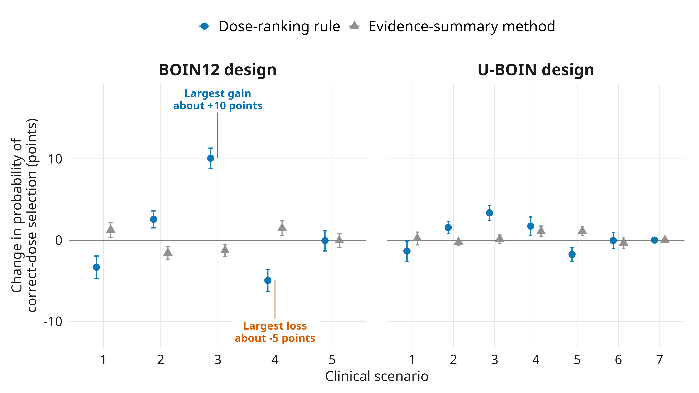{fig-align="center" height="480"}

::: {.notes}
Pull-from-if-needed. Evidence-summary effects are several times smaller than the ranking-rule effects. Never say an order of magnitude, the true ratio is well under ten.

Delivery. The sign flip across situations is the point, not the magnitude. Same design, same patients, one rule swapped.
:::

## How to read the next result

**What changes?** Nothing. This one measures a property every variant shares.

**Why?** If the trial can permanently remove the best dose, no ranking rule can recover it.

**Readout.** How often the true best dose is eliminated before selection.

::: {.notes}
Delivery. This is the hinge into Movement II. It is not bad optimization. It is information that no longer exists.
:::

## Some early mistakes cannot be repaired later

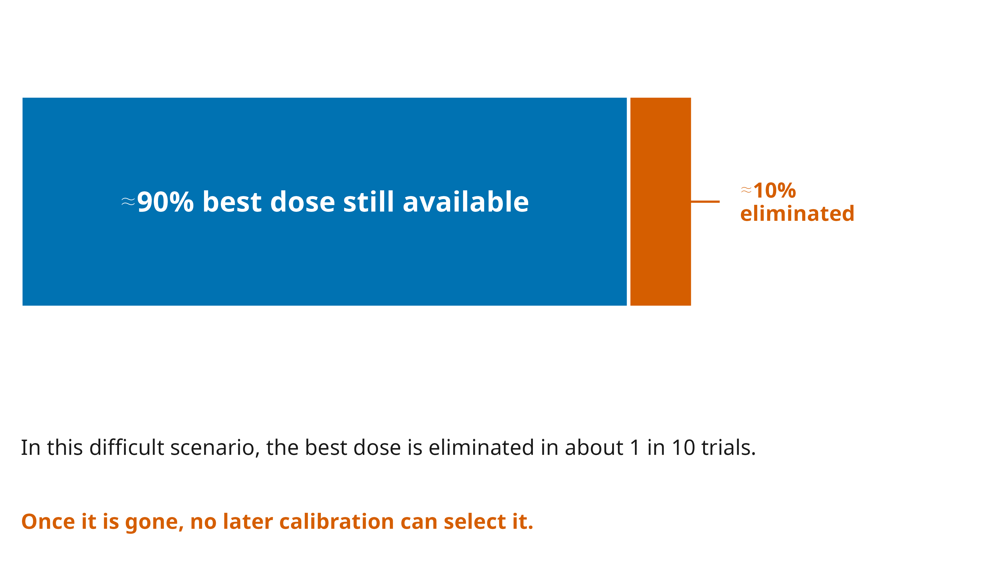{fig-align="center" height="540"}

::: {.notes}
Delivery. This is the hinge into the next question. It is not bad optimization. It is information that no longer exists, and no ranking rule recovers a dose the trial has already removed.
:::

## What Question 1 establishes

::: {style="text-align:center; margin-top:1.2em;"}
[Performance is a property of components and context, not of a design's name.]{style="color:#4B9CD3; font-weight:700; font-size:1.25em;"}
:::

::: {.fragment style="text-align:center; margin-top:1em;"}
Which raises the next question.

**How would you establish that any particular implementation is good enough?**
:::

# What would it take to establish that a design meets its requirements? {.center background-color="#13294B"}

::: {style="color:#E6EAEF; font-style: italic; text-align:center;"}
Question 2 of 4
:::

## The standard evaluation is a simulation table

For each of several scenarios it reports the probability of selecting each dose, the expected sample size, and the distribution of patients across doses.

That table is informative and it is what reviewers are accustomed to reading.

::: {.fragment}
[It reports quantities. It does not evaluate them against requirements.]{style="color:#13294B; font-weight:700; font-size:1.15em;"}
:::

::: {.fragment}
[Nor does it report what was not tried.]{style="color:#13294B; font-weight:700; font-size:1.15em;"}
:::

::: {.notes}
Delivery. This is the whole motivation in three sentences. It indicts the logic of the table, not any design and not any default. That is much harder to dismiss, and nobody in the room has to defend their own choice of design.
:::

## What the table does not tell you

::: {.incremental}
- **What value was required.** A reader sees the target selected in roughly half of trials. Required is not stated.
- **What else was available.** The tuning parameters define a space of alternatives. The table describes one point in it.
:::

::: {.notes}
Delivery. Two gaps here and a third, worse one on the next slide. Both of these are about the space the table does not show, the number reported and the alternatives it was chosen from.

Q&A pocket. *Is roughly half not a normal number?* It is entirely normal. That is the point. Nothing on the page says whether it was the requirement, and normal is not the same as adequate.
:::

## The table also cannot show its own optimism

::: {.fragment}
**Whether the number is optimism.** When the same simulations tune and report the design, a favourable number carries optimism the table cannot show.
:::

::: {.fragment}
So the question becomes: what evidence would actually **establish** that a design meets its requirements?
:::

::: {.notes}
Delivery. This is the gap that motivates everything after it, and it is different in kind from the two before. The first two are about what the table omits. This one is about what the number itself contains.

Pull-from-if-needed. Tuning and reporting on the same simulations is selection on the same noise the report then presents as performance. Nothing on the page distinguishes a design that is good from a design that was lucky on the stream it was tuned on.
:::

## Search nominates. Verification decides.

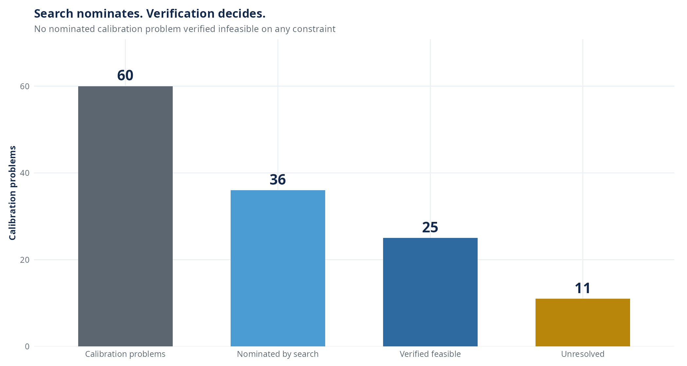{fig-align="center" height="540"}

::: {.notes}
Pull-from-if-needed. A cell is one combination of study, scenario, design family and objective weight. Each is a separate constrained calibration problem carrying its own search, lock and independent verification, on disjoint random streams.

Delivery. Do not rush to the drop. Let them see the two stages are different procedures first.
:::

## The distance is the framework working

::: {style="text-align:center; margin-top:0.2em;"}
[The distance between what search nominates and what verification establishes is the framework operating as specified, not a loss.]{style="color:#13294B; font-weight:700; font-size:1.2em;"}
:::

::: {.fragment style="margin-top:0.5em;"}
Search selects on **point estimates**. Verification decides on an **interval**.
:::

::: {.notes}
Delivery. This is the intellectual centre of the talk. Slow down. If one sentence survives the hour, it is the callout on this slide.

Pull-from-if-needed. Search and verification run on disjoint random streams, so the interval verification decides on is not the interval search was selecting against.
:::

## Unresolved is neither established nor refuted

A nominated candidate whose remaining uncertainty still crosses the requirement is neither established feasible nor refuted on the evidence collected.

::: {.fragment style="margin-top:0.8em;"}
Reporting it as feasible would be exactly the selection-induced optimism the procedure exists to prevent.
:::

::: {.notes}
Delivery. Say the two negatives separately and do not soften either one. Not established. Not refuted. The temptation the room will feel is to hear this as a polite way of saying it failed, and it is not.

Q&A pocket. *So what do you do with an unresolved cell?* Report it as unresolved and say what would resolve it, which is more verification replicates or a different requirement. What you do not do is round it toward whichever of the two verdicts you preferred.
:::

## Every verdict is three-valued

  
<strong>Verified feasible</strong>Evidence clears every prespecified requirement on the situations we chose in advance to test.

  
<strong>Unresolved</strong>The interval still straddles at least one requirement. Not almost feasible. Not failure.

  
<strong>Verified infeasible</strong>Evidence establishes that at least one requirement is missed.

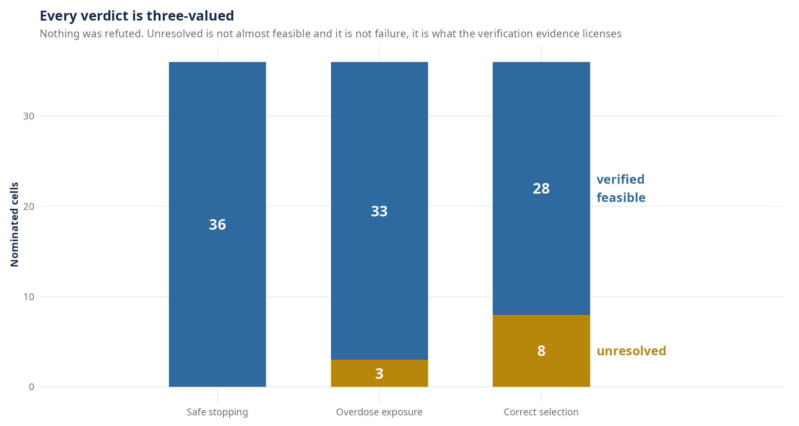{fig-align="center" height="300"}

Actual nominated designs occupied the feasible and unresolved states. None was refuted by verification.

::: {.notes}
Q&A pocket. *Why not just report a point estimate and a p-value?* Because a two-state report forces every unresolved cell into one of two claims the evidence does not support. Unresolved is not almost feasible and it is not failure.

Delivery. Safe stopping was established everywhere it was nominated. The unresolved verdicts concentrate on exposure and on selection.
:::

## Feasibility is not uniform and that is informative

We searched the same kinds of designs over the same ranges. What changed was what counted as the correct dose and which situations the design had to handle.

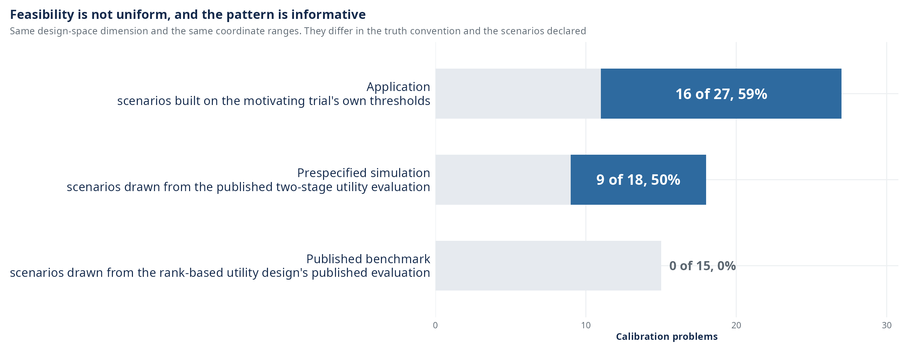{fig-align="center" height="274"}

::: {.fragment style="text-align:center;"}
We offer **no mechanism** for the study that establishes none. The campaign as run does not isolate one.
:::

::: {.notes}
Delivery. Say the no-mechanism line out loud. Volunteering the thing you cannot explain buys more credibility here than any result on the slide.
:::

## A verification verdict is conditional on the situations we chose in advance to test

::: {style="text-align:center; margin-top:0.6em;"}
[And that conditionality is a finding rather than a caveat.]{style="color:#4B9CD3; font-weight:700; font-size:1.2em;"}
:::

::: {.fragment}
Feasibility varied materially across sets of situations chosen in advance at a **fixed** search domain.
:::

::: {.fragment}
Locked designs re-scored on further scientifically plausible scenarios could cross constrained safety limits.
:::

::: {.notes}
Delivery. This slide is what keeps the movement from sounding triumphalist. Two pieces of evidence that the conditionality is real, then the obligation it creates on the next slide.

Guardrail. Scientifically plausible, not adversarial. These were not scenarios built to break the designs, which is what makes the crossing worth reporting.
:::

## What that conditionality obliges us to publish

Verification on a prespecified scenario set does not establish robustness outside it. This is why the calibration specification is frozen and published with the design.

::: {.notes}
Delivery. This is the bridge into the deliverable. A conditional verdict is only usable by someone else if the condition travels with it, and the condition is the specification.

Pull-from-if-needed. Frozen means the scenario set, the requirements and the search domain are fixed before the search runs and are reported whatever the verdict turns out to be. A specification chosen after seeing the verdicts would carry the same optimism the verification stage exists to remove.
:::

## What a trial team receives



This goes into the protocol, not just into the optimization code.

::: {.notes}
Pull-from-if-needed. They also receive the calibration specification in full, the scenario set the design was evaluated against, each required operating characteristic with its verified bound, and the verdict.

Delivery. The point is that this goes into a protocol. A calibration procedure whose output cannot be written into a protocol has not finished.
:::

## What a team does not receive is a guarantee

The verdict is a statement about **the scenarios the specification declared**, at the stated error level, for **the locked design**.

::: {.fragment}
It is not a statement about the design family.
:::

::: {.fragment}
It is not a statement about scenarios outside the declared set.
:::

::: {.fragment}
It is not a statement about a wider range of designs than the one we searched.
:::

::: {.notes}
Delivery. Close the movement here. Then pivot, because everything so far still stops the clock at dose selection.
:::

# Does the metric we optimize early match what the program needs? {.center background-color="#13294B"}

::: {style="color:#E6EAEF; font-style: italic; text-align:center;"}
Question 3 of 4
:::

## How to read the next result

**What changes?** Nothing about the designs. Only how we score them.

**Why?** Selecting the correct dose and ending development at the correct dose are different questions.

**Readout.** The two rankings, compared against each other.

::: {.notes}
Delivery. Short slide. The designs and the simulated patients are held fixed, and the only thing that moves is the scoring rule, which is what makes any difference attributable to the metric rather than to the design.

Delivery. Do not stop here. The next slide holds our own analysis to the standard the last movement just taught, and skipping it is what this room would notice.
:::

## The nine analysis cases behind the next result {.smaller}

**And the standard applies to us.**

- We fixed these **nine analysis cases** before asking the downstream question.
- We later corrected how the simultaneous verification requirements were counted. Under that corrected rule, **seven remain verified feasible** and **two are unresolved**.
- We keep all nine, because dropping two after seeing the downstream results would change the analysis set after the fact.

::: {.notes}
Delivery. Teaching a standard of evidence for thirteen slides and then exempting your own downstream work from it is what this room will notice. Say all three bullets, including the one that costs us something.

Q&A pocket. *Does the correction change your conclusions?* We do not claim it does not. The two cells may contribute to averages over the set. A seven-cell post-correction sensitivity is deferred and labelled, not folded into the primary.

Q&A pocket. *Why not just drop the two?* Because the set was fixed before the downstream question was asked, and dropping cells after seeing the answer is the same after-the-fact selection the second movement spent thirteen slides refusing.
:::

## Locally best need not be globally best

A strategy can score better at dose selection and worse after confirmation.

::: {.r-stack}
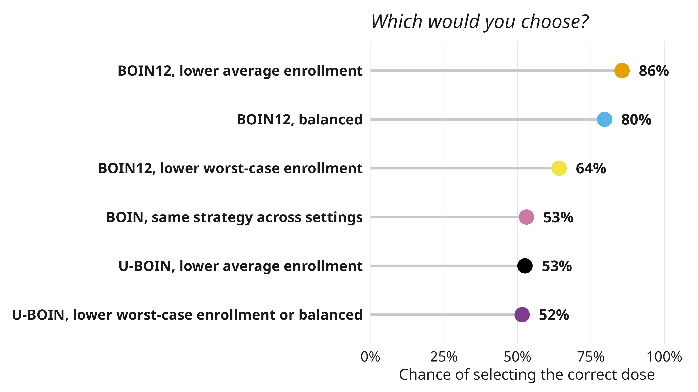{fig-align="center" height="426"}

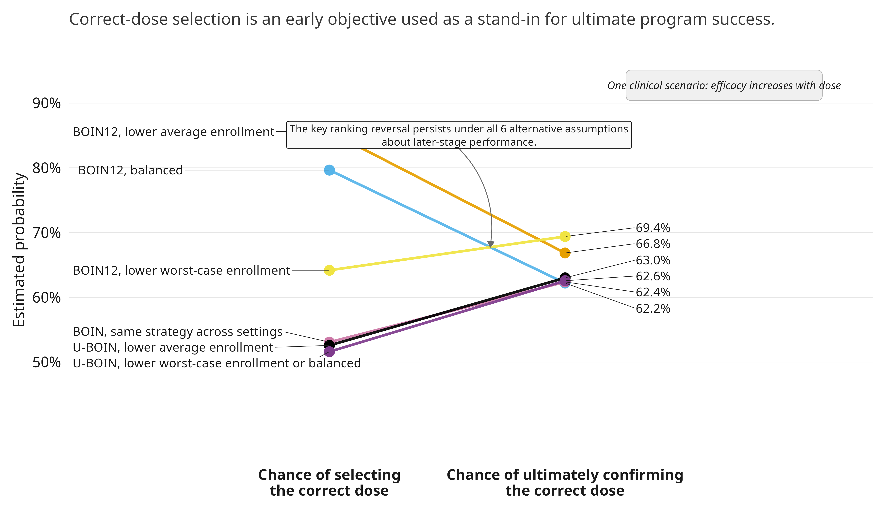{.fragment fig-align="center" height="426"}
:::

The ordering is the claim here. The small vertical gaps are not interpreted as effect sizes.

::: {.notes}
Delivery. Pause on the first frame. Ask the room which they would choose. Then reveal.

Q&A pocket. *Are those differences real?* The plotted quantities are point estimates and the source object carries no interval for them, so I claim the ordering and the one reversal the persistence check supports, and I claim nothing about the size of the small gaps. The reversal I do claim is the one the callout names, and it is the pair that persists on all six alternative later-stage assumptions.

Vocabulary. Always the qualifier. Dose-selection PCS can rank policies differently from program-level success once confirmation is included. Never the bare "PCS misranks designs".
:::

## How to read the next result

**What changes?** How dose finding ends. The correct dose, the neighbouring dose, or no dose.

**Why?** Correct-selection probability scores the last two identically. Both are simply wrong.

**Readout.** What each ending is worth to the rest of the program.

::: {.notes}
Delivery. The mechanism of the reversal. A strategy can raise its selection score by converting adjacent-dose selections into non-selections. In speech, call this downstream confirmation probability, not generic program success.
:::

## Why correct-dose selection is not the same as program success

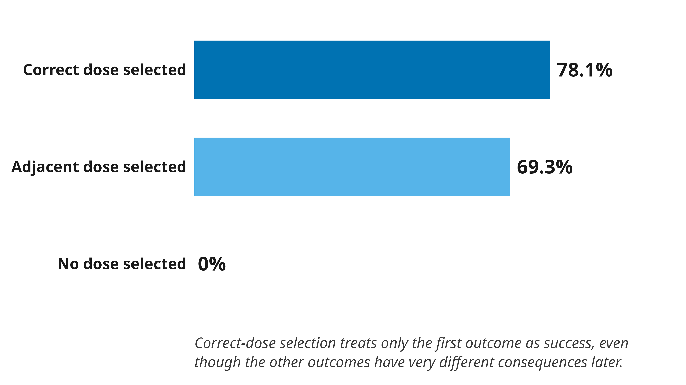{fig-align="center" height="540"}

::: {.notes}
Delivery. The mechanism of the reversal. A strategy can raise its selection score by turning neighbouring-dose selections into no selection at all, and correct-selection probability cannot tell those apart.
:::

## Only one design family was eligible on the second geometry

That result is established on **one** truth. We repeated the question under a second response geometry, where efficacy plateaus instead of rising toward the target.

::: {.fragment}
Only one design family produced enough eligible strategies to compare there. The families that carried the original inversion were not eligible on that geometry.
:::

::: {.notes}
Delivery. Say the eligibility limitation before the outcome, in that order. The cross-family question was not answerable on this geometry, and a room that hears the outcome first will read the limitation as an excuse for it.

Guardrail. Not eligible means they produced too few qualifying strategies to compare, not that they performed badly. Do not let the two be heard as the same statement.
:::

## The second geometry bounds this result

Within the eligible set, **the rank reversal did not recur**.

::: {.fragment style="margin-top:0.8em;"}
So the second geometry does not confirm the discordance result. It bounds it.
:::

::: {.notes}
Delivery. The gate outcome was declared in advance to be itself a geometry-dependence finding. Say that it was prospective, because otherwise this reads as a rescue.

Guardrail. Bounds, never disproves. The absence of recurrence inside the one eligible family is a statement about where the result has been shown to hold, not evidence that it fails elsewhere.
:::

# What does a phase boundary actually decide? {.center background-color="#13294B"}

::: {style="color:#E6EAEF; font-style: italic; text-align:center;"}
Question 4 of 4
:::

## A phase boundary determines what information survives

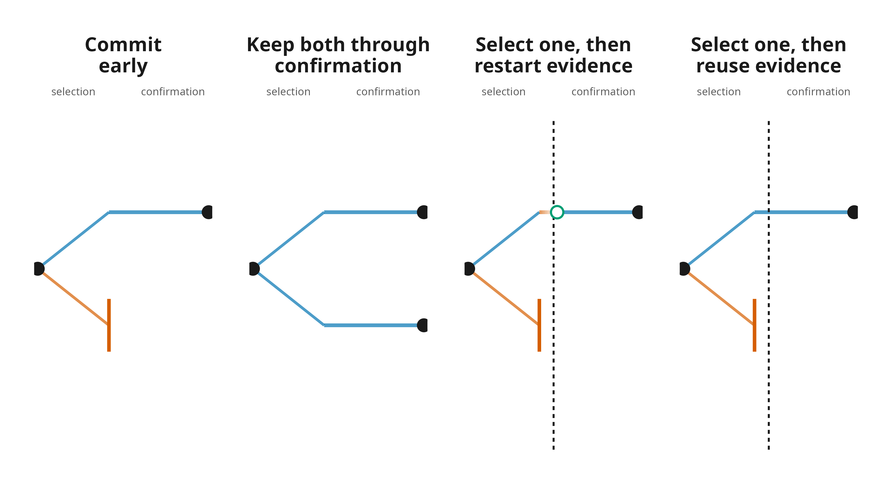{fig-align="center" height="390"}

**Four strategies.** Commit early. Keep both through confirmation. Select one, then restart evidence. Select one, then reuse evidence.

::: {.notes}
Delivery. From here we are no longer comparing named dose-finding methods. Same underlying selection problem, different things done after or around it. Read the four names off the panels as you say them, because these are the names every later slide uses and the room needs them attached to the pictures rather than to a list.

Guardrail. The open circle marks confirmation starting with no earlier evidence carried in. It does not mark selection. Anyone who reads it as selection will misread the third and fourth panels as the same architecture.
:::

## How to read the next result

**What changes?** Only what the program does after dose selection. The selections themselves are identical.

**Why?** Project Optimus, FDA's dose-optimization initiative, encourages sponsors to compare more than one dose later in development.

**Readout.** Whether the correct final dose is supported after confirmation.

::: {.notes}
Pull-from-if-needed. Filled marker means the Bonferroni-adjusted interval excludes zero. Open marker means it does not. The internal contrast identifiers are C1 through C4 in the paper and are deliberately absent here.

Q&A pocket. *Why are the plateau intervals wider?* Fewer qualified cells on that geometry, three against nine, so less information behind each contrast.

Delivery. Read the rows top to bottom. Keep both, transfers and strengthens. The two select-one strategies, positive on monotone and reversing without support on plateau. The evidence boundary at the bottom, small on both and supported on both, which is the one that survives the geometry change.
:::

## What changes across geometries

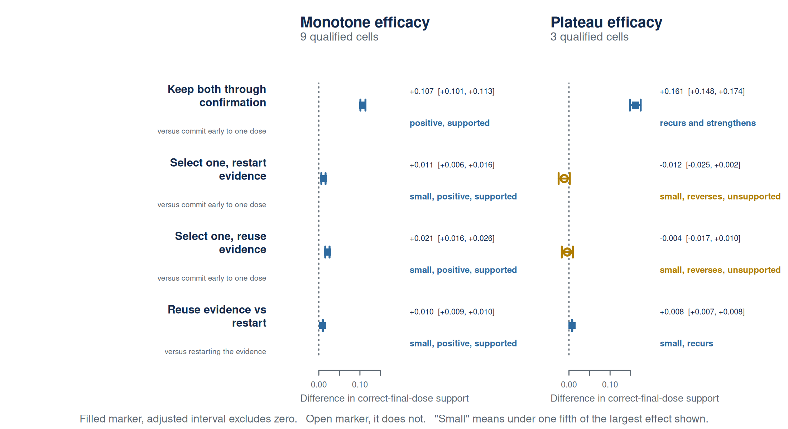{fig-align="center" height="560"}

::: {.notes}
Pull-from-if-needed. Filled marker means the adjusted interval excludes zero. Open marker means it does not.

Delivery. Read top to bottom. Keep both, transfers and strengthens. The two select-one strategies, positive on the rising shape and reversing without support on the plateau. The evidence boundary at the bottom, small on both and supported on both, which is the one that survives the change in shape.
:::

## What the geometry does to the mechanism

::: {style="margin-top:0.4em;"}
[The mechanism used to resolve retained uncertainty has to match the shape of how efficacy changes across doses.]{style="color:#13294B; font-weight:700; font-size:1.15em;"}
:::

::: {.fragment}
Using response data to choose between the two doses helps when efficacy separates the carried doses. When efficacy is flat across them, it no longer resolves the decision and can reverse direction.
:::

::: {.notes}
Delivery. Do not say re-selection "does nothing" on the plateau. It loses its benefit and reverses direction, even though that negative contrast is not supported. And do not say the doses differ "only in toxicity", say efficacy does not separate them.

Delivery. Hold the lesson back. The next slide is the one sentence you want them to leave with, and it lands harder after the mechanism has been stated plainly.
:::

## What actually transfers

::: {style="margin-top:0.4em;"}
[So the transferable lesson is not "retain two doses". It is retain uncertainty in a form the next evidence can actually resolve.]{style="color:#4B9CD3; font-weight:700; font-size:1.2em;"}
:::

::: {.notes}
Delivery. One sentence, one slide, and a pause. This is the sentence a methodologist in the room can take back to a protocol that has nothing to do with dose finding.

Guardrail. Retaining two doses is a mechanism, not the lesson. The room that leaves with "keep two doses" has taken the thing the previous slide just refused, and that is exactly the misreading this deck has already had to correct once.
:::

## Some uncertainty can be bought back. Some information is gone.

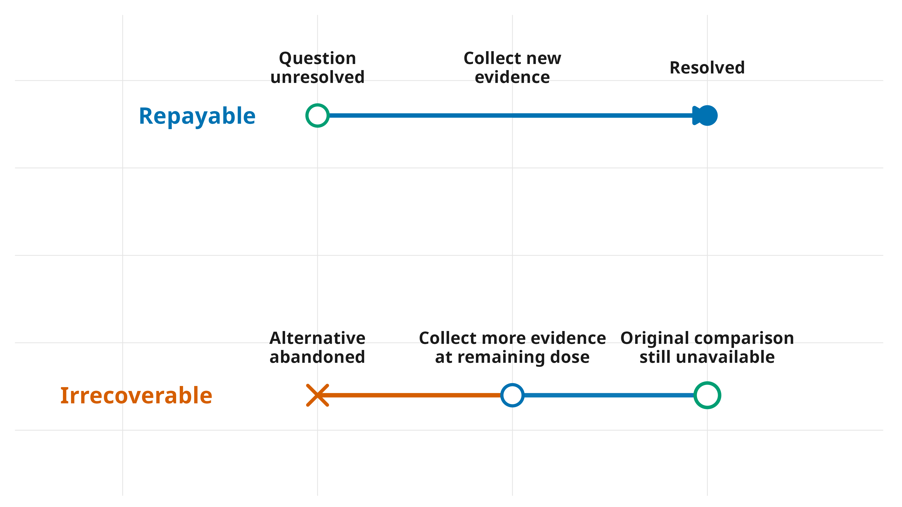{fig-align="center" height="540"}

::: {.notes}
Delivery. This is what I mean by information debt, evidence the program has to generate later because of an earlier decision.
:::

## Sotorasib bought its dose answer after approval

An approved lung-cancer drug whose 960 mg dose was compared against 240 mg only after approval. The original dose was not shown to be wrong. The dose question simply stayed open.

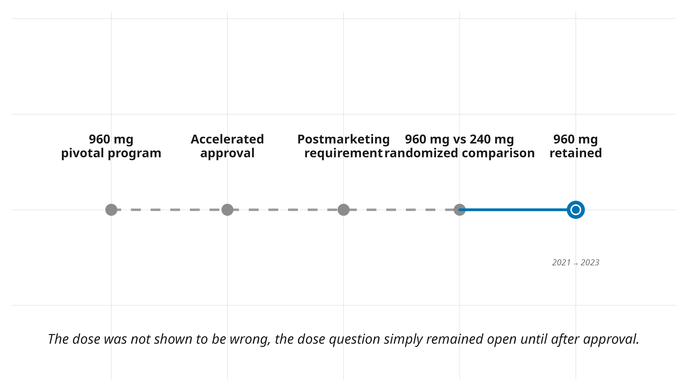{fig-align="center" height="510"}

::: {.notes}
Delivery. Not a wrong dose. The randomized evidence supported retaining the approved dose. The problem is that the pivotal program had already committed before the dose question was settled, so resolving it became a separate post-approval experiment.

Guardrail. This cuts FOR randomized comparison, never against the approved dose.
:::

## How to read the next result

**What changes?** Every strategy now gets the same patient budget.

**Why?** The obvious objection is that *keep both through confirmation* only wins because it spends more patients.

**Readout.** What each strategy can still achieve on that budget.

::: {.notes}
Delivery. Not a horse race. The message is the shared fall. All three remain operable at well under their natural spend, and all three lose power.

The reading. There is no free optionality. The question is where you pay. Parallel pays by confirming two candidates. Selection architectures pay by spending patients deciding which candidate deserves confirmation. A hard boundary adds a third cost, evidence already generated cannot contribute downstream.
:::

## Preserving dose options has a cost

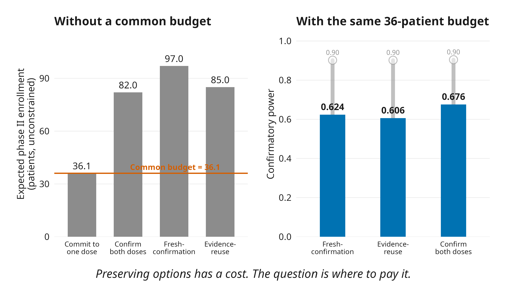{fig-align="center" height="520"}

::: {.notes}
Delivery. Not a horse race. The message is the shared fall. All three stay operable at well under their natural spend, and all three lose ground.

The reading. There is no free optionality. The question is where you pay for it.
:::

## The systems hypothesis

Clinical development has been optimized **locally** while its errors propagate **globally**.

::: {.fragment}
We have methods for optimizing individual trials, and even linked stages. We have not calibrated the full sequence around what early decisions leave later development able, and required, to prove.
:::

::: {.fragment style="margin-top:1em;"}
[A phase III analysis can have perfectly valid false-positive control while the development program has already failed scientifically.]{style="color:#13294B; font-weight:700; font-size:1.1em;"}

Failed scientifically means the remaining program can no longer generate the evidence the final claim needs.

:::

## Where this leaves us

We have been treating dose finding, phase II efficacy evaluation, and confirmation as three separate statistical problems.

::: {.fragment style="margin-top:1.2em;"}
They are not separate. A dose-finding design's output is a dose **and the evidence and options it leaves behind**, and that state determines what the rest of development is able, and required, to prove.
:::

::: {.notes}
Delivery. The first sentence is the opening thesis, word for word. Let the recognition land before the fragment.

Delivery. Do not rush onto the last slide. This one is the argument closing, the next one is the instruction, and they need a beat between them.
:::

## What to do differently

::: {style="text-align:center; margin-top:1.4em;"}
[Calibrate the design. Decompose what drives it. Then follow those components through the development program.]{style="color:#13294B; font-weight:700; font-size:1.35em;"}
:::

::: {.notes}
Delivery. Three imperatives, said slowly, and nothing else on the slide. This is what the room writes down.

Then stop. Do NOT put the closing question on a slide. Say it into Q&A: "So the question I will leave for discussion is, if we knew at the start what evidence the eventual regulatory claim required, would we still design phase I, phase II and phase III as three separately optimized experiments?" Then take questions.

Pull-from-if-needed. Decompose means the component swaps from the first movement, the ranking rule and the evidence summary, not a sensitivity analysis over tuning parameters.
:::

## Acknowledgments {.smaller}

:::: {.columns}
::: {.column width="34%"}
**Clinical collaborators**

PLACEHOLDER, complete before delivery
:::
::: {.column width="33%"}
**Statistical working group and lab**

PLACEHOLDER, complete before delivery, and **bold the students who led the work**
:::
::: {.column width="33%"}
**Funding**

NCI P50-CA257911 (UNC SToP SPORE)

ARPA-H 140D042590009

DOD HT9425241103100121

NCI U01-CA274298
:::
::::

## References {.smaller}

::: {#refs}
:::

::: {.notes}
Q&A ROUTING INDEX.

Why not just report a point estimate → the three-valued verdict slide, Movement II.
Does the corrected verification change your conclusions → the Movement III setup slide.
So two doses is not always better → the four contrasts slide, then the geometry slide.
Is dose finding causing phase III failure → What I am not arguing, slide 3.
Is the six-year PMR figure current → the two ends slide, slide 2.
What does a team actually get → What a trial team receives, Movement II.
What are the limits → What a team does not receive is a guarantee, Movement II.
:::
